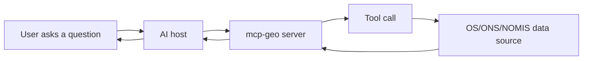

# Overview For Novices

## In Plain Language

This project helps AI assistants answer UK public-sector questions by connecting them to trusted tools and datasets.

Instead of giving an assistant full database access, `mcp-geo` gives it controlled tools such as:

- lookup by postcode
- map and boundary queries
- statistics retrieval
- catalog and routing tools that help the assistant choose the right data path

## Key Terms

- MCP: Model Context Protocol, a standard way for AI hosts to call tools
- Tool: a controlled function the assistant can call
- Resource: a structured document/file endpoint exposed by the server
- Host: the AI client application (for example Claude, VS Code, ChatGPT-compatible surfaces)

## What Was Built

- FastAPI MCP server with HTTP and STDIO transports
- 81 registered tools across OS, ONS, NOMIS, admin, maps, and support domains
- Test and evaluation harnesses for correctness, reliability, and compatibility
- Extensive troubleshooting and trace artifacts for host/runtime issues

## Why This Matters

The project was selected because it combined:

- high practical utility
- a broad read-only tool surface that looked difficult at project start
- low data sensitivity relative to many transactional government systems

This made it a useful pilot for testing an "answers-first" model in public-sector workflows.

## Where To Go Next

- Origins and acknowledgements: [02_origin_story_and_acknowledgements.md](02_origin_story_and_acknowledgements.md)
- Technical architecture: [03_architecture_and_components.md](03_architecture_and_components.md)
- Timeline and ecosystem changes: [04_detailed_timeline_repo_and_ecosystem.md](04_detailed_timeline_repo_and_ecosystem.md)
