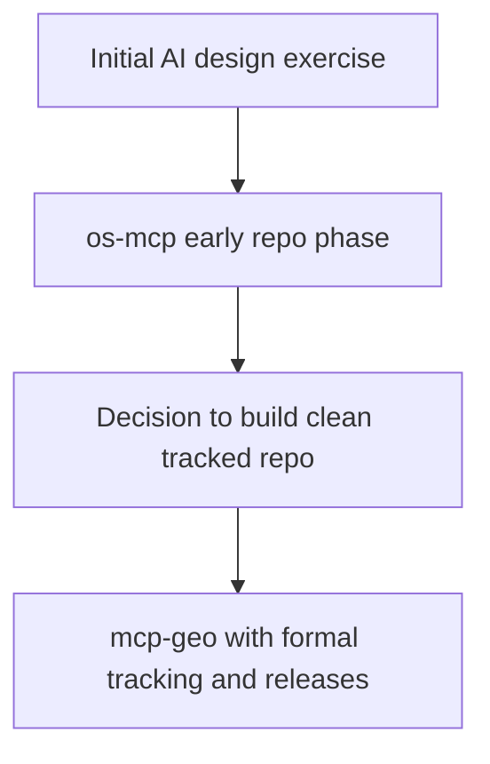

# Origin Story and Acknowledgements

## Scope of This Chapter

This chapter records how the project started, why scope was selected, and how the implementation direction changed.

## Initial Concept

From available project evidence, the initial concept was to test whether a practical public-sector MCP server could:

- expose many read-only data capabilities safely
- handle geospatial and statistical questions in one system
- generate traceable answers suitable for operational and policy contexts

The concept aligned with the research narrative in:

- `research/From Apps to Answers - Connecting Public Sector Data to AI with MCP/`
- `research/Deep Research Report/Research Apps to Answers_ Connecting Public Sector Data to AI with MCP.md`

## Acknowledgement of Early Contribution

Early work is explicitly linked to `os-mcp` via submodule history and initial project prompts.

- The repository includes `submodules/os-mcp` from `https://github.com/chris-page-gov/os-mcp`.
- Initial Codex session evidence references prior work and acknowledges the earlier contribution by Chris Carlon as part of the origin narrative.

This documentation set records that contribution as part of project lineage.

## Change of Course

The implementation moved from inheriting prior structure to building a new, fully tracked repository with:

- explicit progress tracking (`PROGRESS.MD`)
- persistent context tracking (`CONTEXT.md`)
- release-note discipline (`RELEASE_NOTES/`)
- robust tooling and test expansion

## Evidence Anchors

- `.gitmodules`
- `docs/reports/mcp_geo_codex_long_horizon_summary_2026-02-25.json`
- `CONTEXT.md`
- `PROGRESS.MD`
