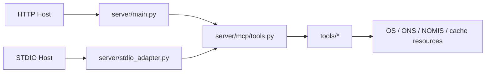

# Architecture and Components

## System View

`mcp-geo` is an MCP server with two transport surfaces:

- HTTP (`/mcp` and REST discovery/call endpoints)
- STDIO (JSON-RPC adapter)

Core directories:

- `server/`: app, transports, routing, observability
- `tools/`: domain tools and handlers
- `resources/`: static and generated data resources
- `tests/`: unit/integration/harness coverage
- `playground/` and `ui/`: host-facing interaction surfaces

## Tooling Domains

Tool families include:

- OS places, names, features, maps, downloads, network, vector/tiles
- ONS search, live data, dimensions, code options, geography cache
- NOMIS datasets and queries
- Admin lookup and boundary workflows
- MCP router/descriptor utilities

## Why the Architecture Evolved

Observed pressures that drove architecture changes:

- large payloads and host startup limits
- differences between hosts in tool naming and UI support
- evolving MCP specification revisions
- need for deterministic troubleshooting evidence

## Current Shape (as measured)

- 81 registered tools (repo runtime registry)
- broad test surface with coverage gate and targeted harness suites
- structured logging, rate limits, and fallback mechanisms

For endpoint and contract details, see:

- `README.md`
- `docs/spec_package/`
- `docs/tool_catalog.md`
