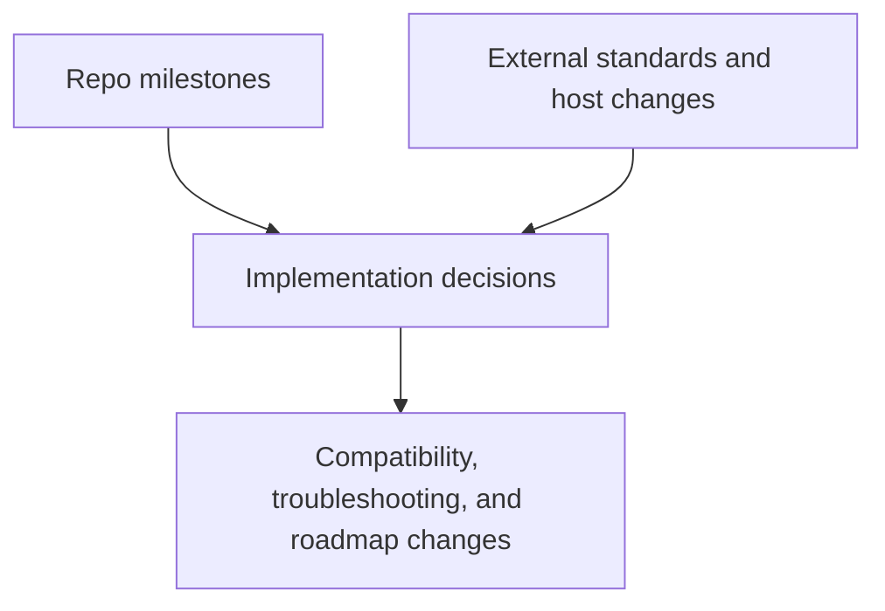

# Detailed Timeline: Repository and Ecosystem

## Reading Guide

- Section A: internal `mcp-geo` milestones
- Section B: external standards/client milestones that affected delivery

## A) Internal Timeline (Repository)

| Date | Milestone | Evidence |
| --- | --- | --- |
| 2025-08-20 | Initial commit and early MCP server scaffolding | `git log --reverse` |
| 2025-09-17 | Early release wave (`0.2.0`/`0.2.1`) with STDIO and ONS dimensions | `RELEASE_NOTES/0.2.1.md` |
| 2025-11-03 | STDIO adapter relocated and endpoint/tooling expansion | `git log`, `CHANGELOG.md` |
| 2026-01-20 | Restart into current architecture stream, including tool search and apps/resources expansion | `git log`, `RELEASE_NOTES/0.2.2.md` |
| 2026-01-21 | Compatibility and transport releases (`0.2.3` to `0.2.5`) | `RELEASE_NOTES/0.2.3.md`, `0.2.4.md`, `0.2.5.md` |
| 2026-01-27 to 2026-01-30 | MCP-Apps alignment, map hardening, boundary cache rollout (`0.2.6` to `0.2.8`) | `RELEASE_NOTES/0.2.6.md`, `0.2.7.md`, `0.2.8.md` |
| 2026-02-01 to 2026-02-11 | Reliability hardening, protocol negotiation upgrades, endpoint contracts (`0.2.9` to `0.2.12`) | `RELEASE_NOTES/0.2.9.md`, `0.2.12.md` |
| 2026-02-13 | Catalog-gap closure and expanded map/data delivery (`0.3.0`, `0.3.1`) | `RELEASE_NOTES/0.3.0.md`, `0.3.1.md` |
| 2026-02-17 | Map-delivery implementation package release (`0.3.2`) | `RELEASE_NOTES/0.3.2.md` |
| 2026-02-21 to 2026-02-23 | Safe-by-design and validation consolidation waves | `PROGRESS.MD`, `CHANGELOG.md` |
| 2026-02-25 | Reporting and complexity analysis release (`0.4.0`) | `RELEASE_NOTES/0.4.0.md` |
| 2026-03-01 to 2026-03-03 | Compact-window reliability, Claude interop hardening, peat failure-chain fixes | `PROGRESS.MD`, `CHANGELOG.md`, troubleshooting reports |

## B) External Timeline (Standards and Clients)

| Date | External Event | Why it mattered to this repo |
| --- | --- | --- |
| 2024-11-05 | MCP protocol revision baseline published | Initial compatibility baseline for server behavior |
| 2025-03-26 | MCP revision introduced Streamable HTTP and auth framework changes | Drove `/mcp` transport and compatibility work |
| 2025-04-03 | VS Code 1.99 announced agent mode and MCP support in stable channel | Increased priority of host-compatibility and local setup guidance |
| 2025-05-16 | OpenAI announced Codex | Influenced tooling choices and delivery surfaces |
| 2025-06-18 | MCP revision updated base protocol details and capability structure | Required sustained multi-version negotiation support |
| 2025-06-18 | Anthropic announced remote MCP support in Claude Code | Increased interoperability testing needs |
| 2025-11-25 | MCP revision changelog added major auth and task changes | Required protocol tracking and compatibility declarations |
| 2026-01-26 | MCP Apps extension (`io.modelcontextprotocol/ui`) declared stable | Informed MCP-Apps UI implementation decisions |
| 2026-02-02 | OpenAI announced Codex app for macOS | Increased emphasis on Codex desktop + devcontainer workflows |

## External Source Links

- MCP 2024-11-05: <https://modelcontextprotocol.io/specification/2024-11-05/basic>
- MCP 2025-03-26 changelog: <https://modelcontextprotocol.io/specification/2025-03-26/changelog>
- MCP 2025-06-18: <https://modelcontextprotocol.io/specification/2025-06-18>
- MCP 2025-11-25 changelog: <https://modelcontextprotocol.io/specification/2025-11-25/changelog>
- MCP updates blog (incl. MCP Apps stable): <https://modelcontextprotocol.io/blog/mcp-updates-from-july-2025-to-january-2026>
- VS Code 1.99 update: <https://code.visualstudio.com/updates/v1_99>
- Anthropic Claude Code announcement: <https://www.anthropic.com/news/claude-code>
- Anthropic remote MCP in Claude Code: <https://www.anthropic.com/news/claude-code-best-practices>
- OpenAI introducing Codex: <https://openai.com/index/introducing-codex/>
- OpenAI introducing the Codex app: <https://openai.com/index/introducing-the-codex-app/>

## Release Sequence (Repo)

`v0.2.1` -> `v0.2.2` -> `v0.2.3` -> `v0.2.4` -> `v0.2.5` -> `v0.2.6` -> `v0.2.7` -> `v0.2.8` -> `v0.2.9` -> `v0.2.10` -> `v0.2.11` -> `v0.2.12` -> `v0.3.0` -> `v0.3.1` -> `v0.3.2` -> `v0.4.0`
