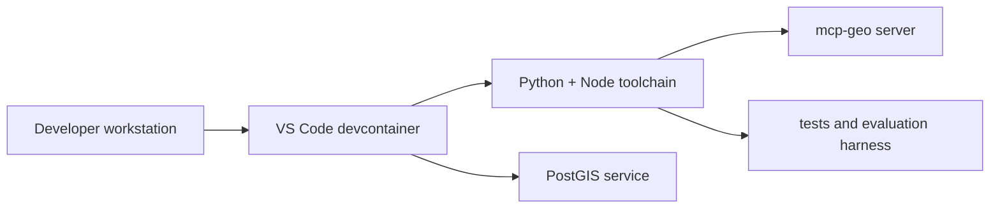

# Reproducible Development Environment

## Goal

Describe the project setup so teams can reproduce development, testing, and troubleshooting workflows.

## Baseline Requirements

- Python 3.11+
- Node.js 20 for playground and Playwright
- Docker (for containerized server and optional PostGIS)
- OS and ONS API credentials for live calls

## Recommended Path: Devcontainer

The repository includes a configured devcontainer:

- `.devcontainer/devcontainer.json`
- `.devcontainer/docker-compose.yml`
- `.devcontainer/Dockerfile`

Key characteristics:

- automated dependency install on create
- mounted persistent `CODEX_HOME` volume
- configured PostGIS service for boundary workflows
- forward ports for server and playground tools

## Environment Variables and Secrets

Primary runtime variables are documented in:

- `.env.example`
- `README.md`
- `docs/getting_started.md`

Current pattern supports:

- direct key injection (`OS_API_KEY`, `ONS_API_KEY`)
- file-based secret loading (`OS_API_KEY_FILE`)
- wrapper-assisted loading for Claude workflows (`scripts/claude-mcp-local`)

## Reproducibility Commands

- install: `pip install -e .[test]`
- run server: `uvicorn server.main:app --reload`
- full tests: `pytest -q`
- playground tests: `npm --prefix playground run test`

## Operational Notes

- both HTTP and STDIO transports are first-class
- startup footprint can be tuned for constrained hosts (toolset and compact list controls)
- troubleshooting runbooks are integrated into docs, scripts, and trace tools

Relevant docs:

- `docs/getting_started.md`
- `docs/Build.md`
- `docs/tutorial.md`
- `docs/client_trace_strategy.md`
