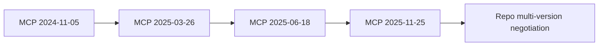

# Standards, Clients, and Tooling Evolution

## Why This Chapter Exists

The project was delivered while MCP standards and host behavior were still changing. This chapter captures how the implementation tracked those changes.

## MCP Standards Evolution in This Repo

Observed compatibility posture:

- preferred protocol: `2025-11-25`
- compatibility maintained for: `2025-06-18`, `2025-03-26`, `2024-11-05`
- MCP Apps extension tracked at `2026-01-26`

Evidence:

- `docs/spec_tracking.md`
- `RELEASE_NOTES/0.2.12.md`
- `server/protocol.py`

## Client and Host Evolution

### Claude surfaces

Key interoperability learnings included:

- tool naming constraints for some host paths
- startup payload pressure requiring compact catalog mode
- runtime differences in MCP-Apps UI mounting behavior

Evidence:

- `PROGRESS.MD` sections `CT-*`, `CTS-*`, `LMR-HOST-4`
- `docs/troubleshooting.md`
- `troubleshooting/*.md`

### Codex surfaces

Codex usage evolved across:

- container-local execution
- host-level execution
- repeatable reporting and context persistence patterns

Evidence:

- `CONTEXT.md`
- `docs/review_codex_in_container.md`
- `docs/reports/mcp_geo_codex_long_horizon_summary_2026-02-25.*`

### VS Code / Playground

The project tracked VS Code-hosted MCP behavior and used Playwright for repeatable checks across compact-window and host-simulation scenarios.

Evidence:

- `playground/tests/`
- `docs/reports/mcp_apps_window_constraints_review_2026-03-01.md`
- `docs/vscode.md`

## Switch From Claude Code To Codex in Delivery Practice

Observed transition pattern:

- early emphasis on Claude compatibility and trace diagnostics
- growing use of Codex for high-volume implementation, branching, and report generation
- formalized Codex telemetry and summary workflow

This is recorded descriptively in:

- `PROGRESS.MD`
- `CONTEXT.md`
- `docs/reports/mcp_geo_codex_long_horizon_summary_2026-02-25.md`
