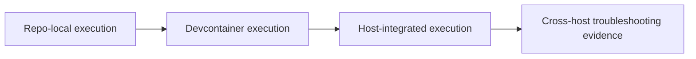
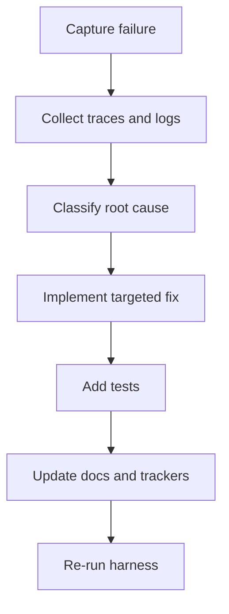

# Harness Permissions and Debugging Journey

## Overview

This project built a troubleshooting and validation harness while host/runtime behavior changed frequently.

## Permission and Execution Evolution

Documented progression:

1. local repo-focused execution
2. containerized execution for deterministic toolchains
3. host-integrated execution for real client/runtime diagnosis

This progression is visible in:

- `docs/review_codex_in_container.md`
- `docs/client_trace_strategy.md`
- `scripts/claude-mcp-local`
- `scripts/mcp_stdio_trace_proxy.py`
- `scripts/mcp_http_trace_proxy.py`

## Troubleshooting Method That Emerged

Common loop:

1. capture trace
2. classify failure domain (host, protocol, server, upstream API, payload size)
3. patch smallest safe layer
4. add regression coverage
5. document incident and runbook update

## Representative Incident Families

- tool discovery mismatch in constrained clients
- UI resource rendering and host bridge behavior
- map payload and startup-footprint failures
- NOMIS/ONS query-shape drift and correction guidance
- legacy collection aliasing and count semantics in feature queries

Key references:

- `docs/troubleshooting.md`
- `troubleshooting/claude-system-instructions-hide-mcp.md`
- `troubleshooting/nomis-and-toolsearch-deep-analysis-2026-03-03.md`
- `troubleshooting/peat-survey-failure-deep-analysis-2026-03-03.md`
- `troubleshooting/peat-survey-trace-evidence-2026-03-03.md`
