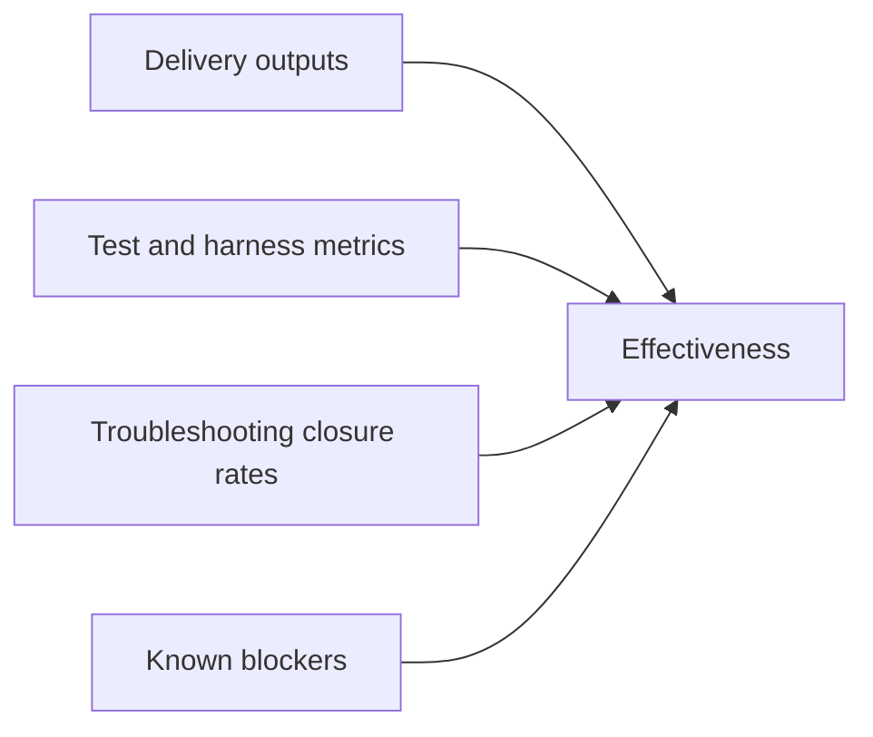

# Effectiveness Evaluation

## Evaluation Approach

This evaluation uses measurable outputs already captured in repository artifacts.

Dimensions used:

- delivery coverage
- reliability and regression safety
- interoperability progress
- governance and assurance progress
- known residual constraints

## Quantitative Signals

### Delivery and coverage

- Tool registry size: 81 tools (`server.mcp.tools` + `tools.registry` runtime load)
- Release sequence through `v0.4.0` with documented notes per release
- Broad evaluation harness question coverage (`tests/evaluation/questions.py`)

### Reliability and quality

From tracker and release artifacts:

- Full regression checkpoints repeatedly reported at or above 90% coverage gate in major waves
- Live harness closure recorded at `6900/6900` (100%) for full OS/ONS live run in `PROGRESS.MD`
- Compact-window acceptance waves completed with explicit Playwright evidence sets in `PROGRESS.MD`

### Troubleshooting effectiveness

The project created a repeatable diagnose-and-fix loop and converted major incidents into:

- code changes
- tests
- documentation updates

This is visible in linked incident pairs across `troubleshooting/`, `PROGRESS.MD`, `CHANGELOG.md`, and targeted test files.

## Observed Strengths

- high traceability between incidents, fixes, and tests
- clear protocol-version compatibility stance
- measurable startup-footprint and host-interop improvements
- extensive documentation coverage for operational handover

## Residual Limits and Risks

Open or partially open items (descriptive):

- external host runtime behavior remains a blocker in some MCP-Apps scenarios (`LMR-HOST-4`)
- CI pipeline automation remains listed as a gap in repository guidance
- future controlled-data expansion requires formal RBAC/ABAC controls
- some functionality remains intentionally stubbed/descriptor-driven for ecosystem compatibility

## Overall Assessment Statement

Based on repository evidence, the solution is effective for a broad read-only geospatial/statistical MCP pilot with strong troubleshooting maturity, while still requiring policy/access-control expansion and host-runtime convergence work for next-stage operational deployment.
