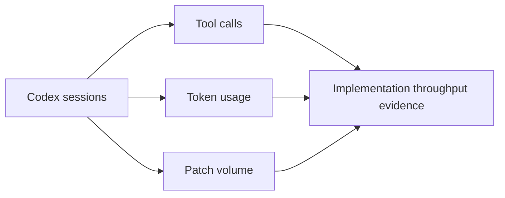

# Codex Usage, Time, and Token Statistics

## Source

Primary source: `docs/reports/mcp_geo_codex_long_horizon_summary_2026-03-04.{md,json,svg}`

Comparison baseline: `docs/reports/mcp_geo_codex_long_horizon_summary_2026-02-25.{md,json,svg}`

## Current Snapshot (Generated 2026-03-04)

- Sessions included: 59
- Active runtime: 668.3 hours
- Wall-clock span: 1038.5 hours
- Total tokens: 1,464.2M
- Tool calls: 16,588
- Patch lines added (apply_patch estimate): 71.3k
- Auto context compactions: 196

## Change Since 2026-02-25 Baseline

| Metric | 2026-02-25 | 2026-03-04 | Delta |
| --- | --- | --- | --- |
| Sessions | 47 | 59 | +12 |
| Active runtime hours | 513.064 | 668.259 | +155.195 |
| Total tokens | 1,109,576,102 | 1,464,239,334 | +354,663,232 |
| Tool calls | 12,914 | 16,588 | +3,674 |
| Patch lines added | 58,744 | 71,320 | +12,576 |
| Context compactions | 150 | 196 | +46 |

## Interpretation Notes

- These values measure engineering activity and interaction volume, not quality by themselves.
- Quality outcomes should be interpreted alongside test/harness and release evidence.
- The statistics are suitable for planning future effort estimation and agent-operation budget controls.
