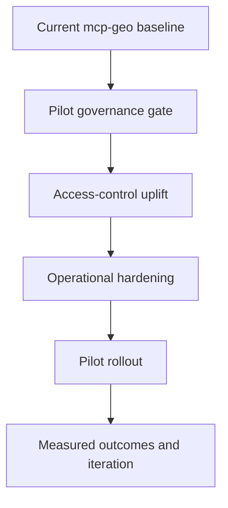

# What Is Required To Extend This Into a BDUK Pilot

## Purpose

This chapter translates the current repository state into a pilot-ready requirements view for BDUK-style delivery.

## Recommended Pilot Workstreams

1. Governance and assurance gate
- define operational ownership and escalation model
- finalize risk controls for live deployments
- map evidence outputs to required assurance checkpoints

2. Access-control uplift
- add role and attribute controls for restricted datasets
- define policy decision points outside prompt logic
- log allow/deny decisions with correlation IDs

3. Operational hardening
- formal CI/CD gate with lint/type/test/coverage/release checks
- environment and secret handling for production lanes
- SLOs and observability thresholds for key tool families

4. Service maturity and onboarding
- user onboarding packs for analysts, operators, and policy users
- stable runbooks and support pathways
- controlled question-bank expansion for pilot use-cases

## Suggested Pilot Entry Criteria

- all critical workflows pass defined harness tests
- explicit incident runbook for host/runtime failures
- security controls validated for target data classes
- reporting pipeline agreed for technical and non-technical stakeholders

## Suggested Pilot Exit Criteria

- stable answer quality across defined question set
- reproducible troubleshooting cycle with evidence artifacts
- measurable reduction in unresolved failure classes
- decision-ready recommendation for scaled rollout
