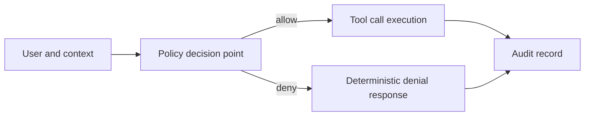

# Extending to Other Datasets: RBAC, ABAC, and Governance Needs

## Current State

Current implementation emphasis is broad read-only access and deterministic troubleshooting for low-to-moderate sensitivity data pathways.

## Why RBAC and ABAC Become Necessary

As scope expands to higher-sensitivity datasets, prompt-only controls are insufficient.

Required controls include:

- RBAC (role-based access control): enforce permissions by user role
- ABAC (attribute-based access control): enforce permissions by data/user/context attributes
- policy decision and enforcement points outside model text generation

## Practical Uplift Requirements

- identity propagation from host to server policy layer
- tool-level authorization checks before upstream calls
- mandatory provenance fields for restricted outputs
- structured denial telemetry for auditing and learning

## Dataset Expansion Design Pattern

1. classify dataset sensitivity and legal basis
2. define allowed user cohorts and contextual constraints
3. encode policy checks in server-side controls
4. add regression tests for policy allow/deny scenarios
5. extend audit outputs for assurance and review

## Related Existing Foundations in Repo

- error taxonomy and deterministic error envelopes
- correlation-aware logging patterns
- mature troubleshooting discipline
- resource and tool metadata structures

These foundations reduce integration risk but are not a replacement for formal access-control policy enforcement.
