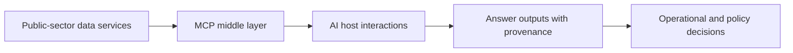

# Current and Future Direction of MCP in UK Public Sector Context

## Current Direction (Observed)

From repository and standards tracking evidence, current direction includes:

- movement toward stable multi-version MCP compatibility
- increasing emphasis on authorization and consent structures in standards evolution
- increasing host/client ecosystem support with uneven runtime behavior
- growing need for interoperability patterns that preserve auditability

## UK Public Sector Relevance

MCP-style delivery aligns with recurring public-sector needs:

- controlled access to authoritative datasets
- reproducible and auditable answer pathways
- cross-domain composition (geospatial + statistics + operational context)

## Near-Term Technical Direction

Likely next-stage requirements based on current evidence:

- stronger auth extension adoption and policy integration
- better host/runtime consistency for MCP-Apps behavior
- sustained compatibility with evolving protocol revisions
- formalized assurance reporting for operational deployments

## Strategic Practicality Statement

For UK public-sector programs, MCP is most effective when implemented as part of a governed delivery layer that combines:

- standards compliance
- policy enforcement
- semantic consistency
- observability and incident discipline

rather than as an isolated protocol adoption exercise.
