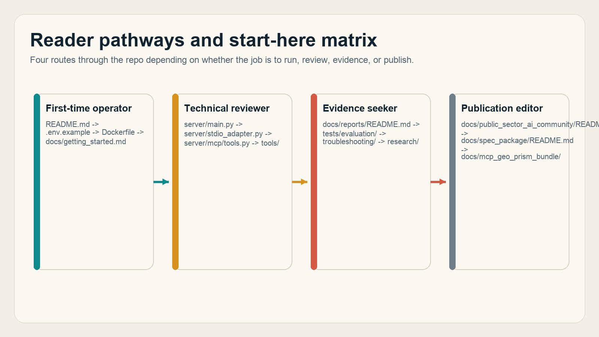
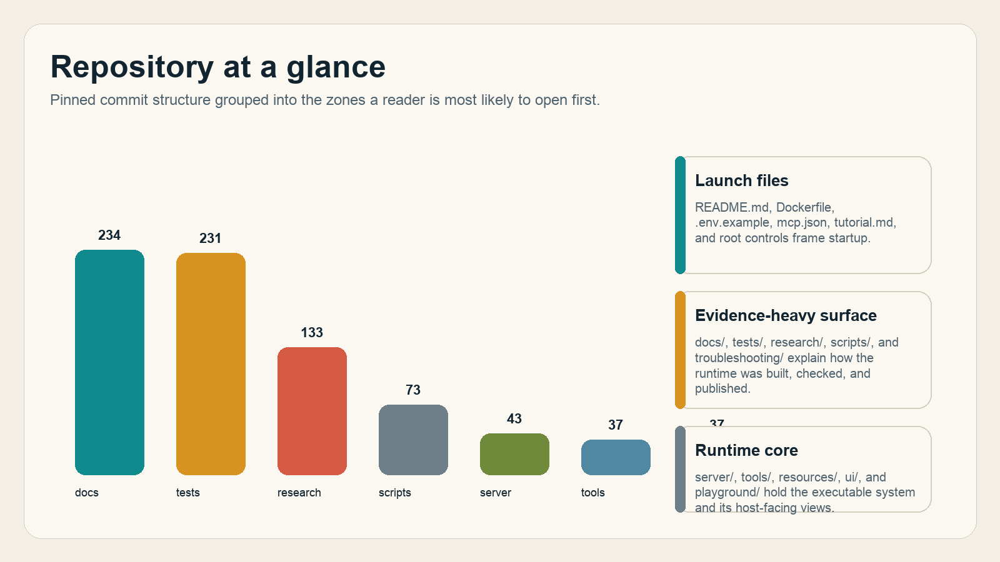
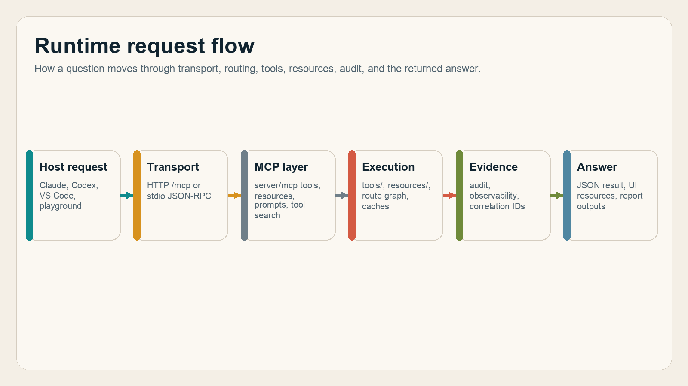
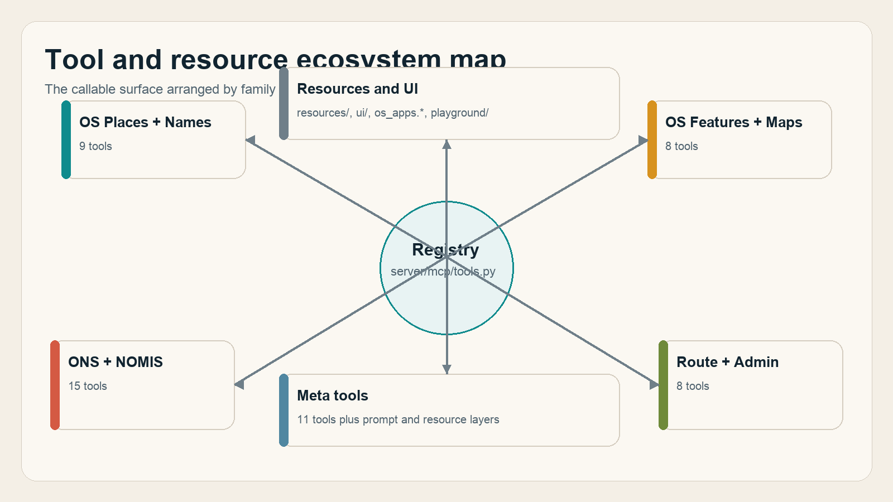
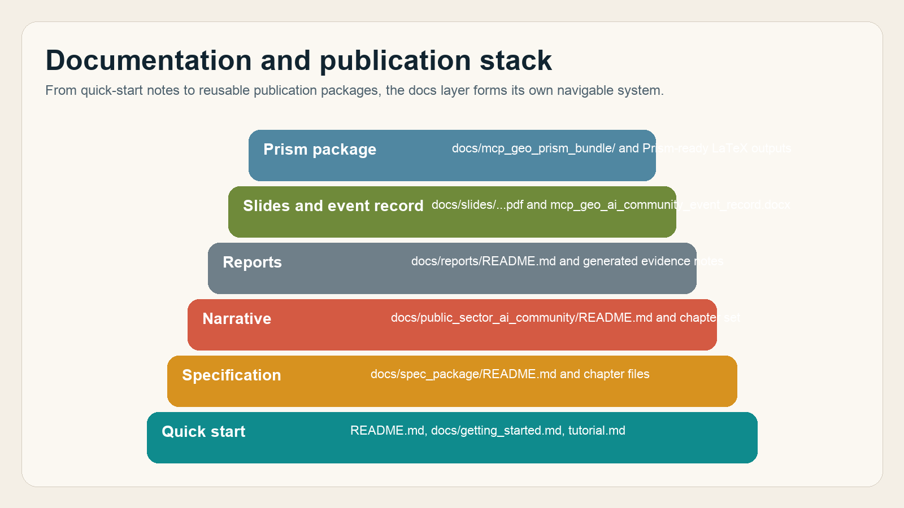
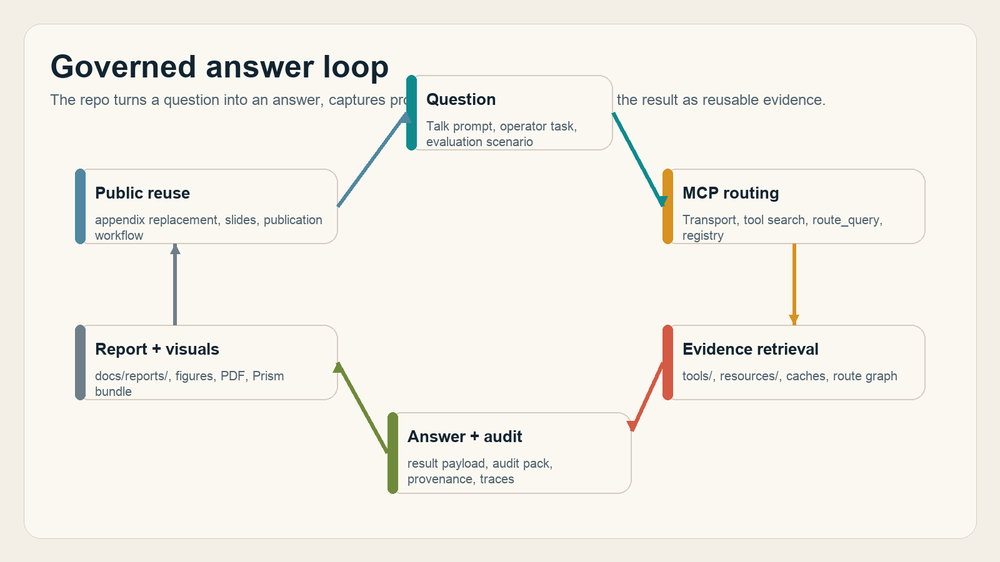
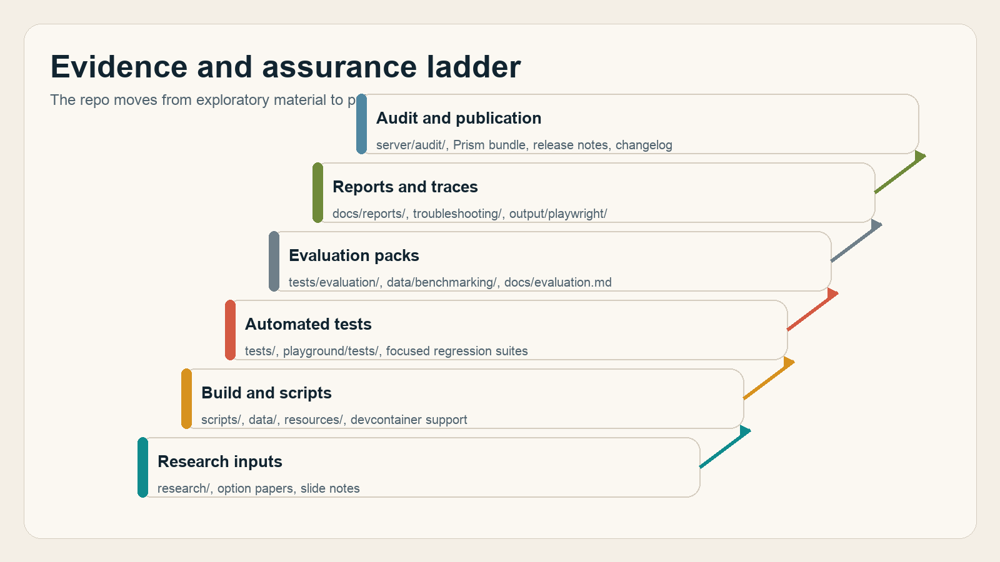
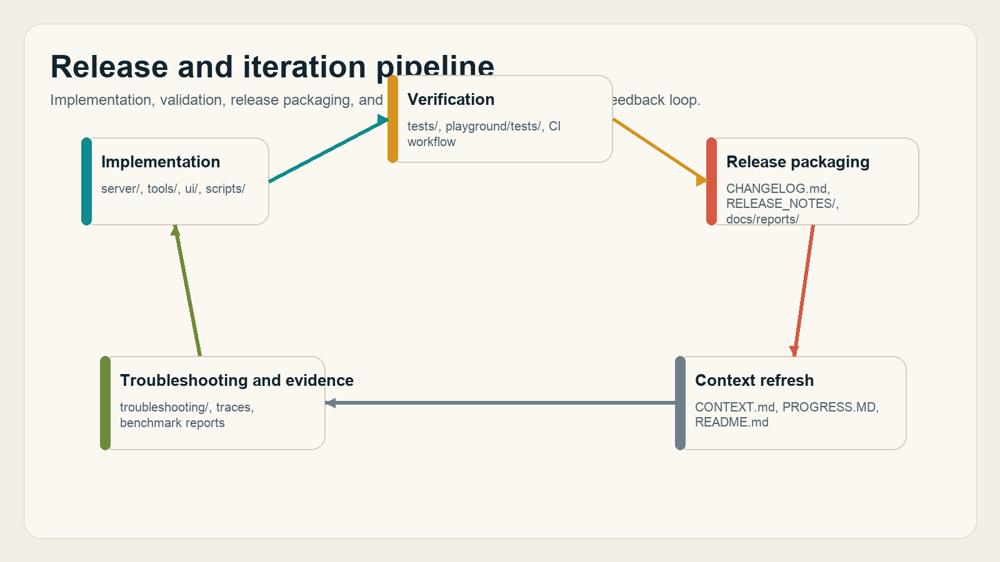

# Appendix A. Analytical Index to the Public MCP-Geo Repository

This appendix-ready slice reuses the standalone analytical index content without relying on external context outside commit `fe862910da246ca77f374cfbe484985f5df4d316`.

This standalone guide maps the public `mcp-geo` repository into a navigable reading system for people who need to move quickly from question to evidence, code, or publication material.

The citation baseline is the public repository pinned to commit `fe862910da246ca77f374cfbe484985f5df4d316`, so every repo hyperlink in this document points to a stable GitHub location rather than a moving branch tip. The slide deck, the current event-record DOCX, and the earlier rough Prism bundle are citable because they exist in that pinned repo state; the external transcript file at `/Users/crpage/Downloads/20260225-AI-Community-MCP-Talk.txt` remains context only and is not cited.

## 1. Reader Orientation

This section explains how to use the index, what kind of repo surface it covers, and how the pinned-commit source policy affects citations.

### 1.1 Reading lanes and audience fit

This subsection gives four practical reading lanes so new readers do not have to infer a path from folder names alone.

Start here: first-time operators should begin with [README.md](https://github.com/chris-page-gov/mcp-geo/blob/fe862910da246ca77f374cfbe484985f5df4d316/README.md#L1-L240), technical reviewers should jump to [server/main.py](https://github.com/chris-page-gov/mcp-geo/blob/fe862910da246ca77f374cfbe484985f5df4d316/server/main.py#L1-L216) and [server/mcp/tools.py](https://github.com/chris-page-gov/mcp-geo/blob/fe862910da246ca77f374cfbe484985f5df4d316/server/mcp/tools.py#L1-L260), evidence-oriented readers should open [docs/reports/README.md](https://github.com/chris-page-gov/mcp-geo/blob/fe862910da246ca77f374cfbe484985f5df4d316/docs/reports/README.md#L1-L71), and publication editors should move straight to [docs/public_sector_ai_community/README.md](https://github.com/chris-page-gov/mcp-geo/blob/fe862910da246ca77f374cfbe484985f5df4d316/docs/public_sector_ai_community/README.md#L1-L60), [docs/spec_package/README.md](https://github.com/chris-page-gov/mcp-geo/blob/fe862910da246ca77f374cfbe484985f5df4d316/docs/spec_package/README.md#L1-L45), and [docs/mcp_geo_prism_bundle/](https://github.com/chris-page-gov/mcp-geo/tree/fe862910da246ca77f374cfbe484985f5df4d316/docs/mcp_geo_prism_bundle).

Where to go: [community documentation set](https://github.com/chris-page-gov/mcp-geo/tree/fe862910da246ca77f374cfbe484985f5df4d316/docs/public_sector_ai_community), [specification package](https://github.com/chris-page-gov/mcp-geo/tree/fe862910da246ca77f374cfbe484985f5df4d316/docs/spec_package), [reports index](https://github.com/chris-page-gov/mcp-geo/blob/fe862910da246ca77f374cfbe484985f5df4d316/docs/reports/README.md), and [tool catalog](https://github.com/chris-page-gov/mcp-geo/blob/fe862910da246ca77f374cfbe484985f5df4d316/docs/tool_catalog.md#L1-L61).

{ width=96% }

Figure F02 shows the fastest route for four reader types: operator, reviewer, evidence seeker, and publication editor.

### 1.2 Citation baseline and source policy

This subsection makes the evidence rules explicit so readers can tell which materials are public repo evidence and which are merely contextual inputs.

The stable source surface is the pinned GitHub repo at [commit `fe862910da246ca77f374cfbe484985f5df4d316`](https://github.com/chris-page-gov/mcp-geo/tree/fe862910da246ca77f374cfbe484985f5df4d316), and the key baseline inputs inside that commit are the [slide deck](https://github.com/chris-page-gov/mcp-geo/blob/fe862910da246ca77f374cfbe484985f5df4d316/docs/slides/20260225%20-%20From_Apps_to_Answers.pdf), the [event record DOCX](https://github.com/chris-page-gov/mcp-geo/blob/fe862910da246ca77f374cfbe484985f5df4d316/docs/reports/mcp_geo_ai_community_event_record.docx), and the [rough initial Prism bundle](https://github.com/chris-page-gov/mcp-geo/blob/fe862910da246ca77f374cfbe484985f5df4d316/docs/mcp_geo_prism_bundle/main.md#L1-L292). The external transcript at `/Users/crpage/Downloads/20260225-AI-Community-MCP-Talk.txt` is deliberately excluded from formal citation because it is outside the pinned public corpus.

Where to go: [pinned repo root](https://github.com/chris-page-gov/mcp-geo/tree/fe862910da246ca77f374cfbe484985f5df4d316), [rough bundle baseline](https://github.com/chris-page-gov/mcp-geo/blob/fe862910da246ca77f374cfbe484985f5df4d316/docs/mcp_geo_prism_bundle/main.md#L122-L292), and [event-record source document](https://github.com/chris-page-gov/mcp-geo/blob/fe862910da246ca77f374cfbe484985f5df4d316/docs/reports/mcp_geo_ai_community_event_record.docx).

### 1.3 What this index does differently

This subsection states the editorial shift from a short appendix to a full navigational system with a stronger visual and validation layer.

The earlier Appendix A in the rough Prism bundle already recognized the repo's main reading zones, but it stopped too early in the deeper report, testing, and release surfaces and did not record the design prompts behind its visuals. This replacement keeps the curated approach, but it accounts for every top-level tracked area at the pinned commit, adds stable source rules, interleaves a larger visual layer, and records one regeneration prompt per infographic.

Where to go: [previous Appendix A start](https://github.com/chris-page-gov/mcp-geo/blob/fe862910da246ca77f374cfbe484985f5df4d316/docs/mcp_geo_prism_bundle/main.md#L122-L292), [report library index](https://github.com/chris-page-gov/mcp-geo/blob/fe862910da246ca77f374cfbe484985f5df4d316/docs/reports/README.md#L1-L71), and [community documentation set overview](https://github.com/chris-page-gov/mcp-geo/blob/fe862910da246ca77f374cfbe484985f5df4d316/docs/public_sector_ai_community/README.md#L1-L60).

## 2. Root and Launch Surface

This section maps the top-level files and folders that tell a newcomer what MCP-Geo is, how to run it, and how the project frames its own maturity.

### 2.1 First-run orientation and launch files

This subsection groups the files that explain the repo fastest to a first-time operator.

The quickest route into the repository is still the [README start-here path](https://github.com/chris-page-gov/mcp-geo/blob/fe862910da246ca77f374cfbe484985f5df4d316/README.md#L20-L126), supported by the [Dockerfile](https://github.com/chris-page-gov/mcp-geo/blob/fe862910da246ca77f374cfbe484985f5df4d316/Dockerfile), the [environment template](https://github.com/chris-page-gov/mcp-geo/blob/fe862910da246ca77f374cfbe484985f5df4d316/.env.example), the [runtime metadata in `mcp.json`](https://github.com/chris-page-gov/mcp-geo/blob/fe862910da246ca77f374cfbe484985f5df4d316/mcp.json), and the lightweight [tutorial note](https://github.com/chris-page-gov/mcp-geo/blob/fe862910da246ca77f374cfbe484985f5df4d316/tutorial.md). Read this cluster when the immediate question is "How do I start it?" rather than "How is it built?".

Where to go: [README.md](https://github.com/chris-page-gov/mcp-geo/blob/fe862910da246ca77f374cfbe484985f5df4d316/README.md#L1-L240), [Dockerfile](https://github.com/chris-page-gov/mcp-geo/blob/fe862910da246ca77f374cfbe484985f5df4d316/Dockerfile), [`.env.example`](https://github.com/chris-page-gov/mcp-geo/blob/fe862910da246ca77f374cfbe484985f5df4d316/.env.example), [`mcp.json`](https://github.com/chris-page-gov/mcp-geo/blob/fe862910da246ca77f374cfbe484985f5df4d316/mcp.json), and [tutorial.md](https://github.com/chris-page-gov/mcp-geo/blob/fe862910da246ca77f374cfbe484985f5df4d316/tutorial.md).

### 2.2 Durable context, governance, and contributor controls

This subsection points to the files that explain how the repo governs itself while it is being built and reviewed.

The project explains its own limits and working style in a tight root-level cluster: [AGENTS.md](https://github.com/chris-page-gov/mcp-geo/blob/fe862910da246ca77f374cfbe484985f5df4d316/AGENTS.md), [CONTEXT.md](https://github.com/chris-page-gov/mcp-geo/blob/fe862910da246ca77f374cfbe484985f5df4d316/CONTEXT.md), [PROGRESS.MD](https://github.com/chris-page-gov/mcp-geo/blob/fe862910da246ca77f374cfbe484985f5df4d316/PROGRESS.MD), [CHANGELOG.md](https://github.com/chris-page-gov/mcp-geo/blob/fe862910da246ca77f374cfbe484985f5df4d316/CHANGELOG.md), [safe-by-design.json](https://github.com/chris-page-gov/mcp-geo/blob/fe862910da246ca77f374cfbe484985f5df4d316/safe-by-design.json), [documentation.md](https://github.com/chris-page-gov/mcp-geo/blob/fe862910da246ca77f374cfbe484985f5df4d316/documentation.md), and [implement.md](https://github.com/chris-page-gov/mcp-geo/blob/fe862910da246ca77f374cfbe484985f5df4d316/implement.md). This is where readers find the repo's durable assumptions, not just its executable code.

Where to go: [AGENTS.md](https://github.com/chris-page-gov/mcp-geo/blob/fe862910da246ca77f374cfbe484985f5df4d316/AGENTS.md), [CONTEXT.md](https://github.com/chris-page-gov/mcp-geo/blob/fe862910da246ca77f374cfbe484985f5df4d316/CONTEXT.md), [PROGRESS.MD](https://github.com/chris-page-gov/mcp-geo/blob/fe862910da246ca77f374cfbe484985f5df4d316/PROGRESS.MD), [CHANGELOG.md](https://github.com/chris-page-gov/mcp-geo/blob/fe862910da246ca77f374cfbe484985f5df4d316/CHANGELOG.md), and [safe-by-design.json](https://github.com/chris-page-gov/mcp-geo/blob/fe862910da246ca77f374cfbe484985f5df4d316/safe-by-design.json).

### 2.3 Repository shape at the pinned commit

This subsection turns the repo root into a readable map by showing which top-level areas dominate and what each cluster is for.

At the pinned commit, the visible mass of the repository lives in [docs/](https://github.com/chris-page-gov/mcp-geo/tree/fe862910da246ca77f374cfbe484985f5df4d316/docs), [tests/](https://github.com/chris-page-gov/mcp-geo/tree/fe862910da246ca77f374cfbe484985f5df4d316/tests), [research/](https://github.com/chris-page-gov/mcp-geo/tree/fe862910da246ca77f374cfbe484985f5df4d316/research), [scripts/](https://github.com/chris-page-gov/mcp-geo/tree/fe862910da246ca77f374cfbe484985f5df4d316/scripts), [server/](https://github.com/chris-page-gov/mcp-geo/tree/fe862910da246ca77f374cfbe484985f5df4d316/server), [tools/](https://github.com/chris-page-gov/mcp-geo/tree/fe862910da246ca77f374cfbe484985f5df4d316/tools), [playground/](https://github.com/chris-page-gov/mcp-geo/tree/fe862910da246ca77f374cfbe484985f5df4d316/playground), and [resources/](https://github.com/chris-page-gov/mcp-geo/tree/fe862910da246ca77f374cfbe484985f5df4d316/resources). That distribution tells the real story of the repo: it is not just a server, but a working evidence pack around a server.

Where to go: [repo root at the pinned commit](https://github.com/chris-page-gov/mcp-geo/tree/fe862910da246ca77f374cfbe484985f5df4d316), [docs/](https://github.com/chris-page-gov/mcp-geo/tree/fe862910da246ca77f374cfbe484985f5df4d316/docs), [tests/](https://github.com/chris-page-gov/mcp-geo/tree/fe862910da246ca77f374cfbe484985f5df4d316/tests), [research/](https://github.com/chris-page-gov/mcp-geo/tree/fe862910da246ca77f374cfbe484985f5df4d316/research), [scripts/](https://github.com/chris-page-gov/mcp-geo/tree/fe862910da246ca77f374cfbe484985f5df4d316/scripts), and [server/](https://github.com/chris-page-gov/mcp-geo/tree/fe862910da246ca77f374cfbe484985f5df4d316/server).

{ width=96% }

Figure F01 reduces the pinned commit into one visual: root launch files up front, runtime code in the middle, and evidence-heavy material surrounding it.

## 3. Runtime and Protocol Implementation

This section shows where MCP-Geo actually runs and how requests are mediated, guarded, and returned.

### 3.1 HTTP server, config, and guardrails

This subsection covers the FastAPI entrypoint, the main operational middleware, and the config surface that controls behavior.

The repo's HTTP runtime starts in [server/main.py](https://github.com/chris-page-gov/mcp-geo/blob/fe862910da246ca77f374cfbe484985f5df4d316/server/main.py#L19-L216), where FastAPI routers, rate limiting, observability, and error handling are wired together, while [server/config.py](https://github.com/chris-page-gov/mcp-geo/blob/fe862910da246ca77f374cfbe484985f5df4d316/server/config.py), [server/security.py](https://github.com/chris-page-gov/mcp-geo/blob/fe862910da246ca77f374cfbe484985f5df4d316/server/security.py), [server/logging.py](https://github.com/chris-page-gov/mcp-geo/blob/fe862910da246ca77f374cfbe484985f5df4d316/server/logging.py), and [server/observability.py](https://github.com/chris-page-gov/mcp-geo/blob/fe862910da246ca77f374cfbe484985f5df4d316/server/observability.py) explain how configuration, redaction, and metrics are handled. Open this cluster when the question is about runtime behavior rather than domain content.

Where to go: [server/main.py](https://github.com/chris-page-gov/mcp-geo/blob/fe862910da246ca77f374cfbe484985f5df4d316/server/main.py#L1-L216), [server/config.py](https://github.com/chris-page-gov/mcp-geo/blob/fe862910da246ca77f374cfbe484985f5df4d316/server/config.py), [server/security.py](https://github.com/chris-page-gov/mcp-geo/blob/fe862910da246ca77f374cfbe484985f5df4d316/server/security.py), [server/logging.py](https://github.com/chris-page-gov/mcp-geo/blob/fe862910da246ca77f374cfbe484985f5df4d316/server/logging.py), and [server/observability.py](https://github.com/chris-page-gov/mcp-geo/blob/fe862910da246ca77f374cfbe484985f5df4d316/server/observability.py).

### 3.2 STDIO transport and MCP protocol machinery

This subsection points to the files that make MCP-Geo interoperable with clients that speak JSON-RPC over STDIO or HTTP.

The transport and protocol layer is concentrated in [server/stdio_adapter.py](https://github.com/chris-page-gov/mcp-geo/blob/fe862910da246ca77f374cfbe484985f5df4d316/server/stdio_adapter.py#L1-L260), [server/protocol.py](https://github.com/chris-page-gov/mcp-geo/blob/fe862910da246ca77f374cfbe484985f5df4d316/server/protocol.py), and the [server/mcp/](https://github.com/chris-page-gov/mcp-geo/tree/fe862910da246ca77f374cfbe484985f5df4d316/server/mcp) package, which holds [HTTP transport](https://github.com/chris-page-gov/mcp-geo/blob/fe862910da246ca77f374cfbe484985f5df4d316/server/mcp/http_transport.py), [resource handling](https://github.com/chris-page-gov/mcp-geo/blob/fe862910da246ca77f374cfbe484985f5df4d316/server/mcp/resources.py), [tool search](https://github.com/chris-page-gov/mcp-geo/blob/fe862910da246ca77f374cfbe484985f5df4d316/server/mcp/tool_search.py), [prompts](https://github.com/chris-page-gov/mcp-geo/blob/fe862910da246ca77f374cfbe484985f5df4d316/server/mcp/prompts.py), and [elicitation forms](https://github.com/chris-page-gov/mcp-geo/blob/fe862910da246ca77f374cfbe484985f5df4d316/server/mcp/elicitation_forms.py). This is the place to look when client behavior, protocol negotiation, or tool-discovery shape is the issue.

Where to go: [server/stdio_adapter.py](https://github.com/chris-page-gov/mcp-geo/blob/fe862910da246ca77f374cfbe484985f5df4d316/server/stdio_adapter.py#L1-L260), [server/protocol.py](https://github.com/chris-page-gov/mcp-geo/blob/fe862910da246ca77f374cfbe484985f5df4d316/server/protocol.py), [server/mcp/http_transport.py](https://github.com/chris-page-gov/mcp-geo/blob/fe862910da246ca77f374cfbe484985f5df4d316/server/mcp/http_transport.py), [server/mcp/resources.py](https://github.com/chris-page-gov/mcp-geo/blob/fe862910da246ca77f374cfbe484985f5df4d316/server/mcp/resources.py), [server/mcp/tool_search.py](https://github.com/chris-page-gov/mcp-geo/blob/fe862910da246ca77f374cfbe484985f5df4d316/server/mcp/tool_search.py), and [server/mcp/elicitation_forms.py](https://github.com/chris-page-gov/mcp-geo/blob/fe862910da246ca77f374cfbe484985f5df4d316/server/mcp/elicitation_forms.py).

{ width=96% }

Figure F03 turns the transport story into a single governed path from host request to audited response.

### 3.3 Audit, cache, and route-planning subsystems

This subsection groups the supporting subsystems that turn the server from a thin transport wrapper into a governed answer engine.

Three deeper runtime areas matter here. The [audit subsystem](https://github.com/chris-page-gov/mcp-geo/tree/fe862910da246ca77f374cfbe484985f5df4d316/server/audit) packages decision records, redaction, disclosure, integrity, and source registers; the cache layer lives in [server/boundary_cache.py](https://github.com/chris-page-gov/mcp-geo/blob/fe862910da246ca77f374cfbe484985f5df4d316/server/boundary_cache.py), [server/ons_geo_cache.py](https://github.com/chris-page-gov/mcp-geo/blob/fe862910da246ca77f374cfbe484985f5df4d316/server/ons_geo_cache.py), and [server/dataset_cache.py](https://github.com/chris-page-gov/mcp-geo/blob/fe862910da246ca77f374cfbe484985f5df4d316/server/dataset_cache.py); and route-planning logic is concentrated in [server/route_graph.py](https://github.com/chris-page-gov/mcp-geo/blob/fe862910da246ca77f374cfbe484985f5df4d316/server/route_graph.py) and [server/route_planning.py](https://github.com/chris-page-gov/mcp-geo/blob/fe862910da246ca77f374cfbe484985f5df4d316/server/route_planning.py). These are the files that explain why the repo is about evidence discipline as well as tool exposure.

Where to go: [server/audit/](https://github.com/chris-page-gov/mcp-geo/tree/fe862910da246ca77f374cfbe484985f5df4d316/server/audit), [server/boundary_cache.py](https://github.com/chris-page-gov/mcp-geo/blob/fe862910da246ca77f374cfbe484985f5df4d316/server/boundary_cache.py), [server/ons_geo_cache.py](https://github.com/chris-page-gov/mcp-geo/blob/fe862910da246ca77f374cfbe484985f5df4d316/server/ons_geo_cache.py), [server/dataset_cache.py](https://github.com/chris-page-gov/mcp-geo/blob/fe862910da246ca77f374cfbe484985f5df4d316/server/dataset_cache.py), [server/route_graph.py](https://github.com/chris-page-gov/mcp-geo/blob/fe862910da246ca77f374cfbe484985f5df4d316/server/route_graph.py), and [server/route_planning.py](https://github.com/chris-page-gov/mcp-geo/blob/fe862910da246ca77f374cfbe484985f5df4d316/server/route_planning.py).

## 4. Tools, Resources, and Interfaces

This section groups the callable capability surface and the user-facing layers that make that surface understandable.

### 4.1 Tool registry and discovery surface

This subsection explains where the server's callable scope is registered and how readers can inspect it quickly.

The routing spine for tools is [server/mcp/tools.py](https://github.com/chris-page-gov/mcp-geo/blob/fe862910da246ca77f374cfbe484985f5df4d316/server/mcp/tools.py#L23-L123), where explicit imports guarantee registration across environments, while [docs/tool_catalog.md](https://github.com/chris-page-gov/mcp-geo/blob/fe862910da246ca77f374cfbe484985f5df4d316/docs/tool_catalog.md#L1-L61) gives the public catalog view and [tools/registry.py](https://github.com/chris-page-gov/mcp-geo/blob/fe862910da246ca77f374cfbe484985f5df4d316/tools/registry.py) defines the shared registration model. This is the best place to orient around breadth before drilling into a specific domain module.

Where to go: [server/mcp/tools.py](https://github.com/chris-page-gov/mcp-geo/blob/fe862910da246ca77f374cfbe484985f5df4d316/server/mcp/tools.py#L1-L260), [docs/tool_catalog.md](https://github.com/chris-page-gov/mcp-geo/blob/fe862910da246ca77f374cfbe484985f5df4d316/docs/tool_catalog.md#L1-L61), [tools/registry.py](https://github.com/chris-page-gov/mcp-geo/blob/fe862910da246ca77f374cfbe484985f5df4d316/tools/registry.py), and [server/mcp/tool_search.py](https://github.com/chris-page-gov/mcp-geo/blob/fe862910da246ca77f374cfbe484985f5df4d316/server/mcp/tool_search.py).

### 4.2 Domain tool families and supporting resources

This subsection groups the domain modules so readers can find the right problem space without reading every schema definition.

The [tools/](https://github.com/chris-page-gov/mcp-geo/tree/fe862910da246ca77f374cfbe484985f5df4d316/tools) directory breaks cleanly into a few families: OS places and names in [tools/os_places.py](https://github.com/chris-page-gov/mcp-geo/blob/fe862910da246ca77f374cfbe484985f5df4d316/tools/os_places.py), [tools/os_places_extra.py](https://github.com/chris-page-gov/mcp-geo/blob/fe862910da246ca77f374cfbe484985f5df4d316/tools/os_places_extra.py), and [tools/os_names.py](https://github.com/chris-page-gov/mcp-geo/blob/fe862910da246ca77f374cfbe484985f5df4d316/tools/os_names.py); OS feature, map, and vector tile work in [tools/os_features.py](https://github.com/chris-page-gov/mcp-geo/blob/fe862910da246ca77f374cfbe484985f5df4d316/tools/os_features.py), [tools/os_maps.py](https://github.com/chris-page-gov/mcp-geo/blob/fe862910da246ca77f374cfbe484985f5df4d316/tools/os_maps.py), [tools/os_vector_tiles.py](https://github.com/chris-page-gov/mcp-geo/blob/fe862910da246ca77f374cfbe484985f5df4d316/tools/os_vector_tiles.py), and [tools/os_map.py](https://github.com/chris-page-gov/mcp-geo/blob/fe862910da246ca77f374cfbe484985f5df4d316/tools/os_map.py); admin and route functions in [tools/admin_lookup.py](https://github.com/chris-page-gov/mcp-geo/blob/fe862910da246ca77f374cfbe484985f5df4d316/tools/admin_lookup.py) and [tools/os_route.py](https://github.com/chris-page-gov/mcp-geo/blob/fe862910da246ca77f374cfbe484985f5df4d316/tools/os_route.py); and ONS, NOMIS, and meta routing in [tools/ons_data.py](https://github.com/chris-page-gov/mcp-geo/blob/fe862910da246ca77f374cfbe484985f5df4d316/tools/ons_data.py), [tools/ons_geo.py](https://github.com/chris-page-gov/mcp-geo/blob/fe862910da246ca77f374cfbe484985f5df4d316/tools/ons_geo.py), [tools/nomis_data.py](https://github.com/chris-page-gov/mcp-geo/blob/fe862910da246ca77f374cfbe484985f5df4d316/tools/nomis_data.py), and [tools/os_mcp.py](https://github.com/chris-page-gov/mcp-geo/blob/fe862910da246ca77f374cfbe484985f5df4d316/tools/os_mcp.py). Supporting static data and catalogs sit in [resources/](https://github.com/chris-page-gov/mcp-geo/tree/fe862910da246ca77f374cfbe484985f5df4d316/resources).

Where to go: [tools/](https://github.com/chris-page-gov/mcp-geo/tree/fe862910da246ca77f374cfbe484985f5df4d316/tools), [resources/](https://github.com/chris-page-gov/mcp-geo/tree/fe862910da246ca77f374cfbe484985f5df4d316/resources), [tools/os_map.py](https://github.com/chris-page-gov/mcp-geo/blob/fe862910da246ca77f374cfbe484985f5df4d316/tools/os_map.py), [tools/os_apps.py](https://github.com/chris-page-gov/mcp-geo/blob/fe862910da246ca77f374cfbe484985f5df4d316/tools/os_apps.py), [tools/ons_data.py](https://github.com/chris-page-gov/mcp-geo/blob/fe862910da246ca77f374cfbe484985f5df4d316/tools/ons_data.py), and [tools/os_route.py](https://github.com/chris-page-gov/mcp-geo/blob/fe862910da246ca77f374cfbe484985f5df4d316/tools/os_route.py).

{ width=96% }

Figure F04 gives the tool breadth in one picture, so the repo does not have to be learned from schemas alone.

### 4.3 UI surfaces, playground, and host-facing views

This subsection points to the HTML and host-facing surfaces that let readers see how MCP-Geo behaves in use rather than only in code.

The UI layer is split between [ui/](https://github.com/chris-page-gov/mcp-geo/tree/fe862910da246ca77f374cfbe484985f5df4d316/ui), which holds individual HTML views such as [geography selector](https://github.com/chris-page-gov/mcp-geo/blob/fe862910da246ca77f374cfbe484985f5df4d316/ui/geography_selector.html), [route planner](https://github.com/chris-page-gov/mcp-geo/blob/fe862910da246ca77f374cfbe484985f5df4d316/ui/route_planner.html), [feature inspector](https://github.com/chris-page-gov/mcp-geo/blob/fe862910da246ca77f374cfbe484985f5df4d316/ui/feature_inspector.html), and [statistics dashboard](https://github.com/chris-page-gov/mcp-geo/blob/fe862910da246ca77f374cfbe484985f5df4d316/ui/statistics_dashboard.html), and [playground/](https://github.com/chris-page-gov/mcp-geo/tree/fe862910da246ca77f374cfbe484985f5df4d316/playground), which provides the Svelte-based host inspection and test harness surface. This is where the repo becomes visibly interactive.

Where to go: [ui/](https://github.com/chris-page-gov/mcp-geo/tree/fe862910da246ca77f374cfbe484985f5df4d316/ui), [playground/](https://github.com/chris-page-gov/mcp-geo/tree/fe862910da246ca77f374cfbe484985f5df4d316/playground), [playground/src/App.svelte](https://github.com/chris-page-gov/mcp-geo/blob/fe862910da246ca77f374cfbe484985f5df4d316/playground/src/App.svelte), [playground/tests/](https://github.com/chris-page-gov/mcp-geo/tree/fe862910da246ca77f374cfbe484985f5df4d316/playground/tests), and [output/playwright/](https://github.com/chris-page-gov/mcp-geo/tree/fe862910da246ca77f374cfbe484985f5df4d316/output/playwright).

## 5. Documentation, Reports, Slides, and Publication Paths

This section maps the repo's explanatory material so readers can see which document family answers which type of question.

### 5.1 Onboarding and specification material

This subsection groups the documents that explain the project cleanly before a reader needs the report library.

Two document clusters matter most here. [docs/getting_started.md](https://github.com/chris-page-gov/mcp-geo/blob/fe862910da246ca77f374cfbe484985f5df4d316/docs/getting_started.md) and the [root README](https://github.com/chris-page-gov/mcp-geo/blob/fe862910da246ca77f374cfbe484985f5df4d316/README.md#L20-L240) explain usage and setup, while the [spec package](https://github.com/chris-page-gov/mcp-geo/tree/fe862910da246ca77f374cfbe484985f5df4d316/docs/spec_package) gives the test-ready design view through [architecture](https://github.com/chris-page-gov/mcp-geo/blob/fe862910da246ca77f374cfbe484985f5df4d316/docs/spec_package/03_architecture.md), [API contracts](https://github.com/chris-page-gov/mcp-geo/blob/fe862910da246ca77f374cfbe484985f5df4d316/docs/spec_package/06_api_contracts.md), [security and privacy](https://github.com/chris-page-gov/mcp-geo/blob/fe862910da246ca77f374cfbe484985f5df4d316/docs/spec_package/07_security_privacy.md), and [testing and quality](https://github.com/chris-page-gov/mcp-geo/blob/fe862910da246ca77f374cfbe484985f5df4d316/docs/spec_package/09_testing_quality.md). Open these first when the question is "What is the intended design?" rather than "What happened in a specific experiment?".

Where to go: [docs/getting_started.md](https://github.com/chris-page-gov/mcp-geo/blob/fe862910da246ca77f374cfbe484985f5df4d316/docs/getting_started.md), [docs/spec_package/README.md](https://github.com/chris-page-gov/mcp-geo/blob/fe862910da246ca77f374cfbe484985f5df4d316/docs/spec_package/README.md#L1-L45), [docs/spec_package/03_architecture.md](https://github.com/chris-page-gov/mcp-geo/blob/fe862910da246ca77f374cfbe484985f5df4d316/docs/spec_package/03_architecture.md), [docs/spec_package/06_api_contracts.md](https://github.com/chris-page-gov/mcp-geo/blob/fe862910da246ca77f374cfbe484985f5df4d316/docs/spec_package/06_api_contracts.md), and [docs/spec_package/09_testing_quality.md](https://github.com/chris-page-gov/mcp-geo/blob/fe862910da246ca77f374cfbe484985f5df4d316/docs/spec_package/09_testing_quality.md).

### 5.2 Community narrative, reports, and slide assets

This subsection explains where the repo stops being purely technical and becomes a narrative record of delivery, evaluation, and public communication.

The most approachable narrative path is the [community documentation set](https://github.com/chris-page-gov/mcp-geo/tree/fe862910da246ca77f374cfbe484985f5df4d316/docs/public_sector_ai_community), whose [README](https://github.com/chris-page-gov/mcp-geo/blob/fe862910da246ca77f374cfbe484985f5df4d316/docs/public_sector_ai_community/README.md#L1-L60) explains its audience and scope boundaries. The dense evidence surface sits next to it in the [report library](https://github.com/chris-page-gov/mcp-geo/blob/fe862910da246ca77f374cfbe484985f5df4d316/docs/reports/README.md#L1-L71), while the talk itself is represented by the [slide deck](https://github.com/chris-page-gov/mcp-geo/blob/fe862910da246ca77f374cfbe484985f5df4d316/docs/slides/20260225%20-%20From_Apps_to_Answers.pdf) and the [event record DOCX](https://github.com/chris-page-gov/mcp-geo/blob/fe862910da246ca77f374cfbe484985f5df4d316/docs/reports/mcp_geo_ai_community_event_record.docx). Read this cluster when the task is to understand how the repo has been communicated and evidenced publicly.

Where to go: [docs/public_sector_ai_community/README.md](https://github.com/chris-page-gov/mcp-geo/blob/fe862910da246ca77f374cfbe484985f5df4d316/docs/public_sector_ai_community/README.md#L1-L60), [docs/reports/README.md](https://github.com/chris-page-gov/mcp-geo/blob/fe862910da246ca77f374cfbe484985f5df4d316/docs/reports/README.md#L1-L71), [slides directory](https://github.com/chris-page-gov/mcp-geo/tree/fe862910da246ca77f374cfbe484985f5df4d316/docs/slides), and [event record DOCX](https://github.com/chris-page-gov/mcp-geo/blob/fe862910da246ca77f374cfbe484985f5df4d316/docs/reports/mcp_geo_ai_community_event_record.docx).

{ width=96% }

Figure F05 shows the publication ladder from setup docs to full publication bundles instead of treating every document as equal.

### 5.3 Prism and publication stack

This subsection shows where publication-ready packaging already exists and where this replacement index now sits inside that stack.

The earlier public-facing Prism precedent is the [community documentation Prism package](https://github.com/chris-page-gov/mcp-geo/tree/fe862910da246ca77f374cfbe484985f5df4d316/docs/public_sector_ai_community/prism), whose [main.tex](https://github.com/chris-page-gov/mcp-geo/blob/fe862910da246ca77f374cfbe484985f5df4d316/docs/public_sector_ai_community/prism/main.tex#L1-L35) and [README](https://github.com/chris-page-gov/mcp-geo/blob/fe862910da246ca77f374cfbe484985f5df4d316/docs/public_sector_ai_community/prism/README.md#L1-L16) show the expected structure. The rough initial Analytical Index attempt lived in [docs/mcp_geo_prism_bundle/main.md](https://github.com/chris-page-gov/mcp-geo/blob/fe862910da246ca77f374cfbe484985f5df4d316/docs/mcp_geo_prism_bundle/main.md#L1-L292); this replacement now occupies the same bundle path with a repeatable Markdown-first workflow and a stronger figure-prompt appendix.

Where to go: [community Prism package](https://github.com/chris-page-gov/mcp-geo/tree/fe862910da246ca77f374cfbe484985f5df4d316/docs/public_sector_ai_community/prism), [community Prism `main.tex`](https://github.com/chris-page-gov/mcp-geo/blob/fe862910da246ca77f374cfbe484985f5df4d316/docs/public_sector_ai_community/prism/main.tex#L1-L35), [rough analytical-index baseline](https://github.com/chris-page-gov/mcp-geo/blob/fe862910da246ca77f374cfbe484985f5df4d316/docs/mcp_geo_prism_bundle/main.md#L122-L292), and [current bundle directory](https://github.com/chris-page-gov/mcp-geo/tree/fe862910da246ca77f374cfbe484985f5df4d316/docs/mcp_geo_prism_bundle).

{ width=96% }

Figure F08 ties the talk thesis back to the repo by showing how a question becomes an inspectable answer and then a publication artifact.

## 6. Research, Testing, Evidence, and Release Operations

This section points to the areas that prove the repo is not only broad, but also inspectable and iterated with evidence.

### 6.1 Research studies and option papers

This subsection gathers the research material that sits behind implementation choices and public examples.

The [research/](https://github.com/chris-page-gov/mcp-geo/tree/fe862910da246ca77f374cfbe484985f5df4d316/research) directory is the long-horizon evidence surface behind the runtime. It includes the [From Apps to Answers research package](https://github.com/chris-page-gov/mcp-geo/tree/fe862910da246ca77f374cfbe484985f5df4d316/research/From%20Apps%20to%20Answers%20-%20Connecting%20Public%20Sector%20Data%20to%20AI%20with%20MCP), the [Deep Research Report set](https://github.com/chris-page-gov/mcp-geo/tree/fe862910da246ca77f374cfbe484985f5df4d316/research/Deep%20Research%20Report), the [map-delivery research pack](https://github.com/chris-page-gov/mcp-geo/tree/fe862910da246ca77f374cfbe484985f5df4d316/research/map_delivery_research_2026-02), and the [ONS dataset-selection work](https://github.com/chris-page-gov/mcp-geo/tree/fe862910da246ca77f374cfbe484985f5df4d316/research/ons_dataset_selection). This is where design reasoning is preserved before it is compressed into code or reports.

Where to go: [research/](https://github.com/chris-page-gov/mcp-geo/tree/fe862910da246ca77f374cfbe484985f5df4d316/research), [From Apps to Answers research package](https://github.com/chris-page-gov/mcp-geo/tree/fe862910da246ca77f374cfbe484985f5df4d316/research/From%20Apps%20to%20Answers%20-%20Connecting%20Public%20Sector%20Data%20to%20AI%20with%20MCP), [Deep Research Report](https://github.com/chris-page-gov/mcp-geo/tree/fe862910da246ca77f374cfbe484985f5df4d316/research/Deep%20Research%20Report), [map-delivery research](https://github.com/chris-page-gov/mcp-geo/tree/fe862910da246ca77f374cfbe484985f5df4d316/research/map_delivery_research_2026-02), and [ONS dataset selection](https://github.com/chris-page-gov/mcp-geo/tree/fe862910da246ca77f374cfbe484985f5df4d316/research/ons_dataset_selection).

### 6.2 Tests, evaluation harnesses, and benchmark packs

This subsection explains where the repo proves behavior, not just intent.

The [tests/](https://github.com/chris-page-gov/mcp-geo/tree/fe862910da246ca77f374cfbe484985f5df4d316/tests) tree covers the runtime broadly, but the most revealing concentrated evidence sits in [tests/evaluation/](https://github.com/chris-page-gov/mcp-geo/tree/fe862910da246ca77f374cfbe484985f5df4d316/tests/evaluation), [playground/tests/](https://github.com/chris-page-gov/mcp-geo/tree/fe862910da246ca77f374cfbe484985f5df4d316/playground/tests), and the generated benchmark artifacts under [data/benchmarking/](https://github.com/chris-page-gov/mcp-geo/tree/fe862910da246ca77f374cfbe484985f5df4d316/data/benchmarking). Pair those with [docs/evaluation.md](https://github.com/chris-page-gov/mcp-geo/blob/fe862910da246ca77f374cfbe484985f5df4d316/docs/evaluation.md) and the [stakeholder evaluation reports](https://github.com/chris-page-gov/mcp-geo/blob/fe862910da246ca77f374cfbe484985f5df4d316/docs/reports/README.md#L66-L71) when you need to see how the repo turns tests into public evidence.

Where to go: [tests/](https://github.com/chris-page-gov/mcp-geo/tree/fe862910da246ca77f374cfbe484985f5df4d316/tests), [tests/evaluation/](https://github.com/chris-page-gov/mcp-geo/tree/fe862910da246ca77f374cfbe484985f5df4d316/tests/evaluation), [playground/tests/](https://github.com/chris-page-gov/mcp-geo/tree/fe862910da246ca77f374cfbe484985f5df4d316/playground/tests), [data/benchmarking/](https://github.com/chris-page-gov/mcp-geo/tree/fe862910da246ca77f374cfbe484985f5df4d316/data/benchmarking), and [docs/evaluation.md](https://github.com/chris-page-gov/mcp-geo/blob/fe862910da246ca77f374cfbe484985f5df4d316/docs/evaluation.md).

{ width=96% }

Figure F06 makes the assurance story visible: research feeds tests, tests feed evaluation, and evaluation feeds reports and audit material.

### 6.3 Release, CI, troubleshooting, and maturity signals

This subsection groups the files that show how work is stabilized, published, and investigated when something goes wrong.

The repo's maturity signals are distributed across [`.github/workflows/ci.yml`](https://github.com/chris-page-gov/mcp-geo/blob/fe862910da246ca77f374cfbe484985f5df4d316/.github/workflows/ci.yml), [CHANGELOG.md](https://github.com/chris-page-gov/mcp-geo/blob/fe862910da246ca77f374cfbe484985f5df4d316/CHANGELOG.md), [RELEASE_NOTES/](https://github.com/chris-page-gov/mcp-geo/tree/fe862910da246ca77f374cfbe484985f5df4d316/RELEASE_NOTES), [docs/troubleshooting.md](https://github.com/chris-page-gov/mcp-geo/blob/fe862910da246ca77f374cfbe484985f5df4d316/docs/troubleshooting.md), the [troubleshooting/](https://github.com/chris-page-gov/mcp-geo/tree/fe862910da246ca77f374cfbe484985f5df4d316/troubleshooting) directory, and the durable planning pair of [CONTEXT.md](https://github.com/chris-page-gov/mcp-geo/blob/fe862910da246ca77f374cfbe484985f5df4d316/CONTEXT.md) and [PROGRESS.MD](https://github.com/chris-page-gov/mcp-geo/blob/fe862910da246ca77f374cfbe484985f5df4d316/PROGRESS.MD). Read this cluster when the question is about release readiness, operational history, or why a prior experiment failed.

Where to go: [`.github/workflows/ci.yml`](https://github.com/chris-page-gov/mcp-geo/blob/fe862910da246ca77f374cfbe484985f5df4d316/.github/workflows/ci.yml), [CHANGELOG.md](https://github.com/chris-page-gov/mcp-geo/blob/fe862910da246ca77f374cfbe484985f5df4d316/CHANGELOG.md), [RELEASE_NOTES/](https://github.com/chris-page-gov/mcp-geo/tree/fe862910da246ca77f374cfbe484985f5df4d316/RELEASE_NOTES), [docs/troubleshooting.md](https://github.com/chris-page-gov/mcp-geo/blob/fe862910da246ca77f374cfbe484985f5df4d316/docs/troubleshooting.md), [troubleshooting/](https://github.com/chris-page-gov/mcp-geo/tree/fe862910da246ca77f374cfbe484985f5df4d316/troubleshooting), [CONTEXT.md](https://github.com/chris-page-gov/mcp-geo/blob/fe862910da246ca77f374cfbe484985f5df4d316/CONTEXT.md), and [PROGRESS.MD](https://github.com/chris-page-gov/mcp-geo/blob/fe862910da246ca77f374cfbe484985f5df4d316/PROGRESS.MD).

{ width=96% }

Figure F07 shows how implementation, verification, release packaging, and documentation updates loop back into each other.

## 7. Appendix A. Infographic Prompts

This appendix records one prompt per infographic so the visual layer can be regenerated, refined, or re-styled without losing the design intent or repo provenance.

### F01. Repository at a glance

This prompt defines the root-map figure that lets a reader grasp the repo's shape without reading the whole index first.

- Figure file: `f01_repo_at_a_glance.png`
- Placement: `### 2.3 Repository shape at the pinned commit`
- Purpose: Show the visible weight of the repo by top-level area and make the root map legible in one glance.
- Source basis: [`README.md`](https://github.com/chris-page-gov/mcp-geo/blob/fe862910da246ca77f374cfbe484985f5df4d316/README.md), [`docs/reports/README.md`](https://github.com/chris-page-gov/mcp-geo/blob/fe862910da246ca77f374cfbe484985f5df4d316/docs/reports/README.md), [`docs/public_sector_ai_community/README.md`](https://github.com/chris-page-gov/mcp-geo/blob/fe862910da246ca77f374cfbe484985f5df4d316/docs/public_sector_ai_community/README.md), and the pinned commit root tree.
- Intended output: `16:9` PNG suitable for PDF embedding.
- Alt text draft: "An infographic showing the top-level shape of the pinned MCP-Geo repository with the largest areas highlighted as docs, tests, research, scripts, server, tools, and UI."
- Prompt: Create a clean editorial infographic titled "MCP-Geo repository at a glance". Use an off-white paper background, dark ink text, muted teal and amber accents, and a public-sector research tone. Show the repository root as a central frame, then group the tracked top-level areas into meaningful clusters: root launch files, runtime code, tools and UI, documentation, research, testing and evidence, release operations, and support data. Include relative scale cues so docs, tests, and research read as the largest visible surfaces. Add small labels for representative anchors such as README.md, server/, tools/, docs/, tests/, research/, scripts/, and RELEASE_NOTES/. Make the layout readable without surrounding text and suitable for a PDF report.

### F02. Reader pathways and start-here matrix

This prompt defines the decision aid that helps readers choose a route through the repo based on purpose instead of guessing from folder names.

- Figure file: `f02_reader_pathways.png`
- Placement: `### 1.1 Reading lanes and audience fit`
- Purpose: Help readers choose the fastest route through the repo based on goal rather than folder name.
- Source basis: [`README.md`](https://github.com/chris-page-gov/mcp-geo/blob/fe862910da246ca77f374cfbe484985f5df4d316/README.md), [`docs/public_sector_ai_community/README.md`](https://github.com/chris-page-gov/mcp-geo/blob/fe862910da246ca77f374cfbe484985f5df4d316/docs/public_sector_ai_community/README.md), [`docs/spec_package/README.md`](https://github.com/chris-page-gov/mcp-geo/blob/fe862910da246ca77f374cfbe484985f5df4d316/docs/spec_package/README.md), and [`docs/reports/README.md`](https://github.com/chris-page-gov/mcp-geo/blob/fe862910da246ca77f374cfbe484985f5df4d316/docs/reports/README.md).
- Intended output: `16:9` PNG suitable for PDF embedding.
- Alt text draft: "A matrix infographic mapping four reader goals to recommended repo reading paths, with arrows from onboarding, runtime, evidence, and publication needs to the best starting documents."
- Prompt: Create an infographic titled "Reader pathways and start-here matrix" for the MCP-Geo repository. Use four audience lanes: first-time operator, technical reviewer, evidence seeker, and publication editor. For each lane, show a short route through named repo documents such as README.md, docs/public_sector_ai_community/README.md, docs/spec_package/README.md, docs/reports/README.md, server/main.py, and server/mcp/tools.py. Make the layout work as a quick decision aid, with arrows and concise labels rather than prose-heavy paragraphs. Keep the style calm, professional, and clearly navigational.

### F03. Runtime request flow

This prompt defines the transport-to-answer diagram that explains the runtime stack to readers who need the system shape fast.

- Figure file: `f03_runtime_request_flow.png`
- Placement: `## 3. Runtime and Protocol Implementation`
- Purpose: Explain how a host request moves through transport, MCP routing, tools, resources, and observability.
- Source basis: [`server/main.py`](https://github.com/chris-page-gov/mcp-geo/blob/fe862910da246ca77f374cfbe484985f5df4d316/server/main.py), [`server/stdio_adapter.py`](https://github.com/chris-page-gov/mcp-geo/blob/fe862910da246ca77f374cfbe484985f5df4d316/server/stdio_adapter.py), [`server/mcp/tools.py`](https://github.com/chris-page-gov/mcp-geo/blob/fe862910da246ca77f374cfbe484985f5df4d316/server/mcp/tools.py), [`server/mcp/resources.py`](https://github.com/chris-page-gov/mcp-geo/blob/fe862910da246ca77f374cfbe484985f5df4d316/server/mcp/resources.py), and [`server/audit/`](https://github.com/chris-page-gov/mcp-geo/tree/fe862910da246ca77f374cfbe484985f5df4d316/server/audit).
- Intended output: `16:9` PNG suitable for PDF embedding.
- Alt text draft: "A left-to-right runtime flow diagram showing host request entry, HTTP and STDIO transport, MCP routing, tool and resource dispatch, caches and audit, and response packaging."
- Prompt: Create a systems infographic titled "Runtime request flow". Show a left-to-right governed request path for MCP-Geo: host or client, HTTP or STDIO transport, MCP router, tool and resource dispatch, caches and helper subsystems, audit and observability, then the returned answer. Include representative file anchors such as server/main.py, server/stdio_adapter.py, server/mcp/tools.py, server/mcp/resources.py, and server/audit/. Make the visual understandable to non-specialist readers while still feeling technically credible. Use clear arrows, a small legend, and restrained colors.

### F04. Tool and resource ecosystem map

This prompt defines the capability map that lets readers understand the callable surface before opening the schema catalog.

- Figure file: `f04_tool_resource_ecosystem.png`
- Placement: `### 4.2 Domain tool families and supporting resources`
- Purpose: Show the breadth of callable tool families without forcing readers through the full schema catalog first.
- Source basis: [`docs/tool_catalog.md`](https://github.com/chris-page-gov/mcp-geo/blob/fe862910da246ca77f374cfbe484985f5df4d316/docs/tool_catalog.md#L1-L61), [`server/mcp/tools.py`](https://github.com/chris-page-gov/mcp-geo/blob/fe862910da246ca77f374cfbe484985f5df4d316/server/mcp/tools.py), [`resources/`](https://github.com/chris-page-gov/mcp-geo/tree/fe862910da246ca77f374cfbe484985f5df4d316/resources), and [`ui/`](https://github.com/chris-page-gov/mcp-geo/tree/fe862910da246ca77f374cfbe484985f5df4d316/ui).
- Intended output: `16:9` PNG suitable for PDF embedding.
- Alt text draft: "A hub-and-spoke diagram showing MCP-Geo tool families around a central registry, with related resources and UI surfaces connected as supporting layers."
- Prompt: Create an infographic titled "Tool and resource ecosystem map" for MCP-Geo. Put the tool registry at the center, then arrange the main tool families around it: OS Places and Names, OS features and maps, admin lookup, ONS and NOMIS, route planning, MCP meta tools, and MCP-Apps UI tools. Add a secondary ring for resources and UI assets, including resources/, docs/tool_catalog.md, ui/, and playground/. Use concise labels and category colors so a visual learner can grasp the breadth of the server without reading the full schema catalog. Keep the visual polished and publication-ready.

### F05. Documentation and publication stack

This prompt defines the document-stack visual that keeps the explanatory surfaces legible instead of burying them inside `docs/`.

- Figure file: `f05_documentation_publication_stack.png`
- Placement: `## 5. Documentation, Reports, Slides, and Publication Paths`
- Purpose: Show how onboarding notes, specs, reports, slides, and Prism outputs relate instead of competing with each other.
- Source basis: [`docs/getting_started.md`](https://github.com/chris-page-gov/mcp-geo/blob/fe862910da246ca77f374cfbe484985f5df4d316/docs/getting_started.md), [`docs/spec_package/README.md`](https://github.com/chris-page-gov/mcp-geo/blob/fe862910da246ca77f374cfbe484985f5df4d316/docs/spec_package/README.md), [`docs/public_sector_ai_community/README.md`](https://github.com/chris-page-gov/mcp-geo/blob/fe862910da246ca77f374cfbe484985f5df4d316/docs/public_sector_ai_community/README.md), [`docs/reports/README.md`](https://github.com/chris-page-gov/mcp-geo/blob/fe862910da246ca77f374cfbe484985f5df4d316/docs/reports/README.md), and [`docs/mcp_geo_prism_bundle/`](https://github.com/chris-page-gov/mcp-geo/tree/fe862910da246ca77f374cfbe484985f5df4d316/docs/mcp_geo_prism_bundle).
- Intended output: `16:9` PNG suitable for PDF embedding.
- Alt text draft: "A stacked publication diagram showing onboarding docs, specifications, narrative documentation, reports, slides, and Prism bundle outputs as linked layers."
- Prompt: Create an infographic titled "Documentation and publication stack". Show MCP-Geo's explanatory material as a layered stack: quick-start docs, specification package, community narrative set, report library, slide and event materials, then Prism-ready publication output. Use representative labels such as docs/getting_started.md, docs/spec_package/README.md, docs/public_sector_ai_community/README.md, docs/reports/README.md, docs/slides/20260225 - From_Apps_to_Answers.pdf, and docs/mcp_geo_prism_bundle/. Make the layout feel like a publishing pipeline rather than a generic folder chart.

### F06. Evidence and assurance ladder

This prompt defines the ladder diagram that shows how MCP-Geo supports scrutiny instead of only feature discovery.

- Figure file: `f06_evidence_assurance_ladder.png`
- Placement: `### 6.2 Tests, evaluation harnesses, and benchmark packs`
- Purpose: Show how research, tests, evaluation, reports, and audit materials combine into a defensible evidence trail.
- Source basis: [`tests/`](https://github.com/chris-page-gov/mcp-geo/tree/fe862910da246ca77f374cfbe484985f5df4d316/tests), [`tests/evaluation/`](https://github.com/chris-page-gov/mcp-geo/tree/fe862910da246ca77f374cfbe484985f5df4d316/tests/evaluation), [`docs/reports/`](https://github.com/chris-page-gov/mcp-geo/tree/fe862910da246ca77f374cfbe484985f5df4d316/docs/reports), [`docs/decision_support_audit_pack.md`](https://github.com/chris-page-gov/mcp-geo/blob/fe862910da246ca77f374cfbe484985f5df4d316/docs/decision_support_audit_pack.md), and [`troubleshooting/`](https://github.com/chris-page-gov/mcp-geo/tree/fe862910da246ca77f374cfbe484985f5df4d316/troubleshooting).
- Intended output: `16:9` PNG suitable for PDF embedding.
- Alt text draft: "A ladder diagram showing successive assurance layers from raw research and fixtures through tests, evaluation harnesses, reports, troubleshooting, and audit packaging."
- Prompt: Create an infographic titled "Evidence and assurance ladder". Present MCP-Geo's assurance model as ascending steps: research inputs and option papers, fixtures and scripts, automated tests, evaluation harnesses and benchmark packs, human-readable reports, troubleshooting traces, and audit-ready packaging. Use repository anchors such as research/, tests/, tests/evaluation/, docs/reports/, troubleshooting/, and docs/decision_support_audit_pack.md. The visual should explain rigor and traceability to a reader who may never open the code.

### F07. Release and iteration pipeline

This prompt defines the publication-and-iteration loop that turns repo maintenance into a visible maturity signal.

- Figure file: `f07_release_iteration_pipeline.png`
- Placement: `### 6.3 Release, CI, troubleshooting, and maturity signals`
- Purpose: Show how work moves from implementation to verification to public release and then back into documentation.
- Source basis: [`CHANGELOG.md`](https://github.com/chris-page-gov/mcp-geo/blob/fe862910da246ca77f374cfbe484985f5df4d316/CHANGELOG.md), [`RELEASE_NOTES/`](https://github.com/chris-page-gov/mcp-geo/tree/fe862910da246ca77f374cfbe484985f5df4d316/RELEASE_NOTES), [`.github/workflows/ci.yml`](https://github.com/chris-page-gov/mcp-geo/blob/fe862910da246ca77f374cfbe484985f5df4d316/.github/workflows/ci.yml), [`PROGRESS.MD`](https://github.com/chris-page-gov/mcp-geo/blob/fe862910da246ca77f374cfbe484985f5df4d316/PROGRESS.MD), and [`CONTEXT.md`](https://github.com/chris-page-gov/mcp-geo/blob/fe862910da246ca77f374cfbe484985f5df4d316/CONTEXT.md).
- Intended output: `16:9` PNG suitable for PDF embedding.
- Alt text draft: "A pipeline diagram showing feature delivery, tests and CI, release packaging, documentation refresh, and feedback loops back into context and progress tracking."
- Prompt: Create an infographic titled "Release and iteration pipeline". Show a clear loop: implementation work, scripts and tooling, automated tests and CI, release notes and changelog, public publication, then context and progress updates feeding the next iteration. Label repository anchors such as .github/workflows/ci.yml, CHANGELOG.md, RELEASE_NOTES/, PROGRESS.MD, and CONTEXT.md. Keep the flow explicit and governance-oriented, suitable for a UK public-sector AI discussion.

### F08. Governed answer loop

This prompt defines the concept figure that reconnects the repo structure to the original talk's core argument.

- Figure file: `f08_governed_answer_loop.png`
- Placement: `### 5.3 Prism and publication stack`
- Purpose: Tie the talk thesis to the repo by showing how a question becomes an inspectable answer and then a publication artifact.
- Source basis: [`docs/slides/20260225 - From_Apps_to_Answers.pdf`](https://github.com/chris-page-gov/mcp-geo/blob/fe862910da246ca77f374cfbe484985f5df4d316/docs/slides/20260225%20-%20From_Apps_to_Answers.pdf), [`docs/reports/mcp_geo_ai_community_event_record.docx`](https://github.com/chris-page-gov/mcp-geo/blob/fe862910da246ca77f374cfbe484985f5df4d316/docs/reports/mcp_geo_ai_community_event_record.docx), [`server/audit/`](https://github.com/chris-page-gov/mcp-geo/tree/fe862910da246ca77f374cfbe484985f5df4d316/server/audit), and [`docs/mcp_geo_prism_bundle/`](https://github.com/chris-page-gov/mcp-geo/tree/fe862910da246ca77f374cfbe484985f5df4d316/docs/mcp_geo_prism_bundle).
- Intended output: `16:9` PNG suitable for PDF embedding.
- Alt text draft: "A circular flow diagram showing a question entering MCP-Geo, passing through tools and evidence, producing an answer and audit trail, and being turned into report and publication outputs."
- Prompt: Create an infographic titled "Governed answer loop". Show a circular public-sector evidence workflow: question, MCP routing and tool choice, evidence retrieval, answer assembly, provenance and audit capture, human-readable report, Prism or PDF publication, then re-entry into future questions. Include light references to the talk material and event record without making the slide deck the whole story. The visual should make the repo feel like a governed answer system rather than a loose collection of files.

## 8. Appendix B. Citation Method and Baseline Replacement Audit

This appendix makes the curation rules explicit and records how the replacement index improves on the rough appendix that preceded it.

### B1. Coverage and curation rules

This subsection records how a "curated full repo" index can still cover the whole public surface without becoming an unreadable file dump.

Every top-level tracked entry at the pinned commit is accounted for, but not every area is expanded to the same depth. Root launch and control files, the runtime, tools, resources, UI, primary documentation, research, tests, troubleshooting, and release material receive direct narrative coverage; bulky zones such as [docs/reports/](https://github.com/chris-page-gov/mcp-geo/tree/fe862910da246ca77f374cfbe484985f5df4d316/docs/reports), [research/](https://github.com/chris-page-gov/mcp-geo/tree/fe862910da246ca77f374cfbe484985f5df4d316/research), [tests/](https://github.com/chris-page-gov/mcp-geo/tree/fe862910da246ca77f374cfbe484985f5df4d316/tests), [docs/vendor/](https://github.com/chris-page-gov/mcp-geo/tree/fe862910da246ca77f374cfbe484985f5df4d316/docs/vendor), [submodules/](https://github.com/chris-page-gov/mcp-geo/tree/fe862910da246ca77f374cfbe484985f5df4d316/submodules), [output/](https://github.com/chris-page-gov/mcp-geo/tree/fe862910da246ca77f374cfbe484985f5df4d316/output), and [tmp/](https://github.com/chris-page-gov/mcp-geo/tree/fe862910da246ca77f374cfbe484985f5df4d316/tmp) are summarized analytically instead of catalogued file by file. That is the editorial compromise that keeps the index navigable.

Where to go: [pinned repo root](https://github.com/chris-page-gov/mcp-geo/tree/fe862910da246ca77f374cfbe484985f5df4d316), [docs/reports/](https://github.com/chris-page-gov/mcp-geo/tree/fe862910da246ca77f374cfbe484985f5df4d316/docs/reports), [research/](https://github.com/chris-page-gov/mcp-geo/tree/fe862910da246ca77f374cfbe484985f5df4d316/research), [tests/](https://github.com/chris-page-gov/mcp-geo/tree/fe862910da246ca77f374cfbe484985f5df4d316/tests), and [submodules/](https://github.com/chris-page-gov/mcp-geo/tree/fe862910da246ca77f374cfbe484985f5df4d316/submodules).

### B2. Baseline replacement audit

This subsection states what the earlier appendix did well, what it missed, and what the replacement now adds.

The earlier Appendix A in [the rough bundle baseline](https://github.com/chris-page-gov/mcp-geo/blob/fe862910da246ca77f374cfbe484985f5df4d316/docs/mcp_geo_prism_bundle/main.md#L122-L292) already had the correct instinct: orient the reader by domain, add short summaries, and place visuals near the text. What it did not yet do was account for the full pinned public surface, distinguish public-citable inputs from external context, or capture one prompt per infographic. This replacement now adds a manifest-backed validation workflow, a full figure-prompt appendix, and a stronger navigation contract that is designed to work both as a standalone document and as an appendix-ready slice.

Where to go: [rough Appendix A baseline](https://github.com/chris-page-gov/mcp-geo/blob/fe862910da246ca77f374cfbe484985f5df4d316/docs/mcp_geo_prism_bundle/main.md#L122-L292), [slide deck input](https://github.com/chris-page-gov/mcp-geo/blob/fe862910da246ca77f374cfbe484985f5df4d316/docs/slides/20260225%20-%20From_Apps_to_Answers.pdf), [event record DOCX](https://github.com/chris-page-gov/mcp-geo/blob/fe862910da246ca77f374cfbe484985f5df4d316/docs/reports/mcp_geo_ai_community_event_record.docx), and [current bundle directory](https://github.com/chris-page-gov/mcp-geo/tree/fe862910da246ca77f374cfbe484985f5df4d316/docs/mcp_geo_prism_bundle).
