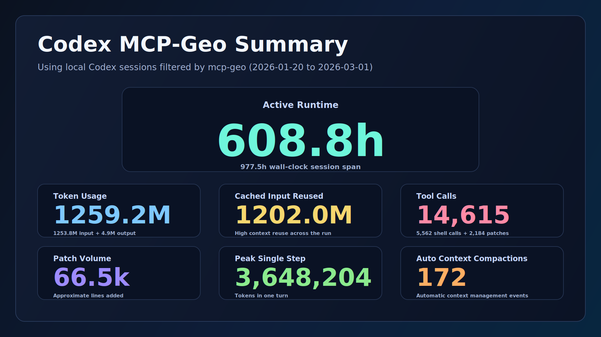

# MCP Geo Codex Session Summary

Generated: `2026-03-01T17:40:30.236411Z`
Codex home: `/Users/crpage/.codex`
Repo filter: `mcp-geo`

## Long Horizon-style Metrics

- Active runtime: `608.8h`
- Wall-clock span: `977.5h`
- Token usage: `1259.2M` (`1253.8M` input + `4.9M` output)
- Cached input reused: `1202.0M`
- Tool calls: `14,615` (`5,562` shell + `2,184` patches)
- Patch volume: `66.5k` lines (from `apply_patch` calls)
- Peak single step: `3,648,204` tokens
- Auto context compactions: `172`

## Session Coverage

- Sessions included: `54`
- Interactive sessions: `42`
- Automation sessions: `12`
- Sessions with token telemetry: `51`
- Date range: `2026-01-20T00:07:27.904000Z` to `2026-03-01T17:40:27.228000Z`

## Top Sessions by Total Tokens

- `019c80af-75c9-70e0-bfb4-d25ff484ad2d`: `316,417,023` tokens, `2026-02-21T14:51:48.553000Z` - `2026-02-23T13:47:33.071000Z`
  Prompt: Catch-up on Content and Progress as well as recent troubleshooting of mapping as we will be validating the mapping here. Pull any outstanding mapping items in the tracking files an
- `019c599d-8652-78c3-b6a6-f38c0d860f7f`: `164,591,630` tokens, `2026-02-14T00:47:01.714000Z` - `2026-02-18T10:07:42.148000Z`
  Prompt: Create branch Map-delivery-implementation and implement the workstreams in the section of PROGRESS.MD named Map delivery recommendations implementation plan (2026-02-14), tracking 
- `019c4d67-d8ba-7bc0-80d2-0c8687cdd1d4`: `80,035,193` tokens, `2026-02-11T15:52:57.274000Z` - `2026-02-12T12:06:14.860000Z`
  Prompt: I want you to plan how to complete the following tasks which are in Progress.md, tracking and committing as you go: ## Open sub-plans still incomplete: Dataset selection: expand co
- `019ca288-dc42-74b1-8dad-dbd6d6d508a3`: `78,094,415` tokens, `2026-02-28T04:36:44.229000Z` - `2026-03-01T17:33:23.880000Z`
  Prompt: I'm testing the simple map on 127.0.0.1:8000 and get this error Error: AJAXError: Too Many Requests (429): http://127.0.0.1:8000/maps/vector/vts/tile/13/2726/4097.pbf?srs=3857&key=
- `019c3526-09cb-7300-83a3-4d58d1e3b18e`: `66,917,353` tokens, `2026-02-06T22:50:11.275000Z` - `2026-02-07T19:12:21.801000Z`
  Prompt: We need to commit and sync the changes

## Method Notes

- Data source: local Codex `sessions` + `archived_sessions` JSONL records.
- Sessions are included when `session_meta.payload.cwd` contains the repo filter.
- Patch volume is estimated from added `+` lines in `apply_patch` payloads.
- Active runtime is summed per-session (`last_event_ts - first_event_ts`).
