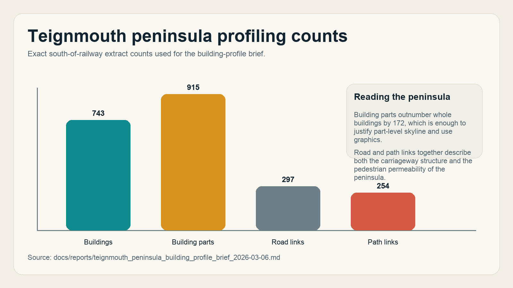
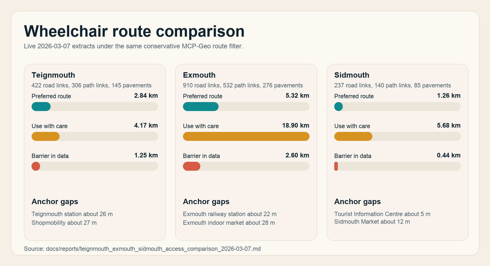
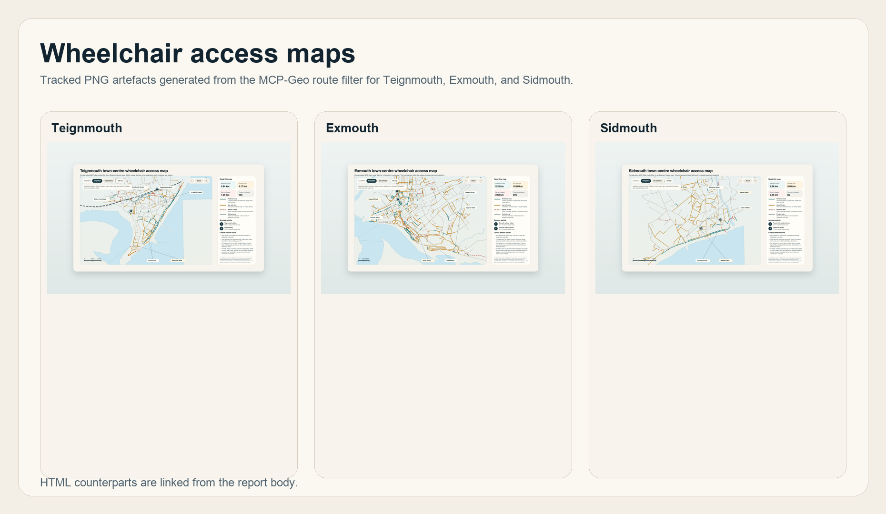

# Overview

This report packages a small set of real MCP-Geo questions asked from Codex into a reusable evaluation document for people deciding whether MCP-Geo is useful in practice.
It focuses on three patterns that matter to evaluators:

- starting from a simple address-level question and expanding into surrounding context
- defining and profiling a custom area of interest rather than only answering lookups
- producing decision-support maps that are explicit about both the evidence and the current limits

The report is generated from a curated input manifest, existing repo notes, and tracked illustration artefacts.
The public source of truth for this run is the repo on `main`:
[input manifest](https://github.com/chris-page-gov/mcp-geo/blob/main/data/report_inputs/mcp_geo_functionality_showcase_examples.json), [generator script](https://github.com/chris-page-gov/mcp-geo/blob/main/scripts/generate_mcp_geo_functionality_showcase.py), [README](https://github.com/chris-page-gov/mcp-geo/blob/main/README.md), and [tool registration module](https://github.com/chris-page-gov/mcp-geo/blob/main/server/mcp/tools.py).

# What MCP-Geo Is Demonstrating

These examples show MCP-Geo being used for more than raw API passthrough.
Across the three cases, the workflow repeatedly combines:

- identifier and address resolution
- OS road, path, pavement, and building layers
- user-framed study areas rather than fixed administrative cuts
- presentation outputs that can be read as markdown, static figures, or interactive HTML

The underlying product surface is visible in the public repository:
the top-level [README](https://github.com/chris-page-gov/mcp-geo/blob/main/README.md) describes the server and its tool families, while [server/mcp/tools.py](https://github.com/chris-page-gov/mcp-geo/blob/main/server/mcp/tools.py) shows the registered tool modules that make those workflows possible.

# Example 1: From a Random Postcode to Dual-Road Building Context

**Question asked**

`Can mcp-geo tell me the road and building details of Clampet Lane, Teignmouth TQ14 8GB?`

**Follow-up**

`Can mcp-geo show me this context, I believe the building referenced has access from both roads?`

This starts with an ordinary address-level question and expands into road geometry, building-part massing, frontage context, and map output. It is a good illustration of how MCP-Geo moves from lookup to interpretation.

- Resolved `UPRN 10032973106` to `FLAT 4, STANLEY HOUSE, CLAMPET LANE, TEIGNMOUTH, TQ14 8GB`.
- Identified `Clampet Lane` as a narrow `Local Road` with average width around `3.4 m` and `Orchard Gardens` as a broader nearby road around `7.5 m`.
- Returned building-part footprints and heights for the Stanley House cluster, including parts around `20.2 m` and `19.9 m` maximum height.
- Produced OS-backed screenshots that show the building cluster sitting between `Clampet Lane` and `Orchard Gardens`, consistent with dual-road context.

{ width=92% }

This example is useful because it shows an evaluator what "good enough for urban context" looks like in MCP-Geo.
The original query starts at postcode level, but the answer moves into road width, building-part height, frontage grouping, and OS-backed map output without leaving the same workflow.

Related artefacts:

- [Stanley House on OS MasterMap context](https://github.com/chris-page-gov/mcp-geo/blob/main/output/playwright/stanley-house-os-mastermap-context.png)
- [Stanley House focused OS Light view](https://github.com/chris-page-gov/mcp-geo/blob/main/output/playwright/stanley-house-os-light-focused.png)
- [Clampet Lane and Orchard Gardens wider context panel](https://github.com/chris-page-gov/mcp-geo/blob/main/output/playwright/stanley-house-os-light-wider-panel.png)

Online sources: [Stanley House / Clampet Lane context case note](https://github.com/chris-page-gov/mcp-geo/blob/main/docs/reports/stanley_house_clampet_lane_context_case_2026-03-07.md), [Repository overview and tool families](https://github.com/chris-page-gov/mcp-geo/blob/main/README.md), [Registered tool modules](https://github.com/chris-page-gov/mcp-geo/blob/main/server/mcp/tools.py)

# Example 2: From a Town-Centre Question to a Repeatable Profiling Brief

**Question asked**

`I’m interested in creating a profile of the buildings on the peninsula south of the railway line. Consider what data you have access to from MCP-Geo and ways this can be visualised in a series of infographics.`

**Follow-up**

`First a set of actual infographic mockups.`

This shows MCP-Geo working as a profiling and planning tool rather than only a lookup service. The answer moved from area definition to exact layer counts, analytic framing, and a reproducible infographic specification.

- Defined a reproducible south-of-railway polygon for the Teignmouth peninsula.
- Counted `743` whole buildings, `915` building parts, `297` road links, and `254` path links in the study area.
- Identified the strongest profile layers: building footprints, building parts, road links, path links, grouped address inventories, and ONS/NOMIS context layers.
- Specified a practical infographic set covering built form, skyline, street character, frontage density, use mix, permeability, and edge conditions.

{ width=88% }

The key shift here is from "tell me about this place" to "define an operational area of interest and specify the analytics pack".
That makes this example especially useful for evaluators who want to know whether MCP-Geo can support briefs, profiling exercises, and future infographic or dashboard work.

The peninsula brief records the exact live counts used in the chart above:

- buildings: `743`
- building parts: `915`
- road links: `297`
- path links: `254`

Online sources: [Teignmouth peninsula building profile brief](https://github.com/chris-page-gov/mcp-geo/blob/main/docs/reports/teignmouth_peninsula_building_profile_brief_2026-03-06.md), [Repository overview and tool families](https://github.com/chris-page-gov/mcp-geo/blob/main/README.md), [Registered tool modules](https://github.com/chris-page-gov/mcp-geo/blob/main/server/mcp/tools.py)

# Example 3: From a Wheelchair Routing Question to Comparative Town Maps

**Question asked**

`I want to use mcp-geo to create a map that shows roads that have pavements suitable for the Quantum iLevel Wheelchair.`

**Follow-up**

`Continue as suggested. Add Sidmouth.`

This case shows MCP-Geo supporting a real public-realm question: turning road width, pavement coverage, lighting, and gradient evidence into route hypotheses, then comparing towns using the same conservative filter.

- Created a route filter using road-link widths, pavement coverage, path type, elevation gain, and lighting rather than a simple nearest-path map.
- Produced both static PNG outputs and interactive HTML maps for Teignmouth, Exmouth, and Sidmouth.
- Showed meaningful differentiation across the three towns: Teignmouth as the constrained case, Exmouth as the broad positive comparator, and Sidmouth as the compact-core comparator.
- Captured product limits explicitly, including dropped-kerb, crossing, clutter, and on-the-day access gaps that MCP-Geo does not yet model.

{ width=94% }

{ width=96% }

The comparative work is especially useful for evaluation because it does not stop at a single map.
It applies one conservative route filter across three coastal towns and then makes the strengths and limits explicit.

- `Teignmouth`: preferred `2.84 km`, use with care `4.17 km`, barrier `1.25 km`; Teignmouth station about 26 m; Shopmobility about 27 m.
- `Exmouth`: preferred `5.32 km`, use with care `18.90 km`, barrier `2.60 km`; Exmouth railway station about 22 m; Exmouth indoor market about 28 m.
- `Sidmouth`: preferred `1.26 km`, use with care `5.68 km`, barrier `0.44 km`; Tourist Information Centre about 5 m; Sidmouth Market about 12 m.

Interactive and static artefacts:

- Teignmouth wheelchair access map PNG: [PNG artefact](https://github.com/chris-page-gov/mcp-geo/blob/main/output/playwright/teignmouth-wheelchair-access-map-2026-03-07.png) and [HTML map](https://github.com/chris-page-gov/mcp-geo/blob/main/docs/reports/teignmouth_wheelchair_access_map_2026-03-07.html)
- Exmouth wheelchair access map PNG: [PNG artefact](https://github.com/chris-page-gov/mcp-geo/blob/main/output/playwright/exmouth-wheelchair-access-map-2026-03-07.png) and [HTML map](https://github.com/chris-page-gov/mcp-geo/blob/main/docs/reports/exmouth_wheelchair_access_map_2026-03-07.html)
- Sidmouth wheelchair access map PNG: [PNG artefact](https://github.com/chris-page-gov/mcp-geo/blob/main/output/playwright/sidmouth-wheelchair-access-map-2026-03-07.png) and [HTML map](https://github.com/chris-page-gov/mcp-geo/blob/main/docs/reports/sidmouth_wheelchair_access_map_2026-03-07.html)
- Generated wheelchair comparison routes chart: [artefact](https://github.com/chris-page-gov/mcp-geo/blob/main/docs/reports/assets/wheelchair_route_comparison_2026-03-07.png)

Implementation note:
the underlying map-production workflow is public in [scripts/generate_teignmouth_wheelchair_access_map.py](https://github.com/chris-page-gov/mcp-geo/blob/main/scripts/generate_teignmouth_wheelchair_access_map.py).

Online sources: [Teignmouth wheelchair access map note](https://github.com/chris-page-gov/mcp-geo/blob/main/docs/reports/teignmouth_wheelchair_access_map_2026-03-07.md), [Exmouth wheelchair access map note](https://github.com/chris-page-gov/mcp-geo/blob/main/docs/reports/exmouth_wheelchair_access_map_2026-03-07.md), [Sidmouth wheelchair access map note](https://github.com/chris-page-gov/mcp-geo/blob/main/docs/reports/sidmouth_wheelchair_access_map_2026-03-07.md), [Three-town wheelchair comparison note](https://github.com/chris-page-gov/mcp-geo/blob/main/docs/reports/teignmouth_exmouth_sidmouth_access_comparison_2026-03-07.md)

# What These Examples Show About Utility

Taken together, the three cases suggest that MCP-Geo is most useful when the user is trying to move through three layers of work:

1. resolve a place, address, or route question into stable identifiers and geometry
2. combine several related spatial layers into an interpretable answer
3. turn that answer into a re-usable artefact such as a note, map, or briefing graphic

The Stanley House case shows address-to-context movement.
The peninsula case shows profiling and briefing.
The wheelchair work shows public-realm interpretation, comparative mapping, and honest treatment of product limits.

# Current Limits and Future Value

The wheelchair case is the clearest reminder that good geospatial answers are not the same thing as a final audit.
The current evidence stack is strong on road width, path type, pavement coverage, lighting, and gradient proxies, but it is weaker where access depends on dropped kerbs, crossing detail, temporary obstructions, and other on-the-ground conditions.

For evaluators, that is a strength rather than a weakness if it is stated clearly:
MCP-Geo works well as a hypothesis engine, a profiling tool, and a map/report generator.
It is not yet a replacement for doorway-level access surveys or formal public-realm audits.

# Repeatability

This report is designed to be rerun.
The content is driven by [the manifest](https://github.com/chris-page-gov/mcp-geo/blob/main/data/report_inputs/mcp_geo_functionality_showcase_examples.json) and generated by [the script](https://github.com/chris-page-gov/mcp-geo/blob/main/scripts/generate_mcp_geo_functionality_showcase.py).
By default the report links to the public `main` branch for web readability, but the generator accepts `--git-ref` so a future run can pin every citation to a release tag or commit.

Regeneration command:

```bash
./.venv/bin/python scripts/generate_mcp_geo_functionality_showcase.py --git-ref main
```

Outputs written by the generator:

- `docs/reports/mcp_geo_functionality_showcase_2026-03-07.md`
- `docs/reports/mcp_geo_functionality_showcase_2026-03-07.docx`
- `docs/reports/mcp_geo_functionality_showcase_2026-03-07.pdf`

# Repository Sources Used

- [README.md](https://github.com/chris-page-gov/mcp-geo/blob/main/README.md)
- [server/mcp/tools.py](https://github.com/chris-page-gov/mcp-geo/blob/main/server/mcp/tools.py)
- [Stanley House / Clampet Lane context case note](https://github.com/chris-page-gov/mcp-geo/blob/main/docs/reports/stanley_house_clampet_lane_context_case_2026-03-07.md)
- [Teignmouth peninsula building profile brief](https://github.com/chris-page-gov/mcp-geo/blob/main/docs/reports/teignmouth_peninsula_building_profile_brief_2026-03-06.md)
- [Teignmouth wheelchair access map note](https://github.com/chris-page-gov/mcp-geo/blob/main/docs/reports/teignmouth_wheelchair_access_map_2026-03-07.md)
- [Exmouth wheelchair access map note](https://github.com/chris-page-gov/mcp-geo/blob/main/docs/reports/exmouth_wheelchair_access_map_2026-03-07.md)
- [Sidmouth wheelchair access map note](https://github.com/chris-page-gov/mcp-geo/blob/main/docs/reports/sidmouth_wheelchair_access_map_2026-03-07.md)
- [Three-town wheelchair comparison note](https://github.com/chris-page-gov/mcp-geo/blob/main/docs/reports/teignmouth_exmouth_sidmouth_access_comparison_2026-03-07.md)
