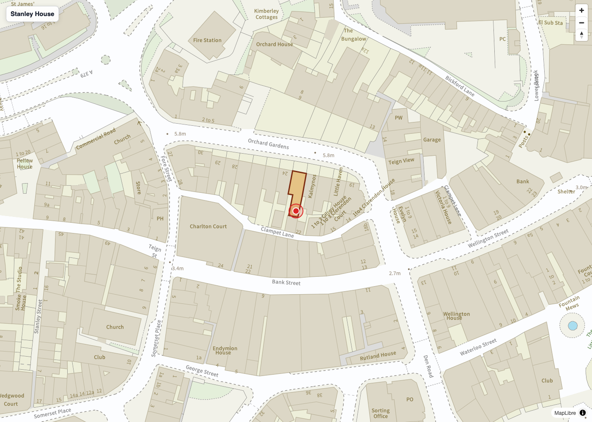
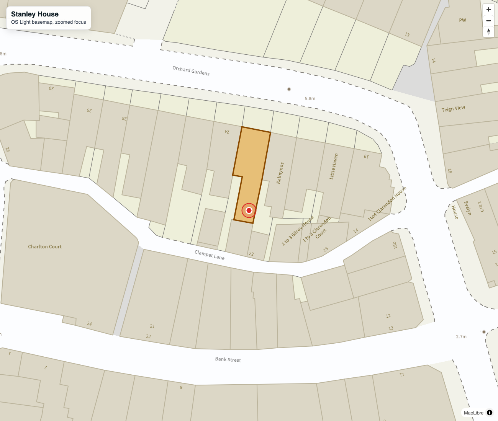
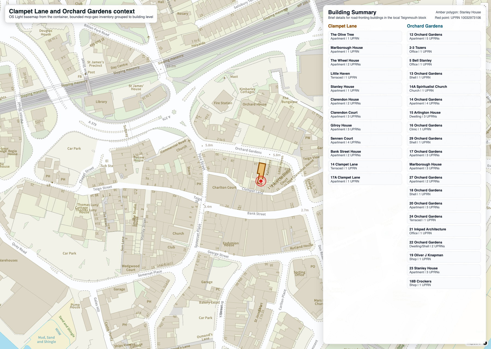

# Stanley House, Clampet Lane and Orchard Gardens context case (2026-03-07)

## Purpose

Preserve a user-led example in the public repository so it can be cited and
reused as a stable MCP-Geo case study.

The original interaction was captured in a user-provided document,
`Example use of MCP-Geo.docx`, and then paired with repo-stored screenshots.
This note records the substantive question, the main findings, and the related
artefacts inside the repository.

## Questions asked

- `Can mcp-geo tell me the road and building details of Clampet Lane, Teignmouth TQ14 8GB?`
- `Can mcp-geo show me this context, I believe the building referenced has access from both roads?`
- `The OSM map is okay but I would rather have OS MasterMap which you can get from mcp-geo.`
- `1 zooming in to focus on the amber polygon and then 3 with an information panel showing all the buildings brief details along Clampet Lane and Orchard Gardens.`

## What the example established

### Address resolution

- `UPRN 10032973106`
- `FLAT 4, STANLEY HOUSE, CLAMPET LANE, TEIGNMOUTH, TQ14 8GB`
- coordinates around `50.5465117, -3.4965064`
- classification `RD06`
- classification description `Self Contained Flat (Includes Maisonette / Apartment)`

### Road context

Nearest-link road details returned for `Clampet Lane`:

- TOID `osgb4000000025318279`
- route hierarchy `Local Road`
- road classification `Unclassified`
- description `Single Carriageway`
- directionality `Both Directions`
- operational state `Open`
- length about `63.331 m`
- average width about `3.4 m`
- minimum width about `2.6 m`
- street lighting `Mostly Unlit`

Nearby comparison road details returned for `Orchard Gardens`:

- TOID `osgb4000000025318267`
- route hierarchy `Minor Road`
- average width about `7.5 m`

### Building context

The same example returned nearby OS NGD building-part context for the Stanley
House cluster, including:

- residential accommodation and private-residence classifications
- footprint areas around `83.586 m2` and `89.664 m2`
- maximum heights around `20.2 m` and `19.9 m`
- smaller associated parts around `21.381 m2`, `32.71 m2`, and `34.5 m2`

### Interpretation

This was a strong example of MCP-Geo moving beyond a single postcode answer.
The resulting spatial context showed that the Stanley House footprint sits in
the block between `Clampet Lane` and `Orchard Gardens`, with local addressing
evidence that spans both roads.

The geometry strongly supports dual-road context and likely practical access
relationship, while still stopping short of any claim about legal access rights
or doorway-level entrance geometry.

## Repo-stored illustrations

The first OS-backed render shows the Stanley House footprint in context on the
OS vector basemap, using the amber polygon for the containing footprint and a
red marker for the resolved UPRN point.

The focused Light-style render tightens the map around the footprint so the
relationship between the building and the nearby roads is easier to read.

The wider panel view adds grouped building summaries across the Clampet Lane and
Orchard Gardens block, showing how the case can move from a single UPRN to a
road-frontage and surrounding-building narrative.

## Why this example matters

This is a good entry-point example for evaluators because it shows that MCP-Geo
can combine:

- address lookup
- UPRN context
- road-link detail
- building-part detail
- OS basemap-backed presentation

In practice, that means a simple postcode question can become a short urban
context study without leaving the MCP-Geo workflow.
