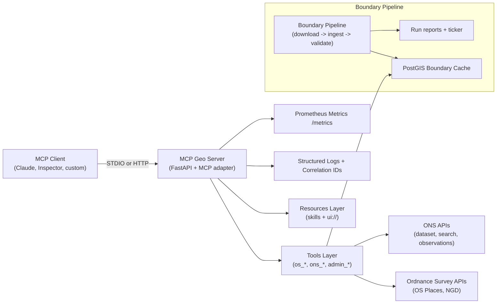
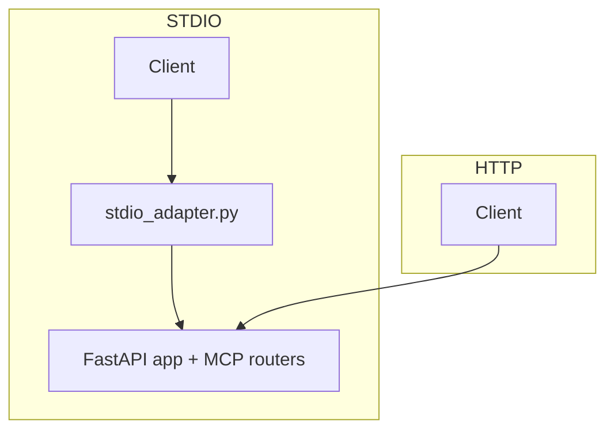

# System Architecture

## High-level architecture

## Transport architecture

## Core components

- **FastAPI server**: core HTTP endpoints, routing, rate limiting, metrics.
- **MCP routers**: `/tools/*`, `/resources/*`, `/prompts/*`, `/mcp`.
- **Tools layer**: OS + ONS + admin lookup tools with schema metadata.
- **Boundary cache**: PostGIS-backed admin boundaries cache, served by admin tools.
- **MCP-Apps UI**: HTML resources delivered by `resources/read`.

## Optional map sidecar profile

For higher-throughput vector delivery, MCP Geo can run with optional sidecars:

- Martin (vector tiles from PostGIS)
- pg_tileserv (table/function tile endpoints)

This profile is additive and must not replace the baseline compatibility path
(`os_maps.render` plus fallback skeleton contracts).

Reference runbook: `docs/sidecar_profile.md`
