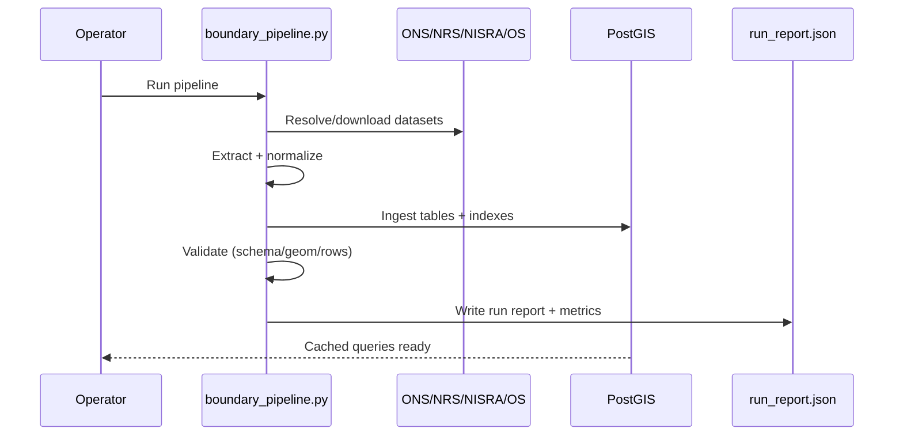
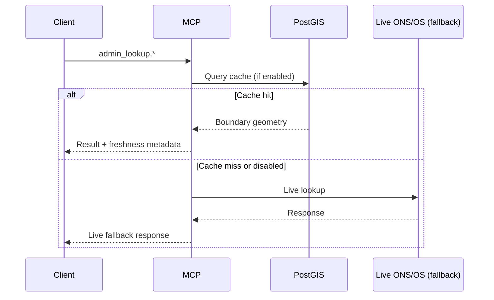

# Data Flow and Cache Pipeline

## Admin boundary cache pipeline

## Cache read flow (admin_lookup)

## ONS codes caching

- `ons_codes.list` and `ons_codes.options` optionally cache results on disk
  (`ONS_DATASET_CACHE_ENABLED=true`).
- All ONS tools require live mode enabled (`ONS_LIVE_ENABLED=true`).

## Cache freshness

- Boundary cache status exposes freshness (`fresh`, `ageDays`) per dataset.
- `BOUNDARY_CACHE_MAX_AGE_DAYS` controls cache staleness evaluation.

