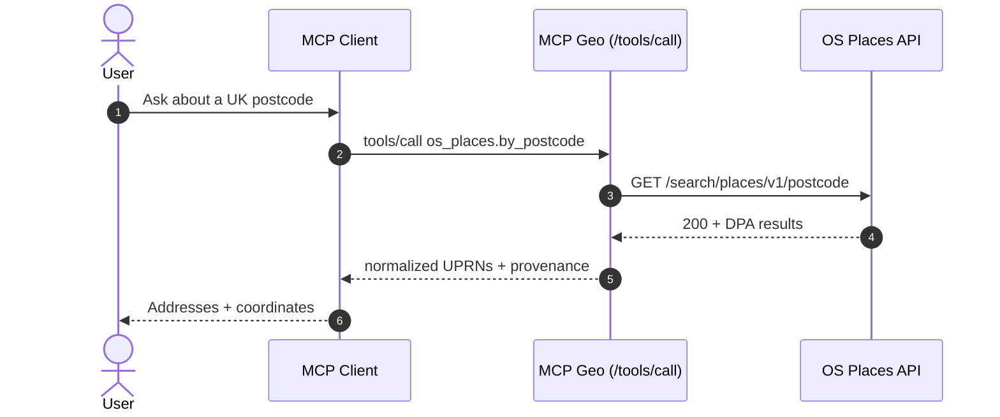
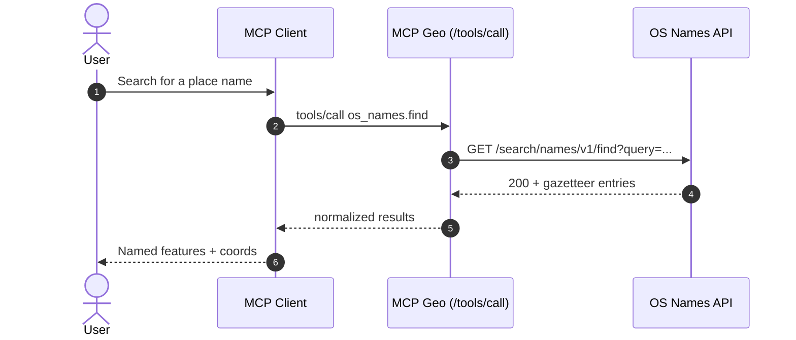
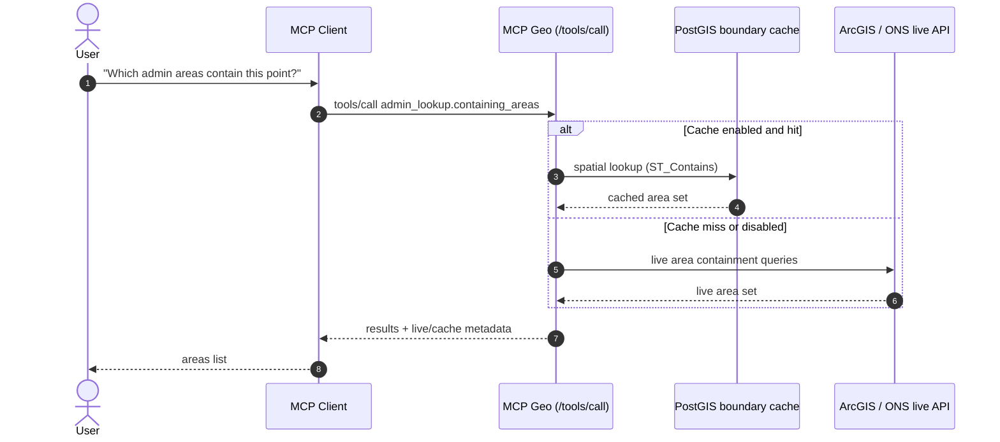
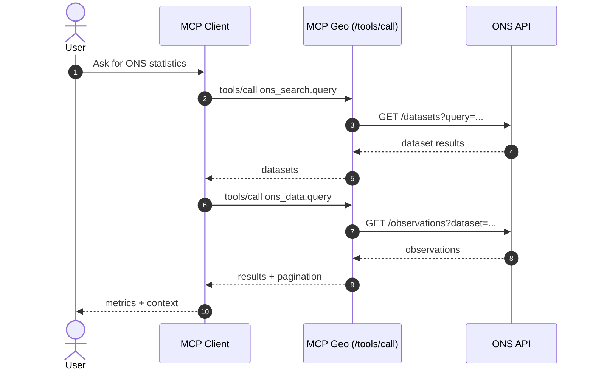
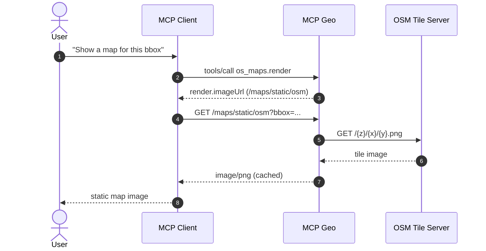
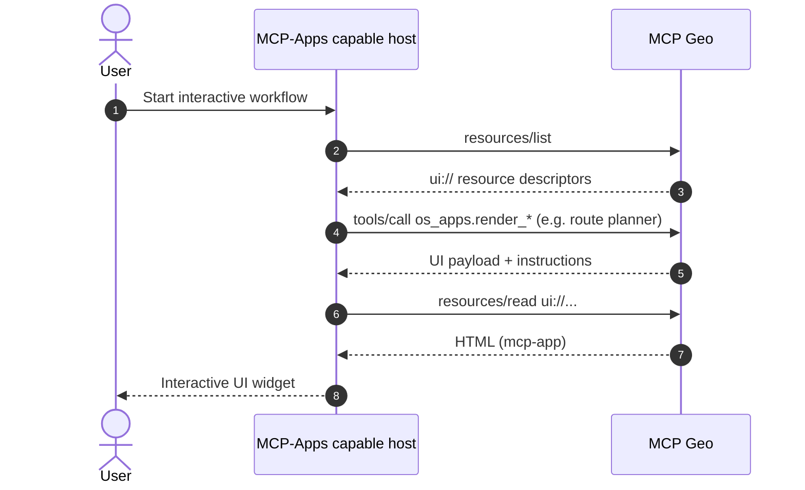
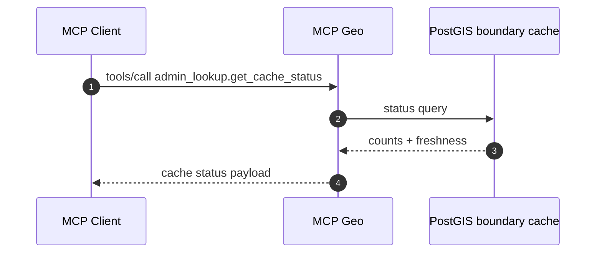

# Sequence Diagrams (Critical Tool Workflows)

This section provides sequence diagrams for the critical end-to-end flows. Diagrams are
expressed in Mermaid so they can render in Markdown-aware viewers.

## 1) Postcode lookup (os_places.by_postcode)

## 2) Place name search (os_names.find)

## 3) Admin containment lookup (admin_lookup.containing_areas)

## 4) ONS dataset discovery + query (ons_search.query, ons_data.query)

## 5) Static map render (os_maps.render -> /maps/static/osm)

## 6) MCP-Apps UI open (ui:// resources)

## 7) Boundary cache status (admin_lookup.get_cache_status)

