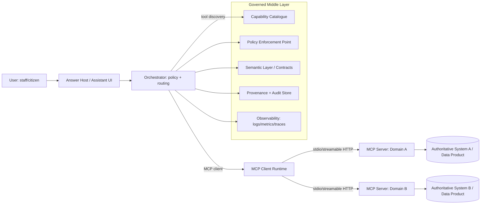
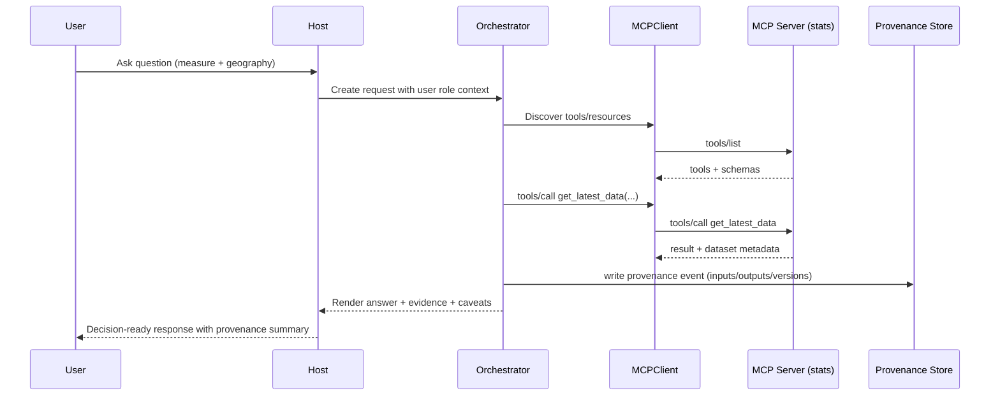

# From Apps to Answers: Connecting Public Sector Data to AI with MCP

## D1 - Full report

### Step A - Seed brief parsing, mapping, and claims-to-validate

#### Confirmed facts
The request specifies that a draft brief ("From Apps to Answers...") is the seed document and that the report must extract its definitions, major claims, and research questions, including an "MCP-Geo / peatland survey episode" case study framing. 

No seed brief file is accessible in the current chat workspace (no retrievable attachment was available via the file interface), so this report cannot quote, validate, or structurally mirror that unseen draft at the level requested. (This is a hard constraint on what can be "confirmed" from the seed.)

To avoid stalling, the report uses (a) the user's prompt as the only visible "seed text", and (b) a closely aligned, recently published public-sector artefact that explicitly discusses MCP and "middle layer" concepts (the 19 January 2026 guidance on making government datasets ready for AI). [1]

#### Analysis and inference
Because the original seed brief is unavailable, the "Apps -> Answers" thesis, "governed middle layer" responsibilities, and MCP-Geo episode must be reconstructed from the prompt and triangulated against public sources. This introduces a systematic risk: the report may deviate from the seed's intended scope, terminology, and emphasis. 

To mitigate, the report treats the following as the reconstructed seed-hypothesis (explicitly derived from the user prompt), and then validates or refines each theme using evidence:

- **Apps -> Answers thesis (reconstructed):** shift public-sector digital delivery from task-centric UIs ("apps") to answer-centric interactions ("answers"), where LLM systems can query governed services and assemble decision-ready outputs.
- **Middle layer responsibilities (reconstructed):** capability discovery, semantic alignment, permissions/policy, provenance/auditability, and operational controls (latency/cost/reliability/degradation).
- **MCP role (reconstructed):** standardise tool/capability exposure and discovery so agentic systems can securely access authoritative data/services.
- **Case study (reconstructed):** a geospatial workflow (peatland survey) fails due to discovery/semantics/boundaries/operations/provenance issues; MCP-Geo is a concrete example for grounding failure modes.

#### Recommendations and opinions
To fully satisfy the "must-use seed brief" requirement, the draft brief should be provided in a retrievable form (file upload or pasted text). Until then, treat this report as: **a best-effort, evidence-backed expansion around the prompt's hypothesis**, rather than a definitive commentary on the unseen draft.

---

### Executive summary

#### Confirmed facts
Public-sector AI adoption is increasingly constrained by **data quality, metadata, governance, and interoperability**, not just model capability. The January 2026 government guidance on dataset readiness frames AI effectiveness and legitimacy as "fundamentally constrained" by the quality/structure/governance of underlying data and highlights that siloed datasets and insufficient metadata hinder reuse. [1] 

The same guidance explicitly identifies **Model Context Protocol (MCP)** and **GraphQL** as access-layer protocols that can support "agentic, single record access," positioning MCP as part of modern interoperability approaches. [1] 

MCP is an open protocol introduced in late 2024 to enable secure, two-way connections between AI applications and external tools/data sources, with an architecture where providers expose capabilities through MCP servers and AI applications act as MCP clients. [2] 

In mid-2025, a major AI platform provider announced support for **remote MCP servers** in its agent-building API surface, indicating ecosystem-level adoption signals beyond early experimentation. [3] 

MCP has a formal specification with dated revisions; the 2025-06-18 revision defines JSON-RPC messaging and standard transports including stdio and "Streamable HTTP." [4] The 2025-11-25 revision changelog records major updates including enhanced authorisation discovery, incremental consent, and experimental "tasks" for deferred result retrieval. [5]

#### Analysis and inference
"Apps -> Answers" is best understood as a **delivery model shift** rather than "add a chatbot". The shift is from:
- **UI-first consumption** (citizens/staff navigate a service, filter dashboards, interpret charts) 
to
- **answer-first consumption** (users ask; systems fetch authoritative evidence, compute, and return decision-ready outputs with provenance).

This shift increases risk unless a **governed middle layer** exists. In practice, "answers" must be assembled from multiple systems with mixed sensitivity, ambiguous semantics, and operational constraints. The middle layer therefore becomes the delivery-critical locus for: (1) discovery, (2) meaning, (3) permissions, (4) provenance/audit, (5) operational behaviour.

MCP can be a useful building block for the middle layer, but it is not sufficient by itself: MCP standardises "how an agent calls" rather than "what it should mean" or "what it is allowed to do". The hard part remains semantic contracts, policy enforcement, and audit-grade traceability.

#### Recommendations and opinions
Decision-makers can use this report to choose:
- whether to pursue an "answers-first" strategy now,
- what to govern (and how) before scaling,
- how MCP fits with existing API and data platform investments,
- how to pilot safely with measurable acceptance tests.

---

### Step B - Background and lineage

#### Confirmed facts
**Natural language interfaces to data** have a long lineage that includes:
- **NL-to-SQL / text-to-SQL** research aimed at translating natural language questions into executable queries, motivated by lowering barriers to database access. Foundational datasets include WikiSQL (released with Seq2SQL) and Spider for cross-domain, complex SQL generalisation. [6] 
- Recent surveys document an acceleration of LLM-based text-to-SQL approaches and the persistent challenges in schema linking, ambiguity, and evaluation. [7] 

**Conversational retrieval and "RAG"** systems combine parametric language models with external retrieval over document corpora to improve factuality and support updatability; RAG was formalised as an architecture combining a generator with a retriever over an external index. [8] 

**Agentic tool use** has been formalised in research patterns such as:
- interleaving reasoning and actions (ReAct), where models call external tools/APIs to reduce hallucination and improve interpretability. [9] 
- training models to decide when/how to call tools (Toolformer). [10] 

**Semantic layers** aim to centralise definitions of metrics/dimensions so multiple consumers receive consistent meaning (for example, Looker's LookML modelling language and dbt's Semantic Layer). [11] 

**Metadata catalogues and interoperability** in public-sector contexts are supported by standards such as:
- **DCAT** (Data Catalog Vocabulary), a W3C recommendation designed to improve interoperability across data catalogues. [12] 
- UK cross-government guidance recommends DCAT for describing data assets in catalogues and notes its role in enabling consistent metadata practices. [13] 

**Provenance** has standardised models such as **W3C PROV-DM**, defining core provenance concepts (entities, activities, agents) and relations. [14] 

Public-sector technology delivery in the UK already expects:
- use of open standards (Technology Code of Practice), [15] 
- API standards including security requirements (e.g., TLS 1.2+ for APIs), [16] 
- consistent identifiers for key reference data (e.g., UPRN/USRN for property and street information). [17] 

#### Analysis and inference
The lineage shows a repeating pattern: each wave of "natural language access" succeeds only when it **binds language to stable semantics and governed interfaces**. 

- NL-to-SQL works for narrow, well-modelled schemas but fails under ambiguity and organisational entropy (changing definitions, undocumented joins, hidden business rules). This is why semantic layers emerged: they reduce "semantic drift" by centralising meaning. 
- RAG improves grounding on documents, but it is often weak on *operational* questions ("what is the latest value?", "what is the authoritative record?", "what is the policy-compliant answer?") unless RAG is paired with tools/APIs. 
- Tool-augmented agents increase capability but expand attack surface and governance requirements (prompt injection, permission escalation, data exfiltration), which the security community increasingly treats as a first-order concern. [18] 

Therefore, "Apps -> Answers" is less a novelty and more a **convergence**: NL interfaces + semantic layers + tool use + provenance + operational controls, reassembled for LLM-era interaction patterns.

#### Recommendations and opinions
A public-sector "answers-first" programme should treat the historical failures of NL interfaces as design requirements:
- invest early in semantics and provenance (not just chat UX),
- constrain scope to bounded question classes,
- require auditability and degradation plans as entry criteria for scale.

---

### Apps -> Answers model

#### Confirmed facts
A recent cross-government guidance document frames AI readiness as an end-to-end organisational capability and explicitly describes cases where a "middle layer" is needed to ensure information remains aligned with official sources; it gives an example where updating policies without synchronisation risks loss of trust and accountability. [19] 

Data.gov.uk provides machine-readable dataset metadata via an API, illustrating that "catalogue-style access to metadata" is already a public-sector pattern (even if not uniformly adopted across all domains). [20] 

#### Analysis and inference
**Definition (operational):** 
"Apps -> Answers" is a delivery model in which staff/citizens receive **decision-ready answers** produced by an LLM system that is *required* to (a) discover authoritative capabilities, (b) call governed tools/services, and (c) return outputs with provenance, uncertainty, and policy-compliant constraints - rather than relying on free-form generation.

**Boundaries - what it is / is not**
- It **is**: an orchestration pattern for evidence-backed responses that treat data/services as first-class "answer components" (retrieval, query, compute, validate, cite). 
- It **is not**: a generic chatbot UI "on top of databases" with ad hoc prompt templates and direct database access. That approach typically fails on semantics, permissions, auditability, and operational resilience.

**Why it matters in public-sector terms**
- It can reduce time-to-insight for routine analytical and operational questions, but only if answers remain **defensible**: traceable inputs, known policy basis, and documented limitations. 
- It changes assurance posture: the system becomes a mediated decision-support layer; without strong provenance and controls, it can amplify misunderstanding (especially where "authoritative tone" masks uncertainty).

#### Recommendations and opinions
Adopt "Apps -> Answers" only where:
- the underlying data products have owners, quality metrics, and stable interfaces,
- a policy enforcement mechanism exists between model and data,
- provenance is recorded to a standard suitable for audit and FOI-adjacent scrutiny.

---

### The governed middle layer

#### Confirmed facts
The MCP specification defines mechanisms for servers to expose:
- **Tools** (invokable functions with schemas), [21] 
- **Resources** (data/context identifiable by URI), [22] 
- **Prompts** (prompt templates retrievable and parameterisable by clients). [23] 

The specification also defines **roots** (client-exposed filesystem boundaries) and **sampling** (server requests for model generation mediated by clients). [24] 

It includes explicit security guidance for tools (input validation, access controls, rate limiting, sanitisation) and client guidance such as confirmations for sensitive operations and audit logging. [25] 

The 2026 dataset readiness guidance emphasises interoperability, metadata, governance authority, and executive risk ownership as core to AI readiness, not just technical dataset properties. [26] 

#### Analysis and inference
The "middle layer" should be treated as a **product** (not a glue script). In public-sector delivery terms, it is the layer where you can actually enforce "responsible answers" because it is where you can:
- enumerate what is callable,
- define what it means,
- enforce who can access it,
- log what happened,
- shape operational behaviour.

##### Definitions table (required)

| Term (from prompt) | Nearest standards / academic terminology | Typical misunderstandings | Delivery implications |
|---|---|---|---|
| Apps -> Answers | Conversational decision support; NL interface + tool-based grounding; "assistant as orchestrator" (agentic workflows) [27] | Mistaken for "chat UI on top of data" | Requires governed interfaces, provenance, and operational controls; otherwise increases risk of plausible but wrong outputs |
| Middle layer | Semantic layer + policy enforcement point + service registry/capability catalogue (composite) [28] | Assumed to be "just an API gateway" | Must integrate semantics, authorisation, and audit-grade logging, not merely routing |
| Capability catalogue | Service registry; DCAT-described data services; federated API discovery patterns [29] | Treated as static documentation | Must be machine-readable and kept current; drives tool discovery and safe defaults |
| Guardrails | Safety controls; policy constraints; "secure-by-design" lifecycle controls [30] | Confused with model refusals alone | Must include hard technical controls (authZ, rate limits, data minimisation), not just prompting |
| Provenance | W3C PROV; lineage frameworks (OpenLineage) [31] | Reduced to "citations" | Needs structured event capture (inputs, transforms, versions, permissions, timestamps) suitable for audit |
| Semantic mismatch | Schema/ontology misalignment; metric definition drift; context loss across datasets [32] | Blamed on "hallucination" alone | Must be addressed via semantic contracts, documented metrics, and disambiguation flows |

##### Responsibilities, checklists, failure modes, and tests (required)

The table below is written as "acceptance criteria for the middle layer" (each criterion should be testable).

| Responsibility | Checklist (what "good" looks like) | Common failure modes | Tests / acceptance criteria |
|---|---|---|---|
| Discovery & catalogues | Machine-readable catalogue entries for each capability; owner; purpose; input/output schema; data classifications; freshness; SLOs; deprecation policy; contact route [29] | Missing/obsolete catalogue entries; shadow tools; duplicated capabilities; agents calling wrong tool | "Tool inventory completeness" test: 100% of production tools listed; "staleness" checks (e.g., last verified < 30 days) |
| Semantics / meaning alignment | Central definitions for key metrics/dimensions; explicit units; spatial reference systems; canonical identifiers; disambiguation prompts; versioning of definitions [33] | Metric drift; unit confusion; CRS mismatch; ambiguous entity resolution | Golden question suite: same question across channels yields same numeric result; unit tests for transformations; CRS round-trip tests |
| Permissions & policy | Strong authN/authZ; least privilege scopes; policy-based access rules; separation of duties; runtime enforcement (not just documentation) [34] | Over-broad tools; permission escalation; data exfiltration via tool parameters; "confused deputy" agent patterns | Red-team tool calls: attempted exfiltration rejected; policy regression tests for each role; audit of denied actions |
| Provenance & auditability | Record tool calls, inputs, outputs (hashed where needed), dataset versions, schema versions, and decision rationale; structured provenance model (e.g., PROV concepts) [35] | "Answer without evidence"; missing lineage; cannot reproduce; FOI/complaint response cannot explain | Reproducibility test: re-run query with same versions yields same result; provenance completeness check > 95% required fields |
| Operations (latency, cost, reliability, degradation) | Payload budgets; caching; pagination; timeouts; retries with backoff; circuit breakers; graceful degradation modes; monitoring and alerting [36] | Tool timeouts cause partial answers; cost blow-outs; runaway tool loops; brittle dependencies | Load tests; chaos tests; cost budgets enforced; "degraded mode" demo: answers still safe, with clear caveats |

##### Operational behaviour (required)

**Confirmed facts**
- MCP defines standard transports and mandates JSON-RPC messaging. [37] 
- The tool specification includes explicit requirements for validation, access controls, rate limiting, and logging for audit purposes. [25] 
- The 2025-11-25 changelog adds experimental "tasks" for deferred result retrieval and polling, directly relevant to long-running queries and payload management. [5] 

**Analysis and inference**
Operational behaviour should be designed as "answer shaping", not just platform plumbing:

- **Payload budgets:** 
 - Do not return entire datasets or large geometry payloads into the model context. 
 - Prefer summary + resource handles (URIs) + citations to authoritative items. 
 - Use deferred results ("tasks") or resource endpoints for large outputs.

- **Progressive disclosure defaults:** 
 - Default response = minimal sufficient evidence + a short explanation + how to drill down. 
 - Require explicit user intent (or role) before expanding scope (e.g., "show full record list").

- **Resource-backed results handling:** 
 - Treat large outputs as resources retrievable via URI, not as inline tokens. MCP resources are explicitly designed for "files, schemas, application-specific information" identified by a URI. [22] 

- **Retries / degradation:** 
 - If a dependency fails, return a safe partial answer with provenance of what worked, what failed, and what evidence is missing. 
 - Degradation is not "guessing": it is "refusing to assert beyond evidence".

- **Monitoring / alerting:** 
 - Monitor tool error rates, latency, and unusual call patterns (potential prompt injection or tool-looping). OWASP identifies prompt injection as a top LLM risk category, reinforcing the need to treat tool-integrated agents as security-sensitive. [18] 

**Recommendations and opinions**
Adopt a "production readiness gate" for any capability exposed to an answers-layer:
- SLOs declared and met,
- cost budget defined and enforced,
- degradation mode demonstrated,
- provenance completeness tested.

---

### MCP in this picture

#### Confirmed facts
MCP is an open protocol intended to standardise integration between LLM applications and external data sources/tools. [38] 

MCP uses **JSON-RPC** for messages and defines standard transports including **stdio** and **Streamable HTTP**. [37] 

MCP provides core primitives:
- **Tools** (server-exposed invocable functions), [21] 
- **Resources** (server-exposed data/context by URI), [22] 
- **Prompts** (server-exposed prompt templates). [23] 

It defines a connection lifecycle that includes capability negotiation and session control. [39] 

The 2025-11-25 "Key Changes" record shows evolution towards stronger authorisation discovery (OpenID Connect Discovery support), incremental consent, and experimental durable tasks. [5] 

#### Analysis and inference
##### What MCP is (and is not)
- **MCP is:** a standard protocol layer for exposing capabilities (tools/resources/prompts) to AI hosts/clients with consistent discovery and invocation semantics. 
- **MCP is not:** a semantic layer. It does not, by itself, guarantee that two datasets share definitions or that a tool implements business rules correctly. 
- **MCP is not:** a replacement for strong authorisation, identity, and policy frameworks. It can integrate with them, but governance must be designed.

##### Where MCP sits relative to adjacent approaches
- **APIs / OpenAPI:** OpenAPI describes HTTP APIs in a machine-readable way so humans and computers can discover and understand service capabilities. [40] MCP can wrap APIs behind a protocol designed for agent interaction. 
- **GraphQL:** GraphQL is a query language and execution model that exposes a typed schema; it is commonly used to let clients request precisely shaped data. [41] MCP is not a query language; it is a tool/resource invocation protocol. 
- **RAG pipelines:** RAG improves grounding by retrieving documents into context; MCP enables calling tools/services for retrieval and computation. [42] 
- **Function calling:** MCP resembles a cross-application generalisation of tool/function calling: tool schemas and calls are explicit, but MCP adds standardised discovery and multi-server composition. The announcement of remote MCP server support in a major agent API suggests MCP is being treated as a first-class external tool interface. [3] 
- **Service registries:** MCP servers effectively become "agent-facing service endpoints"; you still need organisational governance to avoid a sprawl of orphaned connectors - similar to historical API catalogue problems noted in government API discovery work. [43] 
- **Data products / data mesh:** data mesh principles emphasise data as a product and federated computational governance. [44] MCP can be one delivery surface for "data products", but only if ownership, contracts, and governance exist.

##### What MCP enables in practice
- **Capability exposure and discovery:** the ability for a client to enumerate tools/resources/prompts and call them in a standard way. [45] 
- **Auditing hooks:** tool call logging is explicitly recommended/required in MCP tool security considerations. [25] 
- **Composability:** multiple MCP servers can be combined by a host; the practical effect is to reduce the NxM integration problem (many models x many tools) to more manageable patterns (hosts talk MCP; systems expose MCP). This is widely argued in secondary sources, but the primary evidence is the proliferation of MCP SDKs and servers plus platform support signals. [46] 

#### Recommendations and opinions
For a public-sector "middle layer":
- Use MCP as a **standard connector protocol**, but require that any MCP server:
 - has an owner and service level objectives,
 - exposes semantic metadata (units, definitions, dataset versions) via resources,
 - implements policy enforcement outside the model prompt,
 - emits audit-grade logs by default.

---

### Case study deep dive - MCP-Geo and a peatland survey episode

#### Confirmed facts
An open-source MCP server named "MCP-Geo" exists and exposes geocoding tools such as `geocode_location`, `reverse_geocode`, and `geocode_with_details` (including bounding boxes where supported), with rate limiting and error handling described in its documentation. [47] 

A publicly described peatland data environment in Scotland includes:
- a consolidated spatial dataset of peat depth measurements collected during peat depth surveys as part of a peatland restoration programme (2013 - 2023), and published via data.gov.uk links in multiple formats (GeoJSON, GML, GeoPackage, Shapefile) and via OGC services. [48] 
- a mapping portal (ArcGIS Online-based) that allows viewing and downloading programme spatial data, including peat depth and condition survey data. [49] 
- survey method guidance describing field collection expectations and the use of GPS and a 100m grid approach in older guidance. [50] 

#### Analysis and inference (reconstructed narrative)
Because the original "peatland survey episode" seed narrative is not available, the following is a **decision-relevant reconstruction** consistent with the above artefacts and common failure patterns in agentic geospatial workflows:

##### Decision context
A policy or programme user asks an answers-layer assistant something like:
> "For a proposed restoration area near *[place name]*, what peat depth evidence exists, what condition signals are recorded, and what does that imply for prioritisation?"

The assistant must:
1. resolve a location from a human description,
2. identify the relevant peat dataset/service,
3. retrieve the correct features/records at the right resolution and coordinate system,
4. summarise results with caveats (survey resolution, sampling grid),
5. provide provenance linking back to the official dataset/service and method guidance.

##### Failure taxonomy (required)
The MCP-Geo + peatland context naturally triggers the following failure classes:

1. **Discovery failure**
 - Symptom: agent uses a generic geocoder but fails to discover the authoritative peat dataset/service endpoints (or chooses an unrelated peat document). 
 - Risk: answer references the wrong dataset or none at all. 
 - Mitigation: capability catalogue that lists "peat depth dataset lookup" as a first-class capability with documented endpoints and data limits; avoid "search the web" as the default for authoritative data.

2. **Semantic mismatch**
 - Symptom: peat depth values misinterpreted (units, meaning of "depth" measurement context); survey grid resolution ignored, leading to false precision. 
 - Risk: incorrect prioritisation or misleading quantified impact claims. 
 - Mitigation: semantic metadata as a resource: unit definitions, sampling method, spatial resolution (notably the dataset summary indicates 100m resolution), and validity caveats. [51] 

3. **Boundary / CRS mismatch (geospatial-specific)**
 - Symptom: combining GeoJSON in EPSG:4326 with other layers in EPSG:27700 without transformation; bounding box misconstrued as area boundary; "near X" interpreted as wrong locality (geocoding ambiguity). 
 - Risk: wrong area queried; apparent absence/presence of peat becomes artefact of CRS/extent mismatch. 
 - Mitigation: require CRS declaration at every boundary; prefer authoritative identifiers (e.g., administrative codes, parcel IDs) where available; constrain geocoding to user-confirmed disambiguation when ambiguity is high.

4. **Reliability / operational failure**
 - Symptom: geocoding rate limits or timeouts; OGC service temporarily unavailable; agent times out and "fills in" an answer. 
 - Risk: invented outputs presented as evidence-based. 
 - Mitigation: degradation mode = "cannot confirm" + provide links to sources that were reachable; use deferred tasks for long queries (aligning with MCP "tasks" evolution). [52] 

5. **Provenance gaps**
 - Symptom: assistant provides a summary but cannot point to the exact dataset, date, layer, and method used. 
 - Risk: answer is not defensible. 
 - Mitigation: provenance capture aligned to PROV concepts: identify datasets (entities), tool calls/transforms (activities), and responsible systems/users (agents). [35] 

##### Testable requirements extracted for "answers-first" services (required)
These are written as requirements suitable for acceptance testing.

- **R1 (Authoritative discovery):** The system must retrieve peat depth/condition evidence only from catalogued authoritative endpoints; if the authoritative service is unavailable, it must state this and not substitute unverified sources.
- **R2 (Disambiguation):** If a place name geocodes to multiple plausible locations, the system must request disambiguation (or apply a pre-approved rule, e.g., restrict to a programme geography).
- **R3 (CRS correctness):** Any query combining layers must declare CRS for each layer and prove transformation consistency (unit tests with known control points).
- **R4 (Resolution caveats):** Answers must explicitly state survey resolution and what it implies (e.g., cannot infer fine-grained peat depth at sub-grid scale), derived from dataset/guidance metadata. [51] 
- **R5 (Provenance record):** Every answer must include a machine-readable provenance record linking tool calls and dataset versions (minimum fields: dataset IDs/URLs, retrieval time, parameters, role/policy context).
- **R6 (Operational budgets):** Tool calls must enforce rate limits and timeouts; large result sets must be returned as resources/handles, not inline.

#### Recommendations and opinions
Treat geospatial "answers" as high-risk for silent failure because CRS, boundaries, and resolution errors produce plausible but incorrect outputs. Pilot geospatial answers only after:
- CRS and boundary validation is automated,
- semantic metadata is mandatory,
- provenance is captured and reviewable.

---

### Step D - Current work and ecosystem scan

#### Confirmed facts
The UK has recently published guidance on preparing government datasets for AI applications and explicitly discusses MCP as an access-layer protocol for agentic interoperability. [1] 

The UK has published an AI Playbook to guide safe, effective, secure AI use across government, noting it follows the earlier generative AI framework approach. [53] 

The UK operates an Algorithmic Transparency Recording Standard (ATRS) with guidance for public-sector bodies, intended to enable publication of information about algorithmic tools and why they are used. [54] 

A federated model for API discovery in government has been discussed publicly, highlighting the limitations of a single central catalogue and acknowledging that not all APIs can be public for security/commercial reasons. [43] 

Open-source MCP servers targeting UK public data exist:
- a parliamentary data MCP server mapping to parliamentary APIs and adding semantic search capability via a vector database. [55] 
- a server providing MCP access to a UK statistics beta API, with tools for listing datasets and retrieving observations. [56] 

Internationally, a major development institution has published a programme-level argument for "AI-ready data" and explicitly cites MCP as an AI interoperability standard, including building an MCP server to support a data platform. [57] 

Several governments maintain strong AI governance/assurance artefacts:
- a Canadian mandatory algorithmic impact assessment tool supporting an automated decision-making directive. [58] 
- an Australian government technical standard for AI use covering lifecycle practices. [59] 
- a Singaporean model governance framework for AI and a separate AI governance testing framework/toolkit (AI Verify). [60] 

A cross-organisational interoperability platform, X-Road, is described as open-source software providing secure data exchange between organisations, widely associated with digital government ecosystems. [61] 

#### Analysis and inference
##### Landscape map (organisations -> what -> maturity -> evidence)

The table below prioritises "evidence of work underway" (recent dated sources or maintained repositories). "Maturity" is assessed from the evidence (production/prototype signals, documentation scope, operational claims).

| Organisation | What they are doing now (relevant to Apps -> Answers + governed middle layer) | Maturity (inferred) | Evidence |
|---|---|---|---|
| Government Digital Service | Publishes cross-government AI guidance (AI Playbook) and supports standards for transparency and metadata; contributes to government-wide practice shaping | Policy/guidance at scale | [62] |
| Department for Science, Innovation and Technology | Publishes "datasets ready for AI" guidance that explicitly references MCP and "middle layer" patterns; frames AI readiness as organisational capability | Guidance; indicates programme-level direction | [1] |
| Information Commissioner's Office | Maintains guidance on AI and data protection (UK GDPR-aligned), including fairness and accuracy considerations | Ongoing regulator guidance | [63] |
| National Cyber Security Centre | Publishes secure AI system development guidelines and broader AI/cyber guidance; informs guardrails for tool-integrated systems | Ongoing security guidance | [64] |
| Office for National Statistics | Data APIs exist; community MCP implementation indicates agent-access patterns emerging around official stats access | Prototype/open-source connector (unofficial) | [56] |
| UK Parliament | Developer APIs exist; MCP implementation adds semantic search and tool access for parliamentary research workflows | Prototype/open-source connector | [55] |
| World Bank | Publicly advocates "AI-ready data" and explicitly pilots MCP server development for a data platform (Data360) | Active pilot | [57] |
| Canada | Operates a mandatory Algorithmic Impact Assessment tool for automated decision systems | Mature governance tool | [58] |
| Australia | Publishes a technical standard for AI use across lifecycle stages, including performance testing criteria | Mature lifecycle standard | [65] |
| Singapore | Maintains model AI governance guidance and runs an AI governance testing framework/toolkit | Mature governance artefacts | [66] |
| Estonia | Operates an interoperability/data exchange layer model associated with cross-organisational data sharing (X-Road ecosystem) | Mature national pattern | [67] |
| Anthropic | Originated MCP and maintains evolving spec, security guidance, and governance process artefacts | Standard-setting + ecosystem building | [68] |
| OpenAI | Ships agent-building APIs with support for remote MCP servers, signalling mainstream platform adoption | Production platform support | [3] |
| Microsoft | Publishes developer guidance for MCP integration (.NET) and open educational content | Tooling enablement | [69] |

##### What this implies for "Apps -> Answers"
Across jurisdictions, the most robust "answers-first" trajectory appears to be:
1. **governance artefacts** (standards, playbooks, impact assessments) become mandatory or expected,
2. **catalogue and metadata standards** mature (DCAT, API catalogues),
3. **protocol-level interoperability** (MCP, GraphQL, OGC APIs) becomes a practical enabler,
4. **domain-specific connectors** (stats, Parliament, geospatial) emerge as pilots.

The UK signal in early 2026 is that "data readiness + interoperability protocols + governance" is being treated as foundational (not optional), consistent with the new datasets-ready-for-AI guidance. [1]

#### Recommendations and opinions
For UK public-sector delivery, the fastest credible path is to:
- standardise the "middle layer" responsibilities (catalogue, semantics, policy, provenance, operations),
- treat MCP servers as deployable "data product interfaces" only when they satisfy entry criteria (owner, SLO, provenance),
- prioritise domains with mature identifiers and standards first (official statistics, parliamentary records, geospatial reference datasets), because semantics and boundaries are more governable.

---

### Step E - Reference architecture, governance, metrics, staged adoption, and pilot plan

#### Confirmed facts
UK government technology practice expects open standards and secure API operation (including TLS guidance). [70] 

Geospatial APIs have modern interoperability standards such as OGC API - Features, which provide fine-grained feature-level access rather than whole dataset downloads. [71] 

MCP includes explicit guidance for tool input validation, access controls, rate limiting, timeouts, and audit logging. [25] 

Public-sector AI governance includes transparency mechanisms (ATRS) and guidance frameworks (AI Playbook). [72] 

EU AI regulation has an official AI Act page updated in January 2026, underscoring that regulatory expectations remain a live consideration for cross-border services and suppliers. [73] 

#### Analysis and inference
### Reference architecture (required)

Below is an indicative "Apps -> Answers" reference architecture aligned to the middle-layer responsibilities and MCP's role. It is written to make trust boundaries explicit.

**Trust boundaries (conceptual)**
- The **host/orchestrator** is where user identity, role context, and policy decisions must be enforced. 
- MCP servers are "capability surfaces" that must be constrained (least privilege scopes, input validation). [25] 
- Provenance must be captured out-of-band from the model context to ensure auditability even when prompts/tools evolve. [74] 

### Example end-to-end sequence (bounded use case)

Use case: "Retrieve latest official statistic for a chosen measure and geography (read-only)."

### Governance, safety, and assurance (conceptual, not legal advice)

**Confirmed facts**
- UK regulator guidance exists on AI and data protection. [75] 
- UK secure AI development guidelines exist. [76] 
- MCP's tool guidance requires validation and access controls. [25] 

**Analysis and inference**
Key governance controls for mixed-sensitivity data:
- **Separation of contexts:** the model should not receive raw sensitive data unless role, purpose, and minimisation conditions are satisfied; instead, return aggregates or redacted views. 
- **Policy-as-code at the middle layer:** prompts are not enforceable controls; authorisation must be enforced at PEP/MCP server boundaries (scopes, row-level rules, output filters). 
- **Auditability for accountability:** adopt a provenance model aligned to PROV and record enough detail to reproduce outputs (or explain why reproduction is impossible). [74] 
- **Prompt injection and tool safety:** treat every external text/document as potentially adversarial; apply content boundaries and confirm sensitive actions. Security guidance identifies prompt injection as a key risk category in LLM systems. [18] 

### Use-case selection and metrics (required)

**Lens for early use cases**
Choose use cases that are:
- **bounded** (clear question class; stable data product),
- **repeatable** (high frequency; measurable time savings),
- **low-to-moderate risk** (read-only; minimal personal data),
- **measurable** (ground truth available; reproducible query).

**Suggested KPIs**
- Answer accuracy vs a gold standard set (numeric match, entity match, citation correctness)
- Provenance completeness rate (% answers with full provenance record)
- Median and p95 latency per tool call and per end-to-end answer
- Tool failure rate and safe degradation rate (errors leading to "unknown" rather than hallucination)
- Cost per answer (tokens + tool compute + downstream API costs)
- User effort reduction (time-to-answer; number of clicks or steps replaced)

**What would change our mind (explicit)**
- If accuracy cannot exceed a pre-set threshold (e.g., 95% on a gold suite) without unacceptable manual review, the use case is not suitable. 
- If provenance capture materially degrades performance or usability and cannot be engineered via deferred resources/tasks, the approach cannot scale. 
- If access control and data minimisation cannot be enforced reliably at the middle layer, the use case must remain offline or be redesigned.

### Staged adoption path (required)

**Stage: Open**
- Data: open data, published datasets, non-sensitive docs
- Entry: catalogue + basic semantics + basic provenance
- Exit: reliable accuracy on gold suite; stable SLOs; audit logs

**Stage: Controlled**
- Data: internal but low sensitivity; role-based
- Entry: robust authZ, least privilege scopes, monitoring, red-team tests
- Exit: demonstrated incident response playbook; cost controls; assurance sign-off

**Stage: Sensitive**
- Data: personal/special category or operationally sensitive
- Entry: strict minimisation; privacy impact assessment approach; secure environment; human-in-the-loop review; formal audit readiness
- Exit: only when continuous monitoring and independent assurance questions are satisfied

### 30-day thin-slice pilot plan (required)

**Goal:** demonstrate one end-to-end answers workflow with auditability and safe degradation.

**Scope (thin slice use case)**
- Read-only, authoritative query over a single domain data API (e.g., a statistics API) plus a small semantic layer describing measures and geographies. 
- One MCP server exposing: dataset discovery, latest value retrieval, and metadata resources.

**Team (minimum)**
- Product owner (policy/service user)
- Data product owner (domain)
- Platform/infra engineer
- Security/assurance lead
- Delivery manager
- LLM/agent engineer

**Artefacts**
- Capability catalogue entry (machine-readable)
- Semantic definitions (measures, units, geography identifiers)
- MCP server implementation + tests
- Provenance schema + logging pipeline
- Gold question set + acceptance test harness
- Demo script showing normal and degraded modes

**Acceptance tests (examples)**
- A1: For each gold question, output matches reference value and includes dataset metadata citation. 
- A2: If tool call fails, system returns "cannot confirm" with logged failure and no fabricated value. 
- A3: Every answer produces a provenance record containing: user role, tool name, parameters, dataset version/identifier, timestamp, and output hash. 
- A4: Latency SLO: p95 < agreed threshold (set during pilot) with caching enabled. 
- A5: Security regression: attempted over-broad query is rejected by policy enforcement.

**Demo narrative**
1. Ask a question that has a known correct answer (gold suite). 
2. Show tool discovery and call path. 
3. Show provenance record for the answer. 
4. Simulate a dependency failure and demonstrate safe degradation. 
5. Show monitoring dashboard for tool usage and failure rates.

**Recommendations and opinions**
A 30-day pilot should not try to "solve the whole middle layer." It should prove, with measured evidence, that:
- MCP exposure is workable,
- semantics are enforceable enough for one domain,
- provenance can be captured without excessive overhead,
- operational safety (degradation, rate limits) works in practice.

---

## D2 - Evidence register

| Claim / Question | Evidence (source + link) | Source type | Jurisdiction relevance | Confidence | What would change my mind? |
|---|---|---|---|---|---|
| Data governance/metadata constrains safe AI adoption in government | Government guidance on making datasets ready for AI (19 Jan 2026). [1] | Primary (government) | UK | High | Evidence that AI adoption succeeds at scale without improved metadata/governance |
| MCP is positioned as an interoperability/access-layer protocol in government AI-ready data guidance | Same guidance explicitly references MCP at the access/interoperability layer. [1] | Primary | UK | High | If updated guidance removes MCP or reframes it as non-essential |
| MCP is an open standard introduced in late 2024 | Introduction announcement describing MCP purpose and architecture. [2] | Primary (originator) | International | High | If a later official statement disclaims openness or materially changes scope |
| MCP uses JSON-RPC and defines stdio + Streamable HTTP transports | MCP transport specification. [77] | Primary (spec) | International | High | A newer revision changes transport requirements |
| MCP defines tools/resources/prompts as primitives | MCP tools/resources/prompts specs. [45] | Primary (spec) | International | High | A newer spec removes or replaces primitives |
| MCP security best practices include validation, access controls, rate limiting, logging | MCP tools security considerations. [25] | Primary (spec) | International | High | If security guidance is rescinded or contradicted in later spec |
| MCP 2025-11-25 adds OIDC discovery and experimental tasks | MCP changelog. [5] | Primary (spec) | International | High | If tasks are removed or redefined substantially |
| Platform-level adoption: a major provider supports remote MCP servers | Announcement of MCP server support in agent API tooling. [3] | Primary (vendor) | International | High | If support is removed or limited to narrow cases |
| DCAT is a W3C standard for interoperable data catalogues | DCAT v3 recommendation. [78] | Primary (standards body) | International | High | If DCAT is superseded by a conflicting standard with adoption evidence |
| UK recommends DCAT for describing data assets in catalogues | UK recommended standard on metadata in catalogues. [13] | Primary (government) | UK | High | If UK guidance deprecates DCAT |
| Provenance has a standard conceptual model (PROV-DM) | W3C PROV-DM recommendation. [74] | Primary | International | High | If provenance requirements were replaced by a more widely adopted model |
| OpenLineage provides an open framework/spec for lineage | OpenLineage documentation. [79] | Primary (project spec) | International | Medium | Evidence of better-standardised lineage frameworks with stronger adoption |
| Semantic layers centralise metric definitions (dbt Semantic Layer) | dbt Semantic Layer documentation and FAQs. [80] | Primary (vendor docs) | International | Medium | Evidence that decentralised metric definitions outperform without drift |
| Looker uses LookML to define semantic models | Looker LookML docs. [81] | Primary (vendor docs) | International | Medium | If Looker removes semantic model concept |
| NL-to-SQL remains challenging at cross-domain complexity | Spider dataset paper. [82] | Primary (research) | International | High | New evidence that cross-domain NL2SQL is solved robustly in production |
| LLM-era text-to-SQL has active survey literature | Survey of LLM-based text-to-SQL. [83] | Secondary (research survey) | International | Medium | If surveys show tool-based query is obsolete |
| RAG formalised as retrieval-augmented generation approach | RAG paper. [8] | Primary (research) | International | High | If later research disproves core RAG benefits for grounding |
| Agentic tool use reduces hallucination risks via action grounding | ReAct paper. [9] | Primary (research) | International | Medium | Empirical evidence that tool use increases error vs baseline |
| Prompt injection is a top risk category in LLM systems | OWASP GenAI prompt injection risk entry. [84] | Secondary (security guidance) | International | Medium | If OWASP deprioritises prompt injection due to mitigations |
| UK publishes secure AI development lifecycle guidelines | Secure AI system development guidelines. [76] | Primary (government security) | UK | High | If guidance is updated to exclude LLM/tool risks |
| UK AI Playbook provides cross-government AI guidance | AI Playbook publication page. [53] | Primary (government) | UK | High | Replacement guidance contradicts key controls |
| UK ATRS enables publication of algorithmic tool details | ATRS guidance. [85] | Primary (government) | UK | High | If ATRS ceases or becomes non-operational |
| Government API discovery cannot rely solely on one central catalogue | Federated API discovery blog. [43] | Primary (government blog) | UK | Medium | Evidence of comprehensive central catalogue covering all APIs sustainably |
| UK API standards require secure API practices (TLS) | API technical and data standards guidance. [16] | Primary (government) | UK | High | Updated standards weaken security requirements |
| UPRN/USRN are government standards for property/street IDs | Open standards publication on identifiers. [86] | Primary (government) | UK | High | Replacement identifier standard supersedes UPRN/USRN |
| OGC API - Features supports fine-grained feature access | OGC API Features description. [71] | Primary (standards body) | International | High | If OGC deprecates API Features |
| MCP-Geo exists and exposes geocoding tools | MCP-Geo repository README. [47] | Primary (repo) | International | High | If repo is removed or tools differ materially |
| Peat depth data in Scotland is published as a consolidated spatial dataset | Dataset description on data.gov.uk. [87] | Primary (government portal) | UK (Scotland) | High | If dataset is retracted or description corrected |
| Peatland portal provides map-based viewing and download | Peatland mapping portal description. [49] | Primary (public body) | UK (Scotland) | High | If portal scope changes |
| UK parliamentary MCP server maps to parliamentary APIs and adds semantic search | Repository README with architecture. [55] | Primary (repo) | UK | Medium | Evidence it is not maintained or misrepresents capability |
| UK statistics MCP server connects to official stats API (unofficial connector) | Repository README. [56] | Primary (repo) | UK | Medium | Official endorsement contradicts "unofficial" or API access is restricted |
| Canada AIA is mandatory risk assessment tool for automated decision systems | Government AIA page. [58] | Primary (government) | International comparator | High | If policy changes remove mandatory status |
| Australia technical standard outlines best practice across AI lifecycle | Australian AI technical standard page. [59] | Primary (government) | International comparator | High | If standard is withdrawn or replaced |
| Singapore has model AI governance framework and AI Verify toolkit | PDPC framework page and AI Verify launch announcement. [60] | Primary (government) | International comparator | High | Evidence these are discontinued |
| EU AI Act remains a live regulatory artefact with maintained updates | EU AI Act policy page (updated Jan 2026). [73] | Primary (EU) | International / UK suppliers | Medium | If EU delays/withdraws key provisions |

---

## D3 - Patterns and anti-patterns

### Design patterns (when to use)

1. **Catalogue-first tool exposure** - expose any new capability only after it is in a machine-readable catalogue entry with an owner and SLO; use when scaling beyond a single team. [88] 
2. **Semantic contract as a resource** - publish metric definitions, units, and caveats as MCP resources; use when numbers must be defensible. [89] 
3. **Progressive disclosure** - default to summaries + evidence handles; require explicit intent for bulk data. [90] 
4. **Deferred results via tasks** - use MCP tasks patterns for long-running queries and large outputs. [5] 
5. **Policy enforcement outside prompts** - enforce permissions at the service boundary (PEP), not through prompt wording; use for any controlled/sensitive data. [91] 
6. **Golden question suites** - maintain regression tests of canonical questions; use for continuous assurance. [92] 
7. **CRS-asserting interfaces** - require CRS declaration and validation for all geospatial outputs; use for any boundary/location work. [93] 
8. **Provenance by default** - emit provenance events for every answer; use where decisions must be audit-defensible. [35] 
9. **Rate-limited tooling** - enforce rate limits and timeouts at tool level; use for any external dependency. [94] 
10. **Human confirmation for sensitive actions** - require explicit user confirmation for any tool that could disclose or change sensitive records. [25] 
11. **Dual interfaces (API + human UI)** - support both technical and non-technical users; use where adoption spans policy and engineering roles. [19] 
12. **Federated discovery** - allow domain-owned catalogues with shared metadata standards; use where central catalogues cannot be public or complete. [88] 
13. **Semantic layer integration** - route analytical queries through semantic layers when metric drift risk is high. [95] 
14. **Safe degradation** - design explicit degraded modes that refuse to over-assert; use for critical reporting contexts. [96] 
15. **Identifier-first joins** - use canonical identifiers (e.g., UPRN/USRN) for cross-dataset linking; use when entity resolution is error-prone. [17] 

### Anti-patterns / failure traps (how to detect early)

1. **"Chat on top of the database"** - direct DB access from the model without semantic/policy layers; detect via inconsistent answers to repeated questions. 
2. **Prompt-only guardrails** - relying on instruction text rather than enforced controls; detect via successful red-team exfiltration attempts. [97] 
3. **Uncatalogued tool sprawl** - connectors shipped without ownership/SLO; detect via unknown endpoints discovered in logs. [43] 
4. **Metric drift by duplication** - multiple teams define "the same" measure differently; detect via reconciliation failures across reports. [98] 
5. **Silent CRS mismatch** - mixing geospatial layers without CRS validation; detect via spatial joins that "look plausible" but fail against control points. [93] 
6. **Payload dumping** - returning huge tool outputs into model context; detect via token/cost spikes and degraded answer quality. 
7. **No provenance** - can't answer "where did this come from?"; detect via inability to reproduce answers a week later. [74] 
8. **Using web search as the default authority** - agent cites non-authoritative sources when authoritative APIs exist; detect via inconsistent citations and source drift. [57] 
9. **Over-broad tools** - one tool that can "query anything"; detect via permission scopes that are not human-readable or reviewable. [25] 
10. **No degradation mode** - when tools fail, the model improvises; detect via answers produced despite logged upstream failures. [25] 
11. **No cost controls** - runaway loops or unbounded tool calls; detect via anomalous tool invocation patterns. 
12. **Ambiguity not surfaced** - no user disambiguation step for ambiguous entities; detect via high variance across runs. 
13. **Shadow data transformations** - undocumented cleaning steps in the middle layer; detect via outputs that cannot be traced to inputs. [74] 
14. **Maturity mismatch** - prototype-grade connectors used for production decisions; detect via lack of SLOs and missing monitoring dashboards. 
15. **Compliance theatre** - publishing a playbook but not implementing controls; detect via audits revealing missing logs, missing access policies, or incomplete records. [99] 

---

## D4 - One-page "assurance questions" checklist

1. **Authoritative sourcing:** What are the authoritative data products/services this assistant is allowed to use for this question class, and how is that list enforced? 
2. **Semantic clarity:** Where are the definitions of key measures/terms recorded (units, inclusion/exclusion rules), and how does the system prevent multiple conflicting definitions? [95] 
3. **Permission boundaries:** What is the least privilege access model, and how do we prove the assistant cannot retrieve data outside the user's entitlement? [100] 
4. **Data minimisation:** For any personal or sensitive data, what is the minimised representation used for answering, and who approved it? [75] 
5. **Provenance:** For a given answer, can we show exactly which datasets/tools were used, with timestamps and versions, in a form suitable for audit? [35] 
6. **Reproducibility:** Can we reproduce the answer later, and if not, do we have an explicit policy for non-reproducible answers (e.g., "latest snapshot changed")? 
7. **Uncertainty and limitations:** Does the answer explicitly state known limits (coverage gaps, survey resolution, freshness)? [51] 
8. **Operational resilience:** What happens when a dependency fails - does the system degrade safely or does it guess? Show a failure-mode demo. [25] 
9. **Cost control:** What prevents runaway tool calls and unexpected compute or API spend? What are the budgets and alerts? 
10. **Security threats:** How do we defend against prompt injection and tool misuse, and what red-team evidence do we have? [18] 
11. **Monitoring:** What telemetry is captured (tool calls, latency, error rates), and who reviews it? 
12. **Change management:** When data schemas or definitions change, how are breaking changes communicated and handled (versioning, deprecation, rollback)? [101] 
13. **Transparency:** If this is a public-facing or decision-support system, is there an appropriate transparency record explaining why and how it is used? [85] 
14. **Accountability:** Who is accountable for incorrect answers - the data owner, the system operator, or the business sponsor - and is that documented with an incident process? [19] 
15. **Scope control:** What question types are explicitly in scope, and what triggers a refusal or referral to a human expert?

## References

[1] https://www.gov.uk/government/publications/making-government-datasets-ready-for-ai/guidelines-and-best-practices-for-making-government-datasets-ready-for-ai
[2] https://www.anthropic.com/news/model-context-protocol
[3] https://openai.com/index/new-tools-and-features-in-the-responses-api/
[4] https://modelcontextprotocol.io/specification/2025-06-18/basic/transports
[5] https://modelcontextprotocol.io/specification/2025-11-25/changelog
[6] https://arxiv.org/abs/1709.00103
[7] https://arxiv.org/html/2406.08426v3
[8] https://arxiv.org/abs/2005.11401
[9] https://arxiv.org/abs/2210.03629
[10] https://arxiv.org/abs/2302.04761
[11] https://docs.cloud.google.com/looker/docs/what-is-lookml
[12] https://www.w3.org/TR/vocab-dcat-3/
[13] https://www.gov.uk/government/publications/recommended-open-standards-for-government/using-metadata-to-describe-data-assets-in-a-data-catalogue
[14] https://www.w3.org/TR/prov-dm/
[15] https://www.gov.uk/guidance/the-technology-code-of-practice
[16] https://www.gov.uk/guidance/gds-api-technical-and-data-standards
[17] https://www.gov.uk/government/publications/open-standards-for-government/identifying-property-and-street-information
[18] https://genai.owasp.org/llmrisk/llm01-prompt-injection/
[19] https://www.gov.uk/government/publications/making-government-datasets-ready-for-ai/guidelines-and-best-practices-for-making-government-datasets-ready-for-ai
[20] https://www.api.gov.uk/gds/data-gov-uk/
[21] https://modelcontextprotocol.io/specification/2025-06-18/server/tools
[22] https://modelcontextprotocol.io/specification/2025-06-18/server/resources
[23] https://modelcontextprotocol.io/specification/2025-06-18/server/prompts
[24] https://modelcontextprotocol.io/specification/2025-06-18/client/roots
[25] https://modelcontextprotocol.io/specification/2025-06-18/server/tools
[26] https://www.gov.uk/government/publications/making-government-datasets-ready-for-ai/guidelines-and-best-practices-for-making-government-datasets-ready-for-ai
[27] https://arxiv.org/abs/2210.03629
[28] https://docs.getdbt.com/docs/use-dbt-semantic-layer/dbt-sl
[29] https://www.gov.uk/government/publications/recommended-open-standards-for-government/using-metadata-to-describe-data-assets-in-a-data-catalogue
[30] https://www.ncsc.gov.uk/collection/guidelines-secure-ai-system-development
[31] https://www.w3.org/TR/prov-dm/
[32] https://docs.cloud.google.com/looker/docs/what-is-lookml
[33] https://docs.getdbt.com/docs/use-dbt-semantic-layer/dbt-sl
[34] https://modelcontextprotocol.io/specification/2025-11-25/basic/authorization
[35] https://www.w3.org/TR/prov-dm/
[36] https://modelcontextprotocol.io/specification/2025-06-18/server/tools
[37] https://modelcontextprotocol.io/specification/2025-06-18/basic/transports
[38] https://modelcontextprotocol.io/specification/2025-06-18
[39] https://modelcontextprotocol.io/specification/2025-03-26/basic/lifecycle
[40] https://spec.openapis.org/oas/v3.1.0.html
[41] https://spec.graphql.org/October2021/
[42] https://arxiv.org/abs/2005.11401
[43] https://dataingovernment.blog.gov.uk/2022/02/18/using-a-federated-model-for-api-discovery-in-government/
[44] https://martinfowler.com/articles/data-mesh-principles.html
[45] https://modelcontextprotocol.io/specification/2025-06-18/server/tools
[46] https://github.com/modelcontextprotocol/typescript-sdk
[47] https://github.com/webcoderz/MCP-Geo
[48] https://www.data.gov.uk/dataset/ddda0dff-5213-4e77-b527-e42eeb6dd413/peatland-action-peat-depth-condition
[49] https://www.nature.scot/climate-change/nature-based-solutions/nature-based-solutions-practice/peatland-action/peatland-action-data-research-and-monitoring/peatland-action-0
[50] https://www.nature.scot/sites/default/files/2017-10/Guidance-Peatland-Action-Peat-depth-survey-2017-18-A2210297.pdf
[51] https://www.data.gov.uk/dataset/ddda0dff-5213-4e77-b527-e42eeb6dd413/peatland-action-peat-depth-condition
[52] https://modelcontextprotocol.io/specification/2025-11-25/changelog
[53] https://www.gov.uk/government/publications/ai-playbook-for-the-uk-government/artificial-intelligence-playbook-for-the-uk-government-html
[54] https://www.gov.uk/government/publications/guidance-for-organisations-using-the-algorithmic-transparency-recording-standard/algorithmic-transparency-recording-standard-guidance-for-public-sector-bodies
[55] https://github.com/i-dot-ai/parliament-mcp
[56] https://github.com/dwain-barnes/uk-ons-mcp-server
[57] https://blogs.worldbank.org/en/opendata/from-open-data-to-ai-ready-data--building-the-foundations-for-re
[58] https://www.canada.ca/en/government/system/digital-government/digital-government-innovations/responsible-use-ai/algorithmic-impact-assessment.html
[59] https://www.digital.gov.au/policy/ai/AI-technical-standard
[60] https://www.pdpc.gov.sg/help-and-resources/2020/01/model-ai-governance-framework
[61] https://x-road.global/
[62] https://www.w3.org/TR/vocab-dcat-3/
[63] https://www.gov.uk/government/publications/ai-playbook-for-the-uk-government/artificial-intelligence-playbook-for-the-uk-government-html
[64] https://www.gov.uk/government/publications/guidance-for-organisations-using-the-algorithmic-transparency-recording-standard/algorithmic-transparency-recording-standard-guidance-for-public-sector-bodies
[65] https://www.canada.ca/en/government/system/digital-government/digital-government-innovations/responsible-use-ai/algorithmic-impact-assessment.html
[66] https://ico.org.uk/for-organisations/uk-gdpr-guidance-and-resources/artificial-intelligence/guidance-on-ai-and-data-protection/
[67] https://www.gov.uk/government/publications/open-standards-for-government/identifying-property-and-street-information
[68] https://www.ncsc.gov.uk/collection/guidelines-secure-ai-system-development
[69] https://www.ncsc.gov.uk/collection/guidelines-secure-ai-system-development
[70] https://openai.com/index/new-tools-and-features-in-the-responses-api/
[71] https://digital-strategy.ec.europa.eu/en/policies/regulatory-framework-ai
[72] https://www.w3.org/TR/prov-dm/
[73] https://www.w3.org/TR/prov-dm/
[74] https://www.digital.gov.au/policy/ai/AI-technical-standard
[75] https://www.nature.scot/sites/default/files/2017-10/Guidance-Peatland-Action-Peat-depth-survey-2017-18-A2210297.pdf
[76] https://www.pdpc.gov.sg/help-and-resources/2020/01/model-ai-governance-framework
[77] https://modelcontextprotocol.io/specification/2025-06-18/client/roots
[78] https://e-estonia.com/solutions/interoperability-services/x-road/
[79] https://genai.owasp.org/llmrisk/llm01-prompt-injection/
[80] https://www.anthropic.com/news/model-context-protocol
[81] https://dataingovernment.blog.gov.uk/2022/02/18/using-a-federated-model-for-api-discovery-in-government/
[82] https://docs.cloud.google.com/looker/docs/what-is-lookml
[83] https://learn.microsoft.com/en-us/dotnet/ai/get-started-mcp
[84] https://www.gov.uk/guidance/the-technology-code-of-practice
[85] https://www.ogc.org/standards/ogcapi-features/
[86] https://www.gov.uk/government/publications/guidance-for-organisations-using-the-algorithmic-transparency-recording-standard/algorithmic-transparency-recording-standard-guidance-for-public-sector-bodies
[87] https://digital-strategy.ec.europa.eu/en/policies/regulatory-framework-ai
[88] https://www.w3.org/TR/prov-dm/
[89] https://ico.org.uk/for-organisations/uk-gdpr-guidance-and-resources/artificial-intelligence/guidance-on-ai-and-data-protection/
[90] https://www.ncsc.gov.uk/collection/guidelines-secure-ai-system-development
[91] https://modelcontextprotocol.io/specification/2025-06-18/basic/transports
[92] https://www.w3.org/TR/vocab-dcat-3/
[93] https://openlineage.io/docs/
[94] https://docs.getdbt.com/docs/use-dbt-semantic-layer/dbt-sl
[95] https://docs.cloud.google.com/looker/docs/what-is-lookml
[96] https://arxiv.org/abs/1809.08887
[97] https://arxiv.org/html/2406.08426v3
[98] https://genai.owasp.org/llmrisk/llm01-prompt-injection/
[99] https://www.gov.uk/government/publications/guidance-for-organisations-using-the-algorithmic-transparency-recording-standard/algorithmic-transparency-recording-standard-guidance-for-public-sector-bodies
[100] https://www.gov.uk/government/publications/open-standards-for-government/identifying-property-and-street-information
[101] https://www.data.gov.uk/dataset/ddda0dff-5213-4e77-b527-e42eeb6dd413/peatland-action-peat-depth-condition
