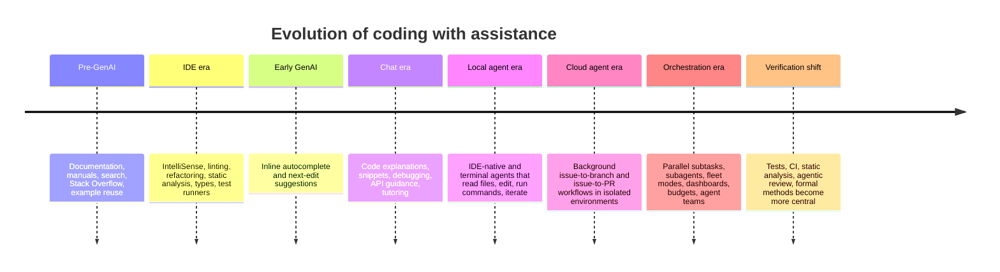
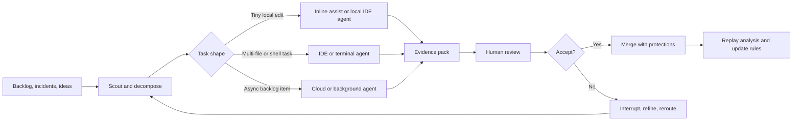

# Coding With Assistance From Reference Lookup to RTS Style Orchestration

> **Source note:** This Markdown export uses resolvable local links and the
> [agentic coding source map](agentic-ai-coding-source-map.md) instead of the
> chat-session citation handles present in the original generated response.

## Executive summary

Software development has moved through a genuine workflow transition, not just a tooling refresh. In the older model, assistance primarily meant external reference material and IDE instrumentation: documentation, web search, Stack Overflow, IntelliSense, linting, refactors, type systems, and code navigation. In the newer model, assistance increasingly means delegated labour: autocomplete that proposes the next move; chat systems that explain, scaffold, and debug; IDE and terminal agents that can read files, edit multiple files, run commands, and use tools; cloud agents that work asynchronously in isolated environments; and orchestration layers that split work across multiple subagents with separate contexts, models, and budgets. Official documentation from Microsoft, GitHub, JetBrains, Anthropic, OpenAI, Google, Replit, Cognition, and Sourcegraph all now describe workflows in which the tool is no longer merely suggestive but can plan, act, validate, and hand back PR-ready work. [source map](agentic-ai-coding-source-map.md)

The strongest version of the claim that “programming is an RTS game now” is not that coding has become more exciting or more gamified. It is that the scarce resource has shifted from keystrokes to attention allocation. In the attached YC transcript, Lukens Orthwein explicitly compares agentic programming to real-time strategy play: economy, production, active units, map exposure, mini-map monitoring, audio cues, worker throughput, and macro-level control over many imperfect concurrent processes. He describes an “orchestrator agent”, spawned workers, visible status boards, worktrees, cloud execution, and an internal APM-like metric based on tool calls per minute. That is an operational model, not a slogan. [supplied transcript](<transcript -  Programming is an RTS Game Now - Lukens Orthwein.md>)

The analogy is useful because modern agent platforms increasingly support the exact practices the metaphor predicts. Claude Code recommends explore-plan-implement loops, explicit verification routes, parallel sessions, fan-out workflows, subagents, and aggressive context management. GitHub’s `/fleet` command explicitly decomposes a plan into parallel subtasks managed by an orchestrating agent. OpenAI Codex, GitHub Copilot cloud agent, Google Jules, Devin, Cursor cloud agents, and Replit Agent all support variants of issue-to-plan, plan-to-diff, or prompt-to-background-workflow execution. [source map](agentic-ai-coding-source-map.md)

The analogy also fails in important ways. Real-time strategy rewards speed, tempo, and resource conversion; software engineering must also reward maintainability, security, correctness, auditability, and accountability. Orthwein’s recommendation to run in “dangerously skip permissions mode whenever possible” only becomes defensible inside strong disposable sandboxes. Anthropic’s own permission documentation says bypass modes belong only in isolated containers or VMs, while OpenAI’s Codex documentation stresses manual review, verifiable evidence, and terminal/test citations. Empirical studies also caution against simplistic speed narratives: a controlled GitHub Copilot experiment found a large speedup on a bounded HTTP-server task, but a 2025 METR randomised trial found experienced developers working on familiar mature repositories were slower with frontier AI tools, despite expecting to be faster. [supplied transcript](<transcript -  Programming is an RTS Game Now - Lukens Orthwein.md>) [source map](agentic-ai-coding-source-map.md)

The best 2026-era synthesis is therefore not “AI pair programmer” and not merely “RTS commander”. It is **RTS-style mission control inside a verification-led engineering workshop**. Use the RTS metaphor to think about build orders, scouting, fog of war, minimaps, workstreams, budgets, model-tool fit, and replay analysis. Use workshop, operating theatre, and court-of-evidence metaphors to remember that each accepted change needs tests, review, traceability, and governance. That is also the central thrust of the attached GPT-5.5-Pro review: the human developer becomes scheduler, strategist, reviewer, and safety authority, while PR count alone is an instrumentation point rather than a success criterion. [transcript-backed analysis](<From Reference Lookup to Agent Orchestration - with transcript.md>)

## Seed material and Orthwein’s RTS analogy

### What the attached transcript actually says

The attached segment appears to be machine-transcribed. The short excerpts below are taken from that supplied transcript, with timestamps as provided in the file. They are therefore the highest-confidence reconstruction available in this response, but not a frame-accurate caption audit of the YouTube original. [supplied transcript](<transcript -  Programming is an RTS Game Now - Lukens Orthwein.md>)

| Timestamp | Short excerpt from the supplied transcript | What it establishes |
|---|---|---|
| 1:00:41–1:00:46 | “Feels exactly like playing real-time strategy games to me.” [supplied transcript](<transcript -  Programming is an RTS Game Now - Lukens Orthwein.md>) | The RTS analogy is explicit, not inferred. |
| 1:00:57–1:01:20 | “you have to always have your economy running, your production running, your units doing something productive” [supplied transcript](<transcript -  Programming is an RTS Game Now - Lukens Orthwein.md>) | The comparison is about continuous parallel resource allocation. |
| 1:01:14–1:01:26 | “parallelize both what your systems are doing but also your attention” [supplied transcript](<transcript -  Programming is an RTS Game Now - Lukens Orthwein.md>) | The scarce resource is human attention, not typing. |
| 1:02:26–1:02:39 | “I have an orchestrator agent that’s run by Claude usually, but could be codeex” [supplied transcript](<transcript -  Programming is an RTS Game Now - Lukens Orthwein.md>) | The human does not directly micromanage every worker; an agent itself can orchestrate. |
| 1:02:50–1:03:02 | “watching your mini map” [supplied transcript](<transcript -  Programming is an RTS Game Now - Lukens Orthwein.md>) | Dashboarding and status visibility are core, not optional. |
| 1:03:09–1:03:28 | workers should “go as far as they can” before asking for feedback, even if “wasteful from… a per token standpoint” [supplied transcript](<transcript -  Programming is an RTS Game Now - Lukens Orthwein.md>) | He explicitly prioritises human time over agent efficiency. |
| 1:03:34–1:03:40 | “they try and take everything all the way to a PR” [supplied transcript](<transcript -  Programming is an RTS Game Now - Lukens Orthwein.md>) | The target unit of work is not a snippet; it is a reviewable change. |
| 1:04:47–1:05:26 | “always running in dangerously skip permissions mode… if you’re having to give feedback at any regular pace, like you’re going to go really slow” [supplied transcript](<transcript -  Programming is an RTS Game Now - Lukens Orthwein.md>) | His operating model strongly prefers low-friction autonomy. |
| 1:05:56–1:06:14 | frontend workers should boot the dev server, run tests, and prepare the environment so the human can test quickly [supplied transcript](<transcript -  Programming is an RTS Game Now - Lukens Orthwein.md>) | Good workers reduce human setup cost, not just write code. |
| 1:07:14–1:07:48 | code is “often like a really expensive source of truth” for agents; teams should create “structured linked… wiki style knowledgebased files” [supplied transcript](<transcript -  Programming is an RTS Game Now - Lukens Orthwein.md>) | He treats durable machine-readable documentation as operating infrastructure. |
| 1:07:54–1:08:00 | “macro by default, micro win it counts” [supplied transcript](<transcript -  Programming is an RTS Game Now - Lukens Orthwein.md>) | Macro-allocation is the central skill. |
| 1:10:02–1:11:01 | he maps sessions to Warcraft and StarCraft units with sound effects and colour coding [supplied transcript](<transcript -  Programming is an RTS Game Now - Lukens Orthwein.md>) | Interface design and attention routing matter materially. |
| 1:12:58–1:13:12 | “tool calls… per minute” [supplied transcript](<transcript -  Programming is an RTS Game Now - Lukens Orthwein.md>) | His “APM” analogue is agent throughput, not human typing speed. |
| 1:13:43–1:13:50 | “you should never have your claude tokens like sitting unused” [supplied transcript](<transcript -  Programming is an RTS Game Now - Lukens Orthwein.md>) | He frames unused agent capacity as bad macro-economy. |
| 1:15:28–1:15:41 | “we’ve three and a halfx our output… PRs per engineer per month” and then “another 60%” after broader adoption [supplied transcript](<transcript -  Programming is an RTS Game Now - Lukens Orthwein.md>) | He makes an explicit productivity claim, but in PR throughput. |

The named tools and workflow components in the segment are also concrete rather than metaphorical: Claude, Codex, git worktrees, cloud instances, knowledge-base markdown files, tmux-like session management, audio cues, visible status tracking, PR-oriented worker tasks, and an orchestrator/worker architecture. The talk is therefore best read as a description of one founder team’s high-parallelism operating model for agentic coding. [supplied transcript](<transcript -  Programming is an RTS Game Now - Lukens Orthwein.md>)

### What the attached GPT-5.5-Pro review contributes

The attached GPT-5.5-Pro review sharpens the same point. Its central argument is that Orthwein’s claim is not merely rhetorical; it is a blueprint for an engineering control system built around isolated workstreams, portable execution, visible dashboards, cheap worker labour, and expensive human attention. It also makes the most important corrective move: PR throughput, speed, and permission bypassing are not success criteria. The review argues that the safe version of this paradigm is “RTS-style mission control inside a verification-led engineering workshop”, with traceability, evidence, and governance treated as first-class constraints. [transcript-backed analysis](<From Reference Lookup to Agent Orchestration - with transcript.md>)

I agree with that reading in substance. Where I would tighten it further is on safety language: Orthwein’s “dangerously skip permissions” recommendation should be translated, for most teams, into **least-privilege autonomous execution inside disposable sandboxes with strong logs, no production access, and mandatory review**. Anthropic’s permission-mode documentation explicitly limits bypass mode to isolated containers and VMs, and OpenAI’s Codex documentation explicitly states that users must manually review and validate all agent-generated code before integration. [source map](agentic-ai-coding-source-map.md)

### Evidence, practitioner opinion, and synthesis

**Evidence.** Orthwein’s transcript does support the claims that the analogy is operational, multi-agent, PR-oriented, and explicitly about throughput, visibility, and attention. [supplied transcript](<transcript -  Programming is an RTS Game Now - Lukens Orthwein.md>)

**Practitioner opinion.** Orthwein’s advice on bypassing permissions, low concern for token waste, and maximising PR throughput reflects a start-up founder workflow optimised for speed and experimentation. It should be read as situated practice, not universal doctrine. [supplied transcript](<transcript -  Programming is an RTS Game Now - Lukens Orthwein.md>)

**My synthesis.** The transferable insight is not “let agents do whatever they like”. It is “treat agentic coding as a coordination problem”. The human gains leverage by decomposing well, routing tasks to the right tool, maintaining durable context, watching a minimap, interrupting bad trajectories early, and requiring evidence before merge. That is where the RTS metaphor becomes genuinely predictive. [source map](agentic-ai-coding-source-map.md)

## Evolution of coding with assistance

### Timeline of major workflow shifts

The sequence above is broad rather than date-perfect, but the workflow direction is clear. Search-driven programming externalised memory into the web and community knowledge bases; Stack Overflow became an important source of reusable examples, but it also introduced staleness and maintenance risks. Static IDE tooling then moved more correctness work into the environment itself. Inline AI suggestions moved assistance into the authoring loop. Chat-based assistants made question-asking itself a development skill. Agentic tools then changed the unit of work from “generate this line” to “investigate, plan, edit, run, iterate, and hand back evidence”. Cloud and fleet modes now extend the same logic into asynchronous and parallel execution. [source map](agentic-ai-coding-source-map.md)

The metaphors also evolve with the mode. “Library research” and “search engine” fit the reference era. “Power tools”, “spellcheck”, and “cockpit instrumentation” fit IDE-native assistance. “Pair programmer” fits autocomplete only weakly: it captures collaboration and fluency, but not accountability or independent reasoning. “Tutor”, “rubber duck”, and “consultant” fit chat assistants better. “Junior developer beside you” can be predictive for local editing agents, provided the task is bounded and reviewed. For background and multi-agent systems, “asynchronous contractor”, “build farm”, “newsroom editor”, “air-traffic control”, and “RTS commander” become more explanatory because they foreground delegation, parallelism, scheduling, and monitoring. [source map](agentic-ai-coding-source-map.md)

### Taxonomy of assistance modes and metaphors

The table below is **my synthesis** of modes A–J. The workflow descriptions are grounded in the cited product documentation, practitioner material, and empirical papers; the “predictive” and “misleading” judgements are analytic rather than vendor claims. [source map](agentic-ai-coding-source-map.md)

| Mode | Practical workflow | Human role | Dominant metaphors | What the metaphor predicts well | Where it misleads |
|---|---|---|---|---|---|
| A Manual coding with documentation and search | Read docs, search errors, inspect examples, adapt snippets, integrate manually | Craftsperson, investigator | Library research, detective work, apprenticeship, search engine | Expertise increasingly includes retrieval skill, source triage, and code adaptation | Can romanticise memory over judgement; ignores stale or copied knowledge risks |
| B IDE assistance and static tooling | Write code with completion aids, inspections, refactors, types, test runners | Driver, instrument pilot | Power tools, spellcheck, cockpit instrumentation | Environment offloads syntax, APIs, and routine correctness checks | Does not imply genuine reasoning or design help |
| C AI autocomplete and copilot coding | Accept or reject inline suggestions and next edits while staying in flow | Author-editor | Predictive text, improvisation partner, “AI pair programmer” | Fluency, local acceleration, boilerplate reduction | “Pair programmer” overstates scrutiny, context, and accountability |
| D Chat-based coding assistant | Ask questions, paste errors, request snippets/explanations, integrate manually | Questioner, reviewer, integrator | Tutor, consultant, rubber duck, Stack Overflow on demand | Better questions and better context produce better answers | Can encourage answer-shopping and weak verification |
| E IDE-native multi-file editing agents | Ask agent to inspect repo, make coordinated edits, run checks, iterate locally | Local supervisor | Junior developer beside you, mechanic in the workshop | Bounded multi-file tasks, local review loops, codebase-aware edits | “Junior dev” invites complacency; agents do not own consequences |
| F Terminal agents and tool-using agents | Let agent use shell, git, tests, browsers, MCP tools, search, and scripts | Operator | Command-line apprentice, lab assistant, robotic process worker | Tool access is real leverage; permissions define risk | Easy to over-grant authority or miss harmful side effects |
| G Cloud/background coding agents | Delegate ticket or issue; agent works in isolated environment; review plan, diff, PR | Delegator, reviewer | Asynchronous contractor, build farm, ticket factory | Background execution, independent sandboxes, backlog reduction | Can hide decision-making, inflate WIP, and create PR spam |
| H Multi-agent orchestration | Split work into parallel subtasks, route by model/tool, monitor status, compose outputs | Commander, producer, engineering lead | RTS commander, air-traffic control, newsroom editor, emergency operations centre | Parallelism, task routing, minimaps, control surfaces, budgets, interruption | Overweights tempo; underweights evidence, ownership, and reuse friction |
| I Verification-led coding | Specify acceptance criteria; require tests, CI, static analysis, security checks, possibly proofs | Specification author, proof/review authority | Court of evidence, referee, laboratory assay, theorem prover | Verification becomes central when generation is cheap and review is costly | Can be mistaken for mere bureaucracy rather than throughput protection |
| J No-code, low-code, and vibe coding | Describe product intent in natural language; iterate on generated artefacts; publish prototypes | Product narrator, creative director | Film director, architect with fast model-maker, prototyping studio | Very fast prototyping and wider access for non-specialists | Maintainability, ownership, accessibility, and security can collapse later |

### Evaluation dimensions by mode

The matrix below is also **my synthesis**. “Latency” means elapsed time to a useful result; “cost” means model/compute spend; “security risk” means operational risk if badly governed; “learning value” reflects likely value for junior developers when used well.

| Mode | Human control required | Tool autonomy | Context required | Verification burden | Latency | Cost | Greenfield fit | Legacy fit | Security risk | Learning value | Productivity ceiling |
|---|---|---|---|---|---|---|---|---|---|---|---|
| A Manual docs/search | Very high | None | Medium | Medium | High | Low | Medium | High | Low to medium | High | Medium |
| B IDE/static tooling | Very high | Low | Medium | Low to medium | Low | Low | High | High | Low | High | Medium |
| C AI autocomplete | High | Low | Medium | Medium | Low | Medium | High | Medium | Medium | Medium | Medium to high |
| D Chat assistant | High | Low to medium | High | High | Medium | Medium | High | Medium | Medium | High if reflective | Medium |
| E IDE-native agents | Medium to high | Medium | High | High | Medium | Medium to high | High | High | Medium to high | Medium | High |
| F Terminal/tool agents | Medium | Medium to high | High | High | Medium | Medium to high | Medium to high | High | High | Medium | High |
| G Cloud/background agents | Medium | High | High | High | Medium to high but asynchronous | High | High | Medium to high | High | Low to medium | High |
| H Multi-agent orchestration | High at system level | Very high | Very high | Very high | Variable | Very high | High | High | Very high | Low unless coached | Very high |
| I Verification-led coding | High | Variable | High | Very high by design | High upfront, lower downstream rework | Medium to high | Medium | Medium to high | Lower if mature | High | High in regulated contexts |
| J No-code/vibe coding | Medium to low | Medium to high | Low to medium | High if production-bound | Low | Medium | Very high | Low | High | Mixed | Medium |

### Which metaphors are rhetorical and which are predictive

The most **rhetorical** metaphor in 2026 discussion is still “pair programmer”. It remains useful for inline suggestions and certain collaborative chat flows, but it usually overstates common ground, long-horizon reasoning, and shared accountability. A 2025 knowledge-transfer study found that developer pairs and Copilot-assisted individuals showed similar frequencies of successful knowledge-transfer episodes, but developers scrutinised Copilot suggestions less than human partner suggestions. That is not how strong pair programming usually works. [source map](agentic-ai-coding-source-map.md)

The most **predictive** metaphors are those that imply specific control practices. “Tutor” predicts that better questions and examples yield better answers. “Junior developer” predicts that bounded tasks and mandatory review matter. “Build farm” predicts asynchronous throughput and inventory risk. “Air-traffic control” predicts dashboards, routing, and interruption. “RTS commander” predicts parallel agents, resource economy, scouting, minimaps, and macro-over-micro attention allocation. “Court of evidence” predicts that generated code must be accepted on evidence, not eloquence. Those metaphors are useful because they imply operating discipline, not just excitement. [source map](agentic-ai-coding-source-map.md)

## RTS mechanics mapped to agentic coding

The mapping below is **my synthesis**, grounded mainly in Orthwein’s transcript and the current capabilities described by Claude Code, GitHub Copilot `/fleet` and cloud agent, OpenAI Codex, Amp, Jules, Replit Agent, and other official materials. [supplied transcript](<transcript -  Programming is an RTS Game Now - Lukens Orthwein.md>) [source map](agentic-ai-coding-source-map.md)

| RTS mechanic | RTS concept | Agentic coding equivalent | Concrete workflow example | What the metaphor reveals | What it hides or distorts | Risk if taken too literally |
|---|---|---|---|---|---|---|
| Build order | Early sequence that shapes the whole game | Repo preparation, task ordering, test harnesses, instruction files, model selection | Before changing code, create `AGENTS.md` or `CLAUDE.md`, make tests runnable, define plan mode, and set cheap subagents for scouting, then escalate harder tasks to stronger models. [source map](agentic-ai-coding-source-map.md) | Early setup compounds later throughput | Good engineering is not only sequence; it also needs reflection and user value | Teams fetishise setup rituals and forget to ship anything useful |
| Scouting | Gather information before committing force | Read-only exploration, repo search, plan mode, context mapping | Use plan mode to inspect auth flow, data stores, and existing patterns before editing. [source map](agentic-ai-coding-source-map.md) | Good delegation starts with uncertainty reduction | Scouting can become endless research | “Investigation” threads fill context and consume time without action |
| Fog of war | Incomplete map knowledge | Unknown code paths, hidden requirements, stale docs, unobserved side effects | Ask a cloud agent to research a repo and draft a plan before writing code. [source map](agentic-ai-coding-source-map.md) | Uncertainty is structural, not a personal failure | Some uncertainty is social or business, not codebase-local | Teams over-trust code exploration and under-consult humans or users |
| Workers | Basic units that gather resources or build | Task-specific agents or sessions | One agent writes tests, another updates docs, another investigates failing CI. [source map](agentic-ai-coding-source-map.md) | Small bounded agents are easier to route and replace | Agents are not people and have no durable ownership | “Worker” framing normalises disposable outputs and weak accountability |
| Resource economy | Spend minerals, gas, supply efficiently | Human attention, token budgets, AI credits, compute, context window | Use low-cost subagents for broad fan-out and reserve expensive models or “oracle” steps for hard reasoning. [source map](agentic-ai-coding-source-map.md) | Cost discipline matters because generation is cheap but not free | Quality is not reducible to utilisation | Teams maximise token burn instead of value per accepted change |
| APM and attention | Rate of effective actions under pressure | Dispatch rate, tool-call throughput, review cadence, interruption skill | Orthwein’s internal APM proxy is tool calls per minute, while official tools expose parallel sessions and background tasks. [supplied transcript](<transcript -  Programming is an RTS Game Now - Lukens Orthwein.md>) [source map](agentic-ai-coding-source-map.md) | Attention routing is a real skill | High action rate is not the same as good judgement | Teams worship busyness and overload reviewers |
| Control groups | Bind units to hotkeys for quick switching | Named agent groups, worktrees, session clusters, custom agents | Keep “frontend”, “tests”, “migration”, and “docs” agents in separate worktrees or panels for rapid switching. [supplied transcript](<transcript -  Programming is an RTS Game Now - Lukens Orthwein.md>) [source map](agentic-ai-coding-source-map.md) | Fast switching reduces coordination overhead | Stable groups can create silos or stale assumptions | Over-specialisation fragments architecture |
| Tech tree | Capability unlock path | Better tests, MCP tools, secrets handling, browser tools, code indexing, cloud sandboxes | A team cannot safely delegate UI refactors until it has screenshots, accessible preview environments, and reliable tests. [source map](agentic-ai-coding-source-map.md) | Tooling maturity determines what can be delegated safely | Real org constraints include procurement, policy, and training | Teams assume autonomy before infrastructure is ready |
| Unit counters and model-tool fit | Some units beat certain others | Different models and agents fit different task types | GitHub `/fleet` and Replit explicitly support picking cheaper or stronger models for different subtasks; Amp exposes a slower, more capable “oracle”. documentation and tests are often easier than large feature work. [source map](agentic-ai-coding-source-map.md) | There is no universally best agent | Human reviewers may still be the best “counter” to subtle errors | People turn model choice into superstition instead of measured routing |
| Expansion | Take more map and economy | Add more parallel workstreams or backlogs | Assign cloud agents to low-urgency refactors and logging tasks while local agents handle today’s feature. [source map](agentic-ai-coding-source-map.md) | Parallelism can unlock neglected maintenance work | More territory also means more surfaces to defend and merge | WIP explodes; review and merge capacity become the bottleneck |
| Harassment | Small opportunistic attacks that disrupt the opponent | Small opportunistic maintenance tasks | While waiting on a larger feature, send an agent to fix typos, improve docs, add missing tests, or clean debug statements. [source map](agentic-ai-coding-source-map.md) | Not all leverage comes from primary objectives | Engineering is not zero-sum combat | Teams fill every idle minute with low-value churn |
| Timing attack | Hit at a narrow vulnerability window | Use asynchronous agents to exploit short shipping windows | Before a release cut, delegate documentation sync, regression tests, or dependency updates to background agents. [source map](agentic-ai-coding-source-map.md) | Timing and batch boundaries matter | Quality work should not become deadline theatre | Short-term tempo overrides prudent review |
| Map control | Own vision and mobility across the map | Codebase understanding, ownership maps, observability | Use repo research, code indexing, and knowledge-base files so agents can answer “where does this flow live?” quickly. [source map](agentic-ai-coding-source-map.md) | Understanding surfaces and chokepoints is core leverage | Social ownership and institutional memory are not just files | Teams mistake searchable code for actual architectural understanding |
| Minimap and dashboarding | Compressed view of state and threats | Session lists, status boards, logs, alerts, PR boards, audio cues | Orthwein’s minimap and soundboard idea is extreme, but GitHub, Cursor, Codex, and Devin all foreground visible background progress and review queues. [supplied transcript](<transcript -  Programming is an RTS Game Now - Lukens Orthwein.md>) [source map](agentic-ai-coding-source-map.md) | Large-scale delegation needs a control surface | Visibility dashboards can show motion without showing correctness | Teams believe colourful dashboards mean they are in control |
| Replay analysis | Review the match afterwards | Post-session review of logs, diffs, failures, and settings | After merge or rejection, inspect agent logs, CI failures, rejected PR reasons, and update `AGENTS.md` or rules. [source map](agentic-ai-coding-source-map.md) | Improvement comes from instrumentation and retrospection | Some failures are organisational, not prompt-level | Teams only optimise local prompts rather than fixing tests, ownership, or architecture |

### What the RTS analogy clarifies

The analogy clarifies five things extremely well. It clarifies that **parallelism is now the main source of leverage**. It clarifies that **attention routing** is a real engineering skill. It clarifies that **front-loaded infrastructure** changes downstream velocity. It clarifies that **task-model fit** matters more than belief in a single magic model. And it clarifies that **reviewing the whole production system** often matters more than manually crafting every diff. Orthwein’s emphasis on minimaps, spawned workers, macro-over-micro, audio cues, and APM is coherent with the design of tools that now support parallel sessions, subagents, custom agents, sandboxes, plans, and background execution. [supplied transcript](<transcript -  Programming is an RTS Game Now - Lukens Orthwein.md>) [source map](agentic-ai-coding-source-map.md)

### Where the RTS analogy breaks down

It breaks down where engineering ceases to resemble a bounded game. There is no clean win condition in software. The “map” changes while you play because requirements, users, dependencies, law, threat models, and organisational priorities change. Output is not value. PRs are not shipped outcomes. Workers are not fungible. Tokens are not a proxy for progress. And unlike an RTS, engineering is not permitted to externalise its mistakes onto users, citizens, or regulated stakeholders. Human-factors research on generative AI also warns that automation often shifts the user’s role from production to evaluation, restructures workflows unhelpfully, increases interruptions, and can make easy tasks easier while making hard tasks harder. [source map](agentic-ai-coding-source-map.md)

## Operating model and governance

### Practical operating model for an RTS-style agentic programmer

A workable daily rhythm begins with **scouting** rather than immediate editing. Use read-only exploration or plan mode to understand the codebase slice, constraints, and acceptance criteria. Then split work into units that are independently reviewable, independently testable, and small enough that a failed attempt is inexpensive. Route tiny local edits to inline or IDE assistance; route multi-file implementation and shell-heavy tasks to terminal or IDE agents; route queueable, asynchronous, or low-urgency work to cloud agents. Always require an evidence pack before code review: tests, terminal output, screenshots, type checks, lint results, and a crisp change summary. After review, either merge under normal protections or interrupt, revise, and reroute. Finally, perform replay analysis by updating durable instruction files and task templates so the next run starts from a better build order. [source map](agentic-ai-coding-source-map.md)

The unit of task should usually be **the smallest independently valuable change that can be verified cheaply**. Good candidates include adding a test, documenting a subsystem, localised refactors, UI polish with visual diffing, fixing reproducible bugs, and contained dependency updates. Bad candidates for unsupervised delegation include ambiguous product requirements, architecture-wide changes with hard-to-see side effects, security-sensitive logic without a clear review path, and work that lacks a runnable acceptance check. Claude Code explicitly recommends “explore first, then plan, then code”, and both Jules and GitHub Copilot cloud agent foreground reviewable plans before or during implementation. [source map](agentic-ai-coding-source-map.md)

### Repository preparation and context management

Agentic throughput depends heavily on repo readiness. A well-prepared repository has: reliable local and CI tests; clear build and dev-server commands; stable example prompts; seeded instruction files such as `AGENTS.md` or `CLAUDE.md`; path- or language-specific conventions; representative examples of good changes; and a short knowledge base for business context and operational caveats. OpenAI Codex, Jules, and Amp all explicitly rely on `AGENTS.md`-style files; Claude Code relies on `CLAUDE.md`; GitHub custom agents and custom instructions serve a similar purpose. [source map](agentic-ai-coding-source-map.md)

Context should be treated as a scarce systems resource. Anthropic’s documentation explicitly warns that context windows fill quickly and that performance degrades as they do; Amp’s subagents and GitHub `/fleet` mitigate that by giving subtasks separate context windows; Orthwein’s own transcript also treats durable linked docs as essential because raw code is “an expensive source of truth” for agents. The practical lesson is simple: keep durable knowledge in reviewed files, not buried in one successful chat; reset or fork stale threads; and use subagents when investigation would otherwise pollute the main working context. [source map](agentic-ai-coding-source-map.md)

### Monitoring, interruption, verification, and merge strategy

An RTS-style programmer needs a control surface. Orthwein pushes this to an extreme with custom audio cues and visually themed sessions, but the principle generalises: if many agents can act at once, the human must be able to switch rapidly among them, identify blocking states, and stop bad trajectories early. Cursor foregrounds in-progress and ready-for-review items; GitHub cloud agent, Codex, and Devin all expose ongoing session state or task progress; GitHub, OpenAI, and Anthropic all emphasise reviewable evidence rather than blind trust. [supplied transcript](<transcript -  Programming is an RTS Game Now - Lukens Orthwein.md>) [source map](agentic-ai-coding-source-map.md)

Verification should be evidence-led. Claude Code says the agent needs a runnable check if you want unattended success. OpenAI Codex says its work should be validated manually and provides evidence through terminal logs and test outputs. GitHub cloud agent runs in an ephemeral environment with tests and linters, but still expects human review of the resulting branch or PR. Security evidence matters too: a 2025 empirical study found security weaknesses in 29.5% of sampled Python snippets and 24.2% of sampled JavaScript snippets from AI-generated code in GitHub projects, while static-analysis-guided chat fixes remediated up to 55.5% of issues. Verification is therefore not a postscript to agentic coding; it is the precondition for safe adoption. [source map](agentic-ai-coding-source-map.md)

Merge strategy should bias towards small, reviewable, low-collision changes. Cloud agents are best used for issues that can produce bounded PRs; fleets are best used where tasks are independently parallelisable. Larger tasks should usually end in a human architectural checkpoint rather than one giant merge. Modern code review research continues to treat review as important for quality and knowledge transfer, even if current research agendas remain somewhat misaligned with practitioner priorities. [source map](agentic-ai-coding-source-map.md)

### Governance, quality, safety, security, and cost controls

The minimum safe control set for multi-agent coding is not exotic. It includes least-privilege execution, disposable sandboxes, explicit approval boundaries, structured audit logs, branch protections, secrets isolation, repository-level opt-outs, model and tool allow-lists, and cost budgets. GitHub’s product materials explicitly highlight detailed audit logs and MCP allow lists; GitHub cloud agent can be enabled or disabled per policy and per repository; Claude Code has explicit permission modes and warns that bypass belongs only in isolated environments; Amp warns that agents with shell and MCP access can be influenced by malicious instructions from untrusted repositories or servers; Copilot `/fleet` warns that parallel subagents consume additional credits; and Replit Agent differentiates low-cost and higher-power modes. [source map](agentic-ai-coding-source-map.md)

For regulated or safety-critical software, add stronger controls: independent human review, traceability from requirement to test to change, reproducible evidence retention, security scanning, and—where justified—formal verification or proof-guided development. Lean’s official site explicitly positions the language and proof assistant as a route to correct, maintainable, and formally verified code, and showcases industrial verification examples such as AWS Cedar. In those contexts, the dominant metaphor should shift from “fast RTS commander” to **operating theatre plus court of evidence**. [source map](agentic-ai-coding-source-map.md)

## Metrics and implications

### Metrics that matter more than vanity counts

The empirical productivity picture is mixed, which is exactly why teams should avoid vanity metrics. In a controlled GitHub Copilot experiment, developers with access to Copilot completed a bounded JavaScript task 55.8% faster. In contrast, the 2025 METR trial found that experienced open-source developers working on mature projects they already knew took 19% longer with early-2025 AI tools, despite forecasting a 24% speedup beforehand and later still believing they had been faster. A 2024 open-source study found project-level productivity gains of 6.5%, but also a 41.6% increase in integration time. These results do not cancel each other out; they show that assistance is highly context-dependent. [source map](agentic-ai-coding-source-map.md)

That is why raw PR counts, token utilisation, and self-reported speed are weak steering signals. Orthwein’s own throughput measure is “PRs per engineer per month”; GitHub cloud agent documents PR and time-to-merge metrics; and Orthwein’s APM analogy values continuous agent activity. All of these can be useful instrumentation, but none is a sufficient outcome measure. A system can raise PR count while increasing reviewer burden, merge conflicts, CI waste, and escaped defects. [supplied transcript](<transcript -  Programming is an RTS Game Now - Lukens Orthwein.md>) [source map](agentic-ai-coding-source-map.md)

| Metric category | Prefer | Why | Be sceptical of |
|---|---|---|---|
| Delivery | Accepted PRs weighted by business value and risk; lead time to accepted change | Connects generation to actual adoption | Raw PR volume |
| Quality | Escaped defects, rollback rate, maintainability trends, review rework | Measures downstream cost of speed | “Looks good” summaries |
| Verification | Test pass rate, static-analysis findings, median evidence completeness per change | Captures whether agents produce proof, not just prose | Token spend alone |
| Review | Reviewer hours, review cycles per PR, rejection reasons, time-to-merge | Reveals whether agents create inventory faster than humans can absorb it | Numbers of agents running |
| Security | Secret exposures, dependency findings, policy exceptions, sandbox escapes | Makes autonomy governable | “No incidents yet” |
| Learning | Junior debugging quality, explanation quality, architectural comprehension, unaided intervention ability | Prevents silent deskilling | Subjective “confidence” |
| Cost | Cost per accepted change, cost per merged low-risk PR, cost per remediated defect | Aligns spend to outcomes | Total monthly model bill with no denominator |

### Implications for different roles

For **senior engineers**, leverage shifts from personally writing the hardest code to designing the system in which acceptable code is produced. The new craft includes decomposition, routing, guardrail design, evidence expectations, review strategy, and maintaining durable context. This is one reason the attached review is right to call the human a scheduler, strategist, reviewer, and safety authority. [transcript-backed analysis](<From Reference Lookup to Agent Orchestration - with transcript.md>) [source map](agentic-ai-coding-source-map.md)

For **junior engineers**, the opportunity is real but fragile. AI chat and coding agents can be strong tutors and scaffolds, and the JetBrains, Claude, and GitHub workflows all make explanation and local guidance easier. But the knowledge-transfer evidence is mixed: AI can remind developers of relevant details, yet developers also scrutinise AI suggestions less than human pair-programming input. Juniors therefore need explicit habits of asking for explanations, reproducing failures, and reviewing evidence rather than accepting authority by default. [source map](agentic-ai-coding-source-map.md)

For **engineering managers**, the key question is no longer “Does the model write code?” but “Where is our bottleneck?” It may now be review bandwidth, environment quality, CI flakiness, missing task decomposition, policy ambiguity, or lack of audit controls rather than raw code generation ability. Multi-agent systems amplify both throughput and failure surfaces, so managers need WIP limits, clear ownership of agent-created PRs, review-capacity planning, and explicit success metrics tied to accepted outcomes. [source map](agentic-ai-coding-source-map.md)

For **public-sector digital teams**, the gains are real but the adoption posture should be more conservative than Orthwein’s. Public services carry accessibility, records, privacy, cyber, procurement, transparency, and accountability duties that do not fit a pure “move fast” ethos. The safe path is to start with documentation, testing, low-risk refactors, legacy comprehension, and bounded internal tooling in isolated environments with strong logs and approved integrations. Enterprise controls such as audit logs, repository policies, and MCP allow lists matter more here than raw agent autonomy. [source map](agentic-ai-coding-source-map.md)

For **regulated or safety-critical software**, agentic coding should begin as verification-led coding, not graduate into it later. Formal methods will not fit every change, but proof assistants, static analysis, rigorous CI, reproducible test evidence, and independent review all become more valuable when code generation is nearly free and patch volume rises. Lean’s verification positioning is a useful signal here: the accepted artefact is not the generated patch alone, but the body of evidence that the patch should be trusted. [source map](agentic-ai-coding-source-map.md)

## Final synthesis and limitations

The best metaphor for 2026-era agentic coding is not singular. It is a **stack of metaphors**, each suited to a different autonomy level.

For low-autonomy work, the right metaphors remain **search engine**, **spellcheck**, and **power tool**.  
For interactive assistance, **tutor**, **rubber duck**, and **consultant** remain useful.  
For bounded local delegation, **junior developer beside you** is often predictive if and only if review is mandatory.  
For cloud execution and parallel subagents, **RTS commander** and **air-traffic control** become the most useful because they force thinking about task routing, parallelism, dashboards, budgets, and interruptions.  
For acceptance, the final metaphor should be **court of evidence inside a workshop**: the patch is not “done” because an agent says it is done; it is done because the evidence, review, controls, and context support acceptance. [source map](agentic-ai-coding-source-map.md)

So, does the RTS analogy clarify the agentic coding paradigm? Yes—more than most competing metaphors—because it accurately foregrounds macro-allocation, fog of war, workstream parallelism, model-tool fit, minimaps, economy, and replay analysis. Where it breaks down is equally important: software delivery is not a game, people are not disposable units, and engineering value is not measured by tempo alone. Orthwein’s transcript is valuable because it captures the real shift from direct implementation towards orchestration; it becomes dangerous only when speed, bypassing friction, or PR volume are mistaken for sufficient indicators of good engineering. [supplied transcript](<transcript -  Programming is an RTS Game Now - Lukens Orthwein.md>) [transcript-backed analysis](<From Reference Lookup to Agent Orchestration - with transcript.md>)

Open questions and limitations remain. The supplied transcript appears machine-generated and was not independently reconciled here against YouTube captions or audio. Vendor documentation is about intended workflows, not independent proof of benefit. Empirical work on multi-agent orchestration, PR acceptance, and CI reliability is still early and uneven. And although you asked for downloadable `.docx` and `.md` artefacts, this response delivers the report content itself rather than generated downloadable files. Those limitations do not change the main conclusion: coding assistance has evolved from lookup, to prediction, to dialogue, to delegated execution, and now to orchestration—and the teams that adopt it well are the ones that pair mission control with verification discipline. [source map](agentic-ai-coding-source-map.md)
