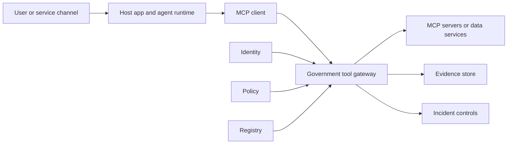
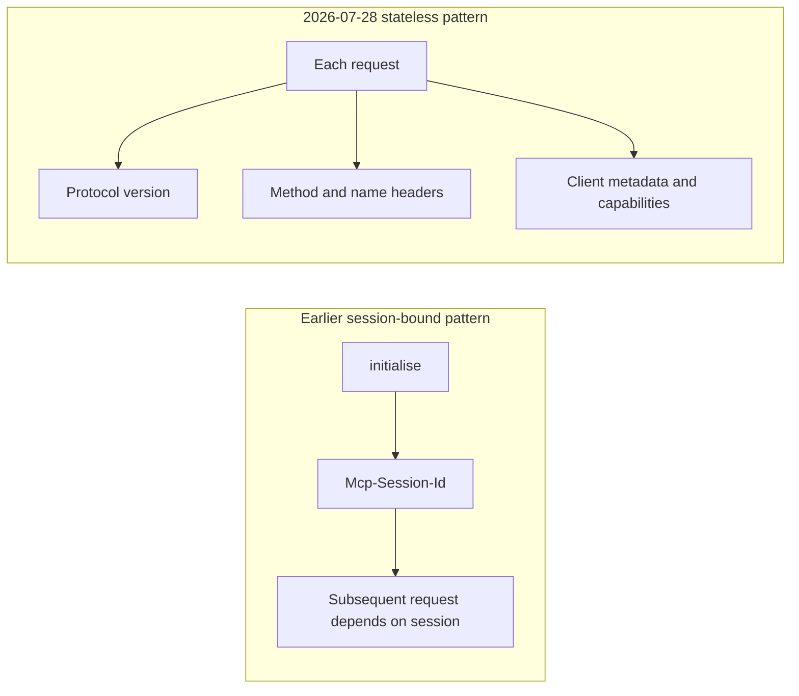
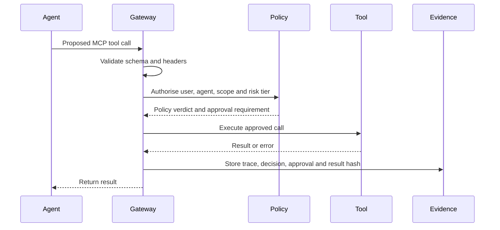
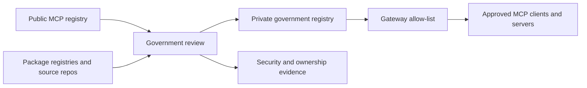

# Agentic AI Governance for UK Government?

> **UNOFFICIAL**  
> **Provenance:** Created by GPT-5.5-Pro, reviewed by Claude Opus 4.8 | **Review:** Active till July 31st | **Approvals:** None | **Authorisation:** None

**MCP 2026-07-28 Release Candidate Specification and Roundtable Primer**

*Draft update prepared 1 June 2026. Human review and departmental approval still required before referencing this document:  
**This is just an AI authored personal development project and not endorsed by any part of Government**.*

## Decision summary — read first

*Added in peer review, 1 June 2026. One-page orientation for participants; the Executive summary below gives the detail.*

Agentic AI does not just analyse data; it acts on it - updating records, triggering payments, contacting citizens, changing eligibility. The governance question is therefore not whether the model is good, but under what conditions an agent may act on government's behalf, and how we prove what it did.

**What is already settled.** The MCP 2026-07-28 specification is a locked release candidate (21 May 2026); the final ships 28 July 2026 and contains breaking changes - treat it as a near-term target for pilots and procurement, not today's standard. MCP standardises how agents connect to and discover tools; it does not decide whether an action is lawful, authorised, proportionate or auditable. Those controls are government's to add, in a profile around MCP.

**Primary question.** What is the UK Government MCP profile, and what must never be left to raw protocol defaults?

**Six decisions to produce today.**

**1.** A minimum MCP profile (the non-negotiable controls around the protocol).

**2.** A minimum tool-metadata schema (see Appendix A for a starter).

**3.** A common evidence schema (see Appendix B for a starter).

**4.** A risk-tiered approvals model (when a human must confirm).

**5.** A stance on remote third-party MCP servers (block / mirror / proxy / curate).

**6.** Procurement criteria (version support, conformance evidence, SDK tier, exportable audit, migration plan).

**The low-controversy non-negotiables (verified against the MCP spec).** A distinct agent identity separate from the human user; all action-bearing calls through an approved gateway; audience-bound tokens with no passthrough; block arbitrary public MCP servers; central trace and evidence held outside the agent runtime; risk-tiered human approval for consequential actions.

**Still needed before this pack is decision-ready.** The legal and accountability basis (see the new section before UK Government recommendations) and anchoring to existing HMG instruments - the AI Playbook for the UK Government, the Generative AI Framework for HMG, NCSC Secure AI, and the Procurement Act 2023.

*This pack is an AI-generated draft against a non-final specification. Protocol claims were independently verified; vendor and adoption figures were not. Verify before any decision relies on them.*

## Executive summary

This update strengthens, rather than reverses, the original report. The original hypothesis was that agentic AI governance is converging around a stack consisting of identity, tool gateway or registry, runtime policy enforcement, observability, evidence and portfolio governance. The 2026-07-28 Model Context Protocol (MCP) Release Candidate makes that architecture more concrete by defining a stateless protocol core, mandatory HTTP routing headers, cacheable discovery results, W3C trace-context propagation, an extension framework, revised long-running task handling, stronger OAuth/OIDC alignment and a formal feature lifecycle. \[45\] \[48\] \[49\] \[52\]

The title now makes the release-candidate dependency explicit because timing matters. The release candidate was published on 21 May 2026, is locked for validation, contains breaking changes, and the final specification is scheduled for 28 July 2026. It should therefore be treated as a near-term target for government pilots and procurement discussion, not as a fully finalised current standard on 1 June 2026. \[45\]

The most important governance implication is that MCP is becoming a credible interoperability surface for agent-to-tool traffic, but not a governance regime in its own right. MCP standardises how hosts, clients and servers exchange tool, resource and prompt capabilities; it does not, by itself, decide whether a government action is lawful, safe, authorised, proportionate or auditable. Those controls must sit in a government profile around MCP. \[46\] \[47\] \[51\]

For the roundtable, the question should therefore be reframed from “Should government use MCP?” to “What is the UK Government MCP profile, and what must never be left to raw protocol defaults?” The practical decision areas are gateway mandate, agent identity, token audience binding, policy enforcement, approval design, registry curation, state-handle governance, trace export, evidence schema, incident response and conformance testing.

The report now includes a plain-English technical primer and glossary. These are designed to stop terminology becoming a barrier to policy discussion. The primer separates facts from judgement: an “agent” is the system attempting work; a “tool” is an action or information source it can call; MCP is a connector protocol; a gateway is the control point; identity and policy decide whether action is allowed; trace and evidence prove what happened afterwards.

The recommended position is to standardise on an approved tool gateway and private or curated MCP registry for production government use. Direct use of arbitrary public MCP servers should be blocked unless reviewed, mirrored, proxied or otherwise made subject to government controls. This recommendation follows from the MCP Registry’s own description: the public registry is a metadata repository for publicly accessible servers, currently in preview, and deliberately delegates security scanning to package registries and downstream aggregators. \[56\]

The updated roundtable pack should aim to produce decisions, not merely shared understanding: a minimum MCP profile, a minimum tool metadata schema, a common evidence schema, a risk-tiered approvals model, a stance on remote third-party MCP servers, and procurement criteria for conformance, identity separation and exportable audit evidence.

## What changed in this update

| **Area**          | **Change made**                                                                                                              | **Why it matters for the roundtable**                                                                                              |
|-------------------|------------------------------------------------------------------------------------------------------------------------------|------------------------------------------------------------------------------------------------------------------------------------|
| Title and framing | Title explicitly references the MCP 2026-07-28 Release Candidate Specification.                                              | Participants can see that this is an update tied to a specific protocol revision and timeline.                                     |
| Technical primer  | Added an introductory explanation of agents, tools, MCP, gateways, identity, policy, approvals, registries and traces.       | Non-specialists can enter the discussion without needing prior protocol knowledge.                                                 |
| Infographics      | Added four source-grounded diagrams covering the governance stack, stateless MCP, tool-call evidence and registry assurance. | Gives the roundtable shared mental models rather than competing vendor diagrams.                                                   |
| MCP profile       | Added a proposed UK Government MCP profile and minimum controls for production use.                                          | Moves the discussion from “MCP yes/no” to enforceable architecture and procurement choices.                                        |
| Glossary          | Expanded the glossary from a short list to a decision-oriented technical glossary.                                           | Reduces the risk that terms such as “agent identity”, “token audience”, “stateless”, “scope” or “gateway” derail policy decisions. |

## Roundtable technical primer

This section is designed to be read before the roundtable. It introduces only the technical ideas needed to evaluate governance choices. It is intentionally plain-English: participants do not need to be protocol specialists to use it.

### The ten terms to understand first

| **Term**                    | **Plain-English meaning**                                                                                                            |
|-----------------------------|--------------------------------------------------------------------------------------------------------------------------------------|
| **Agent**                   | A system that can plan or sequence steps towards a goal, usually by asking a model what to do next and then calling tools.           |
| **Tool**                    | A callable capability: search records, create a case, send a message, delete a file, query a database, start a workflow.             |
| **MCP**                     | A standard way for AI applications to discover and call tools, resources and prompts exposed by servers.                             |
| **Host, client and server** | In MCP, the host is the AI application, the client is its connector to one server, and the server exposes tools or context.          |
| **Gateway**                 | The controlled doorway between an agent and the tools it can call. This is where government should enforce policy.                   |
| **Agent identity**          | A distinct runtime identity for the agent, separate from the human user and separate from shared development credentials.            |
| **Policy decision**         | The answer to “is this action allowed now, for this user, agent, tool, data class and purpose?”                                      |
| **Human approval**          | A pause in the workflow where a person must confirm, deny or modify a sensitive action before it happens.                            |
| **Trace and evidence**      | A linked record of the prompt, tool call, policy decision, approval, result and outcome, sufficient for audit and incident response. |
| **Registry**                | A catalogue of available agents, MCP servers and tools, including who owns them, what they do and whether they are approved.         |

### How the pieces fit together

An agent becomes risky when it can act. A chatbot that only drafts text is mainly an information-risk problem. An agent that can update a record, trigger a payment, email a citizen, change eligibility, deploy code or delete data is an action-governance problem.

The decisive boundary is the transition from reasoning to tool use. The model may suggest a tool call, but the surrounding application, gateway and server decide whether the call is actually made. That is why the report treats tool gateways, identity, policy and evidence as core infrastructure rather than optional guardrails.

MCP matters because it gives a common vocabulary and wire protocol for tools, resources and prompts. The 2026-07-28 release candidate makes MCP more suitable for enterprise infrastructure because each request is self-contained, carries protocol version and client metadata, and exposes method/name headers that gateways can inspect. \[48\] \[49\]

MCP does not remove the need for government policy. The MCP specification explicitly says that it enables powerful data access and code-execution paths, and that implementers must address consent, authorisation, access controls and privacy around the protocol. \[46\]

The recommended government design is therefore: let MCP standardise connection and discovery, but require a government profile to standardise ownership, risk metadata, permitted identities, approvals, trace export, registry curation, retention and incident response.

## Validated discussion infographics

These diagrams are grounded in the primary MCP release-candidate and specification sources, together with the cross-vendor architecture already analysed in the original report. They are simplified discussion aids, not official diagrams from MCP or any vendor. Each separates the protocol fact from the recommended government overlay.

Figure 1. Agentic AI governance: where the controls sit.

> **Source basis and limitation:** Based on the original report’s cross-vendor synthesis of control planes, gateways and observability, and on the MCP architecture model of hosts, clients and servers. The orange gateway is a recommended UK Government control, not an MCP protocol requirement. \[35\] \[47\]

Figure 2. MCP transport shift: session-bound to stateless requests.

> **Source basis and limitation:** Based on the MCP release-candidate blog, lifecycle and transport pages. It represents the protocol-level shift only; production systems may still keep application-level state through explicit handles. \[45\] \[48\] \[49\]

Figure 3. A governed MCP tool call: the minimum evidence path.

> **Source basis and limitation:** Combines MCP tool-call semantics with recommended government controls. MCP defines tool calls, metadata, authorisation requirements and trace propagation; the common evidence schema is a public-sector governance recommendation. \[50\] \[51\] \[59\]

Figure 4. MCP registry and supply-chain assurance for government use.

> **Source basis and limitation:** Based on MCP Registry documentation, which describes the public registry as preview, metadata-focused, not intended for private servers, and reliant on package registries or downstream aggregators for security scanning. The private registry and allow-list are recommended government controls. \[56\]

## MCP 2026-07-28 Release Candidate: significance for UK Government

### What the release candidate changes

| **Change**                      | **Plain-English meaning**                                                                                                                                                                                                                                         | **Roundtable consequence**                                                                    |
|---------------------------------|-------------------------------------------------------------------------------------------------------------------------------------------------------------------------------------------------------------------------------------------------------------------|-----------------------------------------------------------------------------------------------|
| **Stateless protocol core**     | The protocol no longer relies on an initialise/initialised handshake or protocol-level session. Every request carries the information needed to process it, including protocol version, client identity and capabilities. \[45\] \[48\]                           | Prefer per-request controls and avoid designs dependent on hidden sessions.                   |
| **HTTP gateway visibility**     | Streamable HTTP requests must carry standard headers such as MCP-Protocol-Version, Mcp-Method and, where applicable, Mcp-Name. These allow gateways and load balancers to route, inspect and rate-limit without first parsing the JSON body. \[49\]               | Make the gateway the mandatory inspection and enforcement point.                              |
| **Explicit state handles**      | Application state is handled through explicit identifiers returned by tools and passed back as ordinary tool arguments. This makes state visible to the model and gateway, but creates a need for strong handle governance. \[50\]                                | Treat handles as auditable, authorised, bounded-lifetime state references.                    |
| **Cacheable discovery**         | Tool, prompt and resource lists now include ttlMs and cacheScope so clients and intermediaries know how long discovery results are fresh and whether they can be shared. \[52\]                                                                                   | Define how long tool metadata may be trusted and by whom.                                     |
| **Trace propagation**           | The draft documents trace context propagation using traceparent, tracestate and baggage keys, aligning MCP traffic with distributed tracing practice. \[45\] \[52\] \[59\]                                                                                        | Mandate trace export into a government evidence store.                                        |
| **Authorisation hardening**     | The authorisation specification aligns with OAuth 2.1, protected-resource metadata, resource indicators, dynamic client registration and OpenID Connect-style deployments. It requires audience-bound tokens and forbids token passthrough by MCP servers. \[51\] | Ban token passthrough and require audience-bound tokens.                                      |
| **Extensions**                  | Extensions become first-class and negotiable. Tasks move out of the core protocol into an official extension, and MCP Apps introduce server-rendered user interfaces in sandboxed iframes. \[45\] \[48\]                                                          | Decide whether Tasks and MCP Apps are permitted and under what constraints.                   |
| **Deprecation and conformance** | Roots, Sampling and Logging are now deprecated for new implementations, a formal feature lifecycle introduces a minimum twelve-month deprecation window, and SDK tiering introduces conformance expectations. \[52\] \[53\] \[54\] \[55\]                         | Procurement should require conformance evidence and avoid deprecated features for new builds. |

### Recommended UK Government MCP profile

A government profile is a mandatory implementation rule-set around MCP. It should allow compliant systems to interoperate while making public-sector controls non-negotiable. The profile should be treated as an overlay: MCP defines the protocol substrate; the government profile defines the assurance, policy and operational requirements.

- Production remote MCP servers must use authenticated Streamable HTTP through an approved gateway or proxy. Stdio should be restricted to local development, local sandboxing or tightly controlled internal use because the MCP authorisation specification is for HTTP-based transports and says stdio should retrieve credentials from the environment. \[51\]

- Every production action-bearing tool must be registered with owner, department, service, data classification, risk tier, read/write/destructive status, approval requirement, retention period, incident owner and evidence category.

- The gateway must validate MCP-Protocol-Version, Mcp-Method, Mcp-Name, body/header consistency, tool schema, authorisation scope, tool risk tier and trace context before forwarding a call.

- Every protected MCP server must validate that tokens were issued for that server as the intended audience, and no MCP server may pass through the token it received from the client to downstream APIs. \[51\]

- State handles returned by tools must be opaque, bound to caller and purpose, time-limited, revocable, replay-resistant where necessary, and re-authorised on every use.

- Tool lists and resource reads may be cached only according to ttlMs and cacheScope; cached discovery must be invalidated when approval status, authorisation scope or registry state changes.

- Trace context must be propagated through host, client, gateway, MCP server and downstream service, with a standard evidence record stored outside the agent runtime.

- New government implementations should not depend on Roots, Sampling or MCP Logging, because these features are marked Deprecated in the release-candidate specification. \[53\]

- Procurement should require explicit support for the target protocol version, conformance-test evidence, SDK tier disclosure, exportable audit evidence and a migration plan from 2025-11-25 to 2026-07-28 where relevant. \[55\]

### Minimum controls before production agentic action

| **Control**           | **Minimum production requirement**                                                                                                                                                                          |
|-----------------------|-------------------------------------------------------------------------------------------------------------------------------------------------------------------------------------------------------------|
| **Identity**          | Separate the agent runtime identity from the human user and from shared development identities. Record both the human authority and the agent/service authority on each action.                             |
| **Gateway**           | Require all action-bearing calls to traverse an approved tool gateway; no direct production connection from an agent runtime to arbitrary remote MCP servers.                                               |
| **Policy**            | Evaluate tool name, method, input schema, data class, risk tier, scope, user role, agent identity, purpose and approval requirement before execution.                                                       |
| **Approval**          | Require human confirmation for destructive, externally visible, financially material, rights-affecting, eligibility-affecting, credential-changing or legally consequential actions.                        |
| **Evidence**          | Capture prompt/run ID, agent ID, human user ID where applicable, tool ID, protocol version, policy verdict, approval record, parameters or parameter hash, result hash, error state and downstream outcome. |
| **Incident response** | Provide a gateway kill switch, registry suspension, credential revocation, agent quarantine and evidence freeze for suspected out-of-scope action.                                                          |

## Roundtable discussion frame

The roundtable should not be a debate about a single vendor or a single protocol. It should use MCP 2026-07-28 as a concrete forcing function for decisions about identity, action control, evidence and procurement. The proposed primary question is:

**What is the UK Government MCP profile, and what must never be left to raw protocol defaults?**

### Decision questions

1.  Version and timing: should UK Government target MCP 2026-07-28 once final, or define a transitional profile supporting both 2025-11-25 and 2026-07-28?

2.  Gateway mandate: should any production action-bearing MCP server be reachable only through an approved gateway or proxy?

3.  Identity model: when an agent calls a tool, which identities must be recorded and authorised: human user, agent principal, departmental service, or delegated on-behalf-of access?

4.  Token safety: should the profile explicitly ban token passthrough and require resource-bound, audience-validated tokens for every protected MCP server?

5.  Registry and supply chain: should government operate a private MCP registry or curated mirror, and should public MCP servers be blocked unless reviewed, mirrored or proxied?

6.  Tool metadata: what mandatory metadata must every government MCP tool expose beyond the base spec: owner, service, data classification, action tier, read/write/destructive status, approval requirement, retention period and incident owner?

7.  Stateful tools: how should state handles be governed: maximum lifetime, user/agent binding, revocation, audit, replay protection and incident freeze?

8.  Long-running tasks: should the Tasks extension be permitted for government workflows, and under what cancellation, timeout, re-authorisation and evidence requirements?

9.  MCP Apps: should server-rendered MCP UIs be allowed, and under what sandbox, accessibility, phishing-resistance and approval constraints?

10. Observability: should W3C Trace Context be mandatory, and should every MCP call create a standard evidence record?

11. Conformance: should procurement require SDK tier/conformance evidence, not just a supplier statement that they “support MCP”?

12. Incident response: what is the mandatory response pattern if an agent acts outside scope: gateway kill switch, credential revocation, agent quarantine, registry suspension and evidence freeze?

13. Significant-decision test: for each use case, is the action a significant decision under the Data (Use and Access) Act 2025 (Arts 22A-D), and is there meaningful human involvement - or are the Art 22C safeguards (information, representations, human intervention, contest) in place?

14. Transparency (ATRS): which agentic tools require a published Algorithmic Transparency Recording Standard record, and is that a pre-production gate tied to spend controls?

15. Accountable decision-maker: who is the named human legally responsible for each agent's decisions, and how is that authority recorded on every action?

16. Redress: what is the citizen's route to an explanation, human review and appeal when an agent's action affects them, and where is it logged?

17. Impact assessments: are a DPIA and an equality impact assessment mandatory gates before any rights-, eligibility- or money-affecting agent goes live?

### Suggested non-technical framing for the chair

- We are not deciding whether agents are useful; we are deciding the conditions under which agents may act.

- We are not asking whether MCP is safe; we are asking what controls government must require around MCP.

- We are not treating approval as a moral comfort blanket; approval is a designed control that must be risk-tiered, logged and testable.

- We are not trying to buy “agent governance” as a single product; we are defining the stack that suppliers must fit into.

## Original cross-vendor analysis retained

The following sections retain the substance of the original vendor and architectural analysis, with the MCP release-candidate implications added above. Existing source numbering \[1\]-\[44\] is retained from the original report.

### Vendor cards

**Microsoft.** Microsoft’s public direction is a layered enterprise platform rather than a single “agent governance product”. Foundry Agent Service exposes hosted agents, workflow agents, central tool curation through Toolbox, end-to-end tracing, and Entra-based identity and RBAC. The strongest differentiator is formal agent identity: agents are represented as Entra service principals, unpublished agents can share a project identity, and published agents receive distinct identities with separate audit and permission boundaries. Foundry guardrails can intervene on user input, tool calls, tool responses, and outputs, although agent guardrails are preview; workflow agents also support human-in-the-loop steps for approvals. Microsoft’s Cloud Adoption Framework guidance makes inventory, API security, data boundaries, and managed identities part of the operating model, and explicitly recommends API Management for MCP endpoints. The main risk is that Microsoft’s governance story is powerful but distributed: identity, guardrails, workflow approvals, observability, and API controls sit in different layers, and shared project identities remain a real blast-radius hazard if departments stop at the default development model. Maturity is mixed: core services are public, while workflow agents, toolbox, and some guardrails are preview. \[6\]

**AWS.** AWS’s governance model is more IAM- and organisation-policy-centric than agent-control-plane-centric in the reviewed material. Bedrock Agents expose action groups, testing, alias-based deployment, and runtime traces; Bedrock Guardrails can be applied at account level or enforced centrally across AWS Organizations, with immutable guardrail versions and resource policies to support cross-account use. Runtime observability exists through Bedrock traces, and the console allows action groups or knowledge bases to be enabled or disabled during testing. Security guidance is explicit that prompt injection is an application-layer risk under the customer’s responsibility, even while guardrails can mitigate it. AWS’s strongest differentiator is organisation-level enforcement of guardrails across accounts and OUs. Its weakest area, relative to Microsoft and Google, is a public first-class agent identity model: in the reviewed sources, governance is expressed via IAM, org policies, resource policies, Lambda/action groups, and application orchestration rather than “agent as principal”. A notable failure mode is documented directly: automated reasoning policy is unsupported in guardrail enforcements and can cause runtime failures if included. The cited pages do not label Bedrock Agents or Guardrails as preview, but they also do not present a single enterprise “agent control plane” abstraction. \[7\]

**Google Cloud.** Google currently has the most explicit agent governance architecture in public docs. Gemini Enterprise Agent Platform documents Agent Registry as a central hub for agents, MCP servers, and tools; Agent Identity as a unique cryptographically protected persona for every agent; Agent Gateway as the network entry and exit point for governed interactions; IAM/IAP as the access-control substrate; Semantic Governance Policies as a runtime policy decision engine; and Model Armor as content-security enforcement for user prompts, tool traffic, MCP traffic, and even OpenAI-compatible egress. The runtime flow is unusually clear: the gateway intercepts model suggestions and tool traffic, passes them to the governance engine, and can return allow, deny, or allow-if-confirmed verdicts. Google also documents agent traces, topology views, online monitors, and agent evaluation. The strongest differentiators are first-class agent identity, network-layer governance, and explicit support for open protocols including MCP, A2A, REST, and gRPC. The main caveat is maturity: many of the governance features are Preview or Private Preview. A documented failure mode is that Model Armor does not sanitise every payload type; for example, certain A2A streaming operations, MCP resources/\*, and tools/list are allowed without sanitisation. \[8\]

**OpenAI.** OpenAI’s stance is developer-centric: the Responses API, built-in tools, Agents SDK, MCP connectors, guardrails, human approvals, tracing, and evals are presented as the core building blocks for agents. The strongest public mechanisms are tool guardrails, tripwires that halt agent execution, human-in-the-loop approvals for sensitive tool calls, built-in tracing for model calls and tool calls, and explicit guidance on MCP trust, approval defaults, and data logging. The platform lets developers choose hosted MCP connections or keep private/local MCP connectivity in their own runtime, preserving their own network boundaries. OpenAI’s sandboxes separate the control plane around the model from the compute plane where commands and files execute, which is an important step towards privilege separation. The main limitations are that the reviewed materials do not document a first-class enterprise agent identity comparable to Microsoft or Google, and compliance evidence remains lighter than the GRC-focused vendors. OpenAI also documents an important failure mode: if input guardrails run in parallel, the model may already have spent tokens or run tools before the guardrail trips. Another is remote MCP risk: tool definitions can change unexpectedly, and malicious MCP servers may contain hidden prompt injections. Maturity is mixed: Responses API is available to all developers; some tools are preview; sandboxes are beta. Adoption evidence is explicit but selective: OpenAI says the earlier Swarm SDK was widely adopted and deployed by multiple customers, and cites Coinbase and Box as users of the new agent stack. \[9\]

**Anthropic.** Anthropic’s public model is also runtime-centric rather than cloud-control-plane-centric. Claude tool use clearly distinguishes client tools, which your application executes, from server tools, which Anthropic executes; Managed Agents add long-running sessions, a cloud container or self-hosted sandbox, event streams, webhooks, vault-backed MCP credentials, and multi-agent sessions. Permission policies are well defined: server-executed tools can be always_allow or always_ask, MCP toolsets default to approval, and individual tools can override the default. Anthropic’s vaults provide write-only secret storage and MCP OAuth refresh handling; credentials can be rotated without restarting sessions. Anthropic’s strongest differentiators are the practicality of its agent runtime, self-hosted execution for compliance or data-residency needs, and the clarity of its approval model for server and MCP tools. Its major governance weakness, relative to Google and Microsoft, is the absence in the reviewed sources of a similarly formal enterprise agent-principal model. Anthropic also documents two important failure modes: remote MCP servers are third-party, not endorsed, and should only be connected if trusted; and a bad vault credential surfaces as an MCP authentication error while the session continues. Managed Agents are clearly beta, as shown by the required beta header. Anthropic’s broader safety narrative still leans on Constitutional AI and human oversight rather than a full enterprise action-governance plane. \[10\]

**IBM.** IBM positions watsonx.governance as an enterprise AI assurance and GRC layer rather than solely an agent runtime. Its product page emphasises visibility, control, accountability, governance graphs that relate assets to policies and regulations, continuous audit-ready reporting, and integrated compliance content across more than 200 frameworks. IBM’s agentic story is strengthening, but much of it is still roadmap-facing in the reviewed sources: a 2025 announcement describes forthcoming agent monitoring and insights, in-loop evaluations at conversation, interaction, and tool level, root-cause analysis, dashboards, alerts, and Guardium-derived security metrics embedded in governance workflows. IBM’s main differentiator is the strongest publicly marketed compliance and audit posture among the reviewed vendors, especially for hybrid, multi-vendor estates. Its main weakness is that a number of specifically agentic monitoring and security capabilities are “upcoming releases” rather than clearly GA in the cited sources. Uptake evidence is better than most governance vendors: IBM cites Infosys running more than 2,700 AI use cases and IBM itself approving more than 1,000 models for reuse through the platform. \[11\]

**ServiceNow.** ServiceNow’s positioning is that of a business-side governance control tower. AI Control Tower claims vendor-agnostic inventory across AI agents, models, and MCP servers; tracking of AI identity, access, and exposure; least-privilege enforcement; prompt-injection blocking; lifecycle and risk management; log and trace monitoring; and integration with CMDB and risk products. The product package explicitly includes AI discovery and inventory, AI asset lifecycle management, AI risk and compliance management, and NIST AI RMF and EU AI Act content. ServiceNow’s differentiator is how tightly it ties AI governance to workflow, CMDB, case management, and broader enterprise controls. It is especially strong for inventory, lifecycle, and operational governance across a heterogeneous estate. The public limitation is that its page gives less implementation detail than Google or Microsoft about where runtime enforcement happens, how tool-level policy decisions are made, or how approvals are executed in protocol terms. It is therefore convincing as a control-tower and enterprise-governance layer, but less transparent in the reviewed material as a low-level policy enforcement plane. Still, among workflow platforms it is one of the clearest public attempts to govern any AI agent, model, and identity from one place. \[12\]

**Salesforce.** Agentforce combines an agent platform with Salesforce’s existing trust layer. Publicly, Salesforce highlights the Atlas Reasoning Engine, low-code default-on guardrails, grounding in trusted enterprise data, human escalation when issues exceed scope, MuleSoft/API connectors for actions, and external tool access through Salesforce MCP servers. Guardrails are described as combining Salesforce-managed protections with customer-defined safeguards, while the Einstein Trust Layer adds dynamic grounding, zero data retention, and toxicity detection. Salesforce also says customers can observe an agent’s plan of action in Agent Builder and use the broader platform to encrypt, audit, monitor, mask, protect, back up, and archive data. The differentiator is the combination of CRM-native data, low-code orchestration, and trust-layer controls. The main limitation in the reviewed sources is specificity: the public page is convincing about guardrails and data protection, but thinner on a formal agent identity model, step-level audit export, and enterprise runtime policy semantics than Google, Microsoft, or even Anthropic’s permission policy docs. This makes Salesforce strong for trusted in-platform orchestration, but less explicit as a general cross-estate control plane. \[13\]

**Databricks.** Databricks’ Unity AI Gateway is one of the clearest examples of a tool and model gateway pattern. Databricks says it standardises access across LLMs and MCPs, centralises usage and request/response logs, enforces safety and PII guardrails on every request, supports role-based access and rate limiting, stores inference tables in the lakehouse, maintains audit logs in Unity Catalog, and provides traffic routing and fallback controls. The gateway is positioned as governance and observability for models, chains, and agents, including support for external model providers. This gives Databricks a strong story on runtime mediation, logging, cost governance, and neutral access to multiple models. Its main limitation is that the reviewed product page does not evidence first-class agent identities or native human approval workflows; those may exist elsewhere, but they were not visible in the cited material. Databricks is therefore especially strong as a cross-model and cross-agent gateway layer, and weaker as a full control plane for ownership, lifecycle, and delegated authority. \[14\]

**NVIDIA.** NeMo Guardrails is best understood as guardrail middleware, not as a full enterprise governance platform. The documentation shows support for input rails, output rails, topical rails, jailbreak protection, PII detection, agentic security, evaluation, vulnerability scanning, logging, tracing, OpenTelemetry, and metrics. It also integrates with LangChain, LangGraph, and tools frameworks, and exposes Colang flows and custom actions for programmable control over LLM behaviour. NVIDIA’s strength is flexibility: it is a composable safety and visibility layer that can sit inside many different agent stacks. Its weakness is equally clear: it does not itself provide a business inventory, agent identity system, enterprise ownership model, or procurement-grade compliance control plane. In UK Government terms, NeMo Guardrails is best seen as a component within the runtime enforcement layer, not the whole governance answer. \[15\]

### Cross-vendor comparison matrix

Legend: P = present in cited public docs; Partial = partial or distributed across products; Roadmap = announced/upcoming; NE = not evidenced in the cited sources reviewed.

| **Vendor**   | **Agent identity** | **Registry or gateway** | **Runtime policy at tool boundary** | **Approvals or HITL** | **Trace and audit** | **Compliance evidence** | **Security controls** | **Evaluation** | **Open protocols** | **Maturity**                               | **Sources** |
|--------------|--------------------|-------------------------|-------------------------------------|-----------------------|---------------------|-------------------------|-----------------------|----------------|--------------------|--------------------------------------------|-------------|
| Microsoft    | P                  | P                       | P                                   | P                     | P                   | Partial                 | P                     | Partial        | P                  | Mixed                                      | \[16\]      |
| AWS          | Partial            | Partial                 | P                                   | Partial               | P                   | Partial                 | P                     | Partial        | Partial            | Public docs, preview not indicated         | \[7\]       |
| Google Cloud | P                  | P                       | P                                   | P                     | P                   | Partial                 | P                     | P              | P                  | Mixed, much Preview/Private Preview        | \[17\]      |
| OpenAI       | Partial            | Partial                 | P                                   | P                     | P                   | Partial                 | P                     | P              | P                  | Mixed, with preview/beta components        | \[18\]      |
| Anthropic    | Partial            | Partial                 | P                                   | P                     | Partial             | Partial                 | P                     | Partial        | P                  | Beta/Preview                               | \[19\]      |
| IBM          | Partial            | P                       | Partial                             | Partial               | Partial             | P                       | Roadmap               | Roadmap        | Partial            | Mixed, key agentic features on roadmap     | \[11\]      |
| ServiceNow   | Partial            | P                       | Partial                             | Partial               | P                   | P                       | P                     | Partial        | P                  | Public product page, preview not indicated | \[12\]      |
| Salesforce   | Partial            | Partial                 | P                                   | Partial               | Partial             | Partial                 | P                     | Partial        | P                  | Public product page, preview not indicated | \[20\]      |
| Databricks   | Partial            | P                       | P                                   | NE                    | P                   | P                       | P                     | Partial        | P                  | Public product page, preview not indicated | \[14\]      |
| NVIDIA       | NE                 | NE                      | P                                   | NE                    | P                   | Partial                 | P                     | P              | Partial            | Public library docs                        | \[15\]      |

The matrix shows three broad clusters. First, Microsoft and Google are moving towards a full-stack cloud-native governance model with real agent identities, policy-enforcement points, and registries. Second, OpenAI, Anthropic, AWS, and NVIDIA provide strong runtime controls, but rely more heavily on surrounding application code or cloud configuration for enterprise governance. Third, IBM, ServiceNow, Salesforce, and Databricks are strongest where governance becomes enterprise inventory, risk, observability, and evidence management, rather than low-level identity or protocol enforcement. This synthesis is an inference from the cited material. \[21\]

### Architectural patterns emerging

**Agent control plane.** The most mature pattern is a central system of record for agents, tools, ownership, and lifecycle. Google calls this Agent Registry; Microsoft spreads it across Foundry, Entra Agent ID, and Toolbox; ServiceNow exposes AI discovery, inventory, lifecycle management, and CMDB linkage; IBM exposes a governance graph tying assets to controls and regulations. This pattern looks stable enough for UK Government to standardise. \[22\]

**Tool gateway and registry.** The tool-governance pattern is no longer just “function calling”. Google’s Agent Gateway mediates traffic to tools and MCP servers; Microsoft Toolbox exposes centrally curated MCP-compatible tools; Databricks Unity AI Gateway governs requests across LLMs and MCPs; ServiceNow inventories MCP servers; OpenAI and Anthropic both make MCP a first-class tool surface. This strongly supports a UK Government choice to standardise on an open tool interface, but only with a government profile for metadata, ownership, and approvals. \[23\]

**Runtime policy decision point and policy enforcement point.** Google is the clearest example: Semantic Governance Policies evaluate tool suggestions and Agent Gateway enforces the verdict. OpenAI’s tool guardrails and tripwires, Anthropic’s permission policies, Microsoft’s intervention points on tool calls and responses, and AWS’s organisation-level guardrail enforcement all point to the same design principle: the decisive governance boundary is the model-to-tool transition, not just the model output. \[24\]

**Approvals and privilege rings.** Mature vendors increasingly separate low-risk reading, medium-risk changes, and high-risk destructive actions. OpenAI pauses runs for approval before sensitive tool calls; Anthropic defaults MCP tools to approval; Google exposes ALLOW_IF_CONFIRMED; Microsoft workflow agents support human-in-the-loop approval steps. Sandboxing is the parallel “privilege ring” pattern: OpenAI sandboxes and Anthropic self-hosted sandboxes or cloud containers point to a future in which code execution should be isolated from the orchestration plane. \[25\]

**Observability and agent tracing.** Every serious approach now treats traces as governance primitives, not just developer debugging. Microsoft exposes end-to-end tracing and Application Insights; Google exposes Cloud Trace, Cloud Logging, relationship topology, and online monitors; OpenAI traces model calls, tool calls, guardrails, and custom spans; AWS exposes Bedrock traces; Databricks stores inference tables and request/response logs; NVIDIA exposes OpenTelemetry tracing and metrics. This convergence strongly supports a UK Government requirement for central trace export. \[26\]

**Compliance evidence and audit.** This is the least converged area. IBM, ServiceNow, and Databricks are the strongest public examples of governance systems that talk directly about audit-ready reporting, control mapping, NIST content, or complete audit logging. Microsoft and Google give strong telemetry and inventory, but the reviewed sources are lighter on explicit compliance artefact generation. OpenAI and Anthropic provide traces, approvals, logs, and event history, but not a fully expressed compliance-evidence plane in the reviewed materials. This matters for UK Government procurement: evidence generation remains the biggest build-or-buy gap. \[27\]

**Illustrative failure modes.** The same patterns also reveal repeated failure modes. Microsoft documents the wider blast radius of shared project identities. Google documents that some Model Armor payloads are not sanitised. AWS documents runtime failures if an unsupported automated-reasoning policy is included in enforcement. OpenAI documents the race condition where parallel guardrails may allow tool execution before blocking. Anthropic documents that untrusted third-party MCP servers remain a supply-chain and prompt-injection risk, and that invalid credentials may fail open at session level rather than halting the whole session. These are exactly the kinds of defects a UK Government reference model must assume and contain. \[28\]

### Effectiveness and widespread use

The overall evidence base for maturity is stronger than the evidence base for adoption. Google’s governance stack is architecturally impressive, but many core pieces are explicitly Preview or Private Preview. Microsoft’s most agent-specific controls are also mixed in maturity, with workflow agents, toolbox, and some guardrail capabilities still preview. Anthropic Managed Agents are still behind an explicit beta header. IBM’s agentic monitoring and some security integrations, meanwhile, are clearly roadmap or forthcoming features. \[29\]

The clearest explicit real-world uptake in the reviewed sources comes from IBM and OpenAI. IBM cites Infosys with more than 2,700 AI use cases, IBM itself reusing more than 1,000 models, and multiple named case studies. OpenAI cites customer deployments for the Agents SDK, including Coinbase and Box, and says its earlier Swarm SDK was widely adopted and deployed by multiple customers. Anthropic says it has worked with dozens of teams building LLM agents across industries, but provides fewer numerically precise adoption figures in the reviewed material. \[30\]

For the workflow and platform vendors, adoption evidence is thinner in the reviewed primary sources than their marketing prominence would suggest. ServiceNow, Salesforce, and Databricks all present governance capability convincingly, but the pages reviewed are stronger on product direction than on named production deployments or hard adoption metrics. That does not imply weak uptake; it simply means the evidence is thin in the cited material and should not be overstated. \[31\]

The reliable conclusion for UK Government is therefore that the sector is mature enough for controlled production pilots, but not mature enough to skip architectural standardisation. The market has converged on component patterns, yet still lacks strong, universal answers for separate agent identity, exportable compliance evidence, and tool-supply-chain assurance. That is why governance, not model capability, remains the bottleneck. This is an inference from the cross-vendor evidence. \[32\]

## Legal, accountability and redress

*Added in peer review, 1 June 2026. Not legal advice - confirm with departmental legal advisers and current ICO guidance. Several Data (Use and Access) Act 2025 provisions commence by regulation, so check what is in force at deployment.*

The controls in this pack answer two technical questions well: can the agent act, and can we prove what it did? They do not answer the questions a public body is accountable for: may government lawfully take this decision, in this way, and can the person affected understand and challenge it? Those are set by law and public-law duties, which bind regardless of the protocol and largely cannot be delegated to a system. In several cases the binding control is law, not protocol.

### What the law requires, and where it lands in the stack

| **Legal / accountability requirement**                                                                                        | **What it demands of an agentic system**                                                                                                                                                                                                                                    | **Where it lands**                                                                   |
|-------------------------------------------------------------------------------------------------------------------------------|-----------------------------------------------------------------------------------------------------------------------------------------------------------------------------------------------------------------------------------------------------------------------------|--------------------------------------------------------------------------------------|
| **Data protection & automated decisions - UK GDPR / DPA 2018, as amended by the Data (Use and Access) Act 2025 (Arts 22A-D)** | For a significant solely-automated decision (legal or similarly significant effect, no meaningful human involvement): provide information, allow representations, enable human intervention, and let the person contest it. Special-category data stays tightly restricted. | Approval design; human-in-the-loop; evidence; significant-decision test per use case |
| **DPIA & data protection by design - UK GDPR Arts 35 and 25**                                                                 | High-risk processing needs a DPIA before go-live; privacy and data minimisation designed in, not bolted on.                                                                                                                                                                 | Mandatory pre-production gate                                                        |
| **Algorithmic transparency - ATRS (mandatory across central government; tied to digital spend controls)**                     | Publish an ATRS record for tools that significantly influence decisions with public effect or that interact with the public.                                                                                                                                                | Registry / inventory; procurement & spend-control gate                               |
| **Public-law duties - lawfulness/vires, rationality, procedural fairness, duty to give reasons**                              | Decisions must be within powers, rational, fair and explainable; a named human remains the legal decision-maker even when an agent executes the steps.                                                                                                                      | Identity (record human authority); policy; evidence (reasons)                        |
| **Equality - Public Sector Equality Duty, Equality Act 2010 s.149**                                                           | Due regard to eliminating discrimination and advancing equality; equality impact assessment and bias testing across protected groups.                                                                                                                                       | Evaluation; pre-production gate                                                      |
| **Redress & accountability**                                                                                                  | A clear route for the citizen to get an explanation, human review and appeal; complaint handling; exposure to judicial review; unambiguous ownership.                                                                                                                       | Incident response; governance / portfolio management                                 |

Each row maps onto a control this pack already proposes (identity, approval, evidence, registry, evaluation, incident response). The change is to make the legal duty the reason for each control, and to add the controls that are currently missing.

Five further decision questions (13-17) have been added to the Decision questions list above, covering the significant-decision test, ATRS, the named accountable decision-maker, citizen redress, and impact assessments.

## UK Government recommendations

**Minimum controls before production agentic actions.** Before any production agent is allowed to change data, trigger transactions, communicate externally or operate across system boundaries, UK Government should require a distinct runtime identity for the agent, all action-bearing calls through an approved tool gateway, deterministic policy checks at the tool boundary, risk-tiered human approvals, isolated sandboxes for code execution, central trace export and externally retained evidence records. This recommendation is a synthesis of the cross-vendor evidence and the MCP release-candidate architecture. \[33\] \[45\] \[49\] \[51\]

**Procure, build, standardise.** Centrally procure or platform-manage the identity substrate, tool gateway, central telemetry/evidence store, secrets/vault patterns and compliance mapping layer. Build once across government a standard MCP metadata profile, approval-pattern library, canonical agent inventory schema, standard tool risk labels and common evidence schema. Leave to departments the business prompts, departmental policies and domain-specific tools, provided they fit the common profile. \[34\]

**Reference architecture.** A practical UK Government reference architecture has six layers: user/channel; agent runtime and sandbox; MCP-aware tool gateway; identity and policy; observability and evidence; governance and portfolio management. The MCP release candidate makes the gateway layer more viable because requests are stateless, carry protocol metadata on each request and expose method/name headers for routing and inspection. \[35\] \[48\] \[49\]

**MCP posture.** Government should treat MCP 2026-07-28 as the leading near-term candidate for an agent-to-tool interoperability surface once final, but only through a government profile. Raw MCP adoption is insufficient because the specification deliberately leaves many trust, consent, authorisation and operational controls to implementers. \[46\]

**Migration posture.** Pilots started before 28 July 2026 should either target the release candidate deliberately, with migration budget and conformance checks, or remain on 2025-11-25 with a documented upgrade path. Procurement should require suppliers to disclose which MCP version they support and how they handle breaking changes, deprecated features and SDK conformance. \[45\] \[52\] \[55\]

## Analytical index and limitations

### Analytical index.

- Strongest public agent-identity models: Microsoft, Google.

- Strongest public runtime policy architecture: Google; then OpenAI, Anthropic, Microsoft, AWS.

- Strongest public tool-gateway pattern: Google, Microsoft, Databricks, ServiceNow.

- Strongest public audit/compliance posture: IBM, ServiceNow, Databricks; Microsoft and Google are stronger on traces than on explicit evidence packaging in the reviewed sources.

- Strongest public approval semantics: OpenAI, Anthropic, Google, Microsoft.

- Strongest public open-protocol bet: Google, Microsoft, OpenAI, Anthropic, Salesforce, Databricks.

- Strongest public sandbox story: OpenAI and Anthropic.

- Best fit as middleware component rather than full governance stack: NVIDIA NeMo Guardrails.

### Open questions and limitations.

This report deliberately favours primary documentation and official vendor announcements. Some vendors named in scope, especially Palantir and some GRC specialists outside IBM, did not yield equally accessible or sufficiently detailed primary materials in the reviewed source set, so they were not scored at the same level of confidence. Where a feature is marked NE, that means not evidenced in the cited sources reviewed, not definitively absent.

## Glossary for the roundtable

The glossary is grouped by decision area. The “why it matters” column is deliberately practical: it links each term to a governance, procurement or assurance question.

| **Term**                                   | **Plain-English meaning**                                                                                                   | **Why it matters**                                                                                        |
|--------------------------------------------|-----------------------------------------------------------------------------------------------------------------------------|-----------------------------------------------------------------------------------------------------------|
| **A. People, agents and authority**        |                                                                                                                             |                                                                                                           |
| **Agent**                                  | A system that can plan, choose or sequence steps and call tools to complete a task.                                         | The governance risk rises sharply when the system can act, not merely answer.                             |
| **Agent runtime**                          | The software environment that runs the agent loop, manages context and calls tools.                                         | Runtime design determines where approvals, logs, retries and failures appear.                             |
| **Agent identity / agent principal**       | A distinct technical identity assigned to the agent or deployed agent service.                                              | Allows least privilege, audit and blast-radius control instead of using shared user credentials.          |
| **Human user identity**                    | The identity of the person on whose behalf the agent is acting.                                                             | Needed for accountability, delegated authority and lawful access decisions.                               |
| **Service principal**                      | A machine or application identity used to authenticate software to other systems.                                           | Useful for agents, but risky if many agents share the same broad principal.                               |
| **On-behalf-of access (OBO)**              | Delegated access where software acts using authority granted by a user.                                                     | Clarifies whether action is authorised by the user, the service, the department, or a combination.        |
| **Least privilege**                        | Granting only the permissions needed for the task.                                                                          | Core principle for reducing damage if an agent or credential is misused.                                  |
| **Blast radius**                           | The practical scope of damage if an identity, tool or agent is compromised.                                                 | Shared identities and broad scopes increase impact; separated identities reduce it.                       |
| **B. MCP roles and protocol basics**       |                                                                                                                             |                                                                                                           |
| **Model Context Protocol (MCP)**           | An open protocol for connecting AI applications to tools, resources and prompts.                                            | A candidate standard interop surface for government tool access, but not a complete governance system.    |
| **Host**                                   | The AI application that coordinates users, models and MCP clients.                                                          | The host usually enforces user consent and manages the overall interaction.                               |
| **Client**                                 | The connector inside the host that communicates with one MCP server.                                                        | The client is where request metadata and capabilities are attached.                                       |
| **Server**                                 | A service or local process that exposes tools, resources or prompts via MCP.                                                | Servers must be trusted, registered and governed before production use.                                   |
| **JSON-RPC**                               | A lightweight request/response message format used by MCP.                                                                  | Explains why MCP calls have methods such as tools/list and tools/call.                                    |
| **Streamable HTTP**                        | The HTTP transport used by MCP for remote servers.                                                                          | The production-relevant transport for gateways, authentication and policy enforcement.                    |
| **stdio**                                  | A local process transport using standard input and output.                                                                  | Useful for local tools, but less suitable for production remote authorisation models.                     |
| **Protocol version**                       | The MCP revision a request targets, such as 2026-07-28.                                                                     | Procurement and migration need version clarity because the RC contains breaking changes.                  |
| **server/discover**                        | A method for finding a server’s supported protocol versions and capabilities.                                               | Helps clients negotiate version support and avoid incompatible assumptions.                               |
| **Capability negotiation**                 | How clients and servers declare supported features.                                                                         | Prevents agents from assuming a tool, extension or feature exists when it does not.                       |
| **Extension**                              | An optional protocol capability negotiated outside the core MCP specification.                                              | Lets government permit or block features such as Tasks or MCP Apps explicitly.                            |
| **C. Tools, resources and schemas**        |                                                                                                                             |                                                                                                           |
| **Tool**                                   | A callable function exposed to the agent, such as search, update, send or delete.                                           | Tools are the key action boundary for governance.                                                         |
| **Resource**                               | Data or context exposed by a server for the model or user to use.                                                           | Resources can leak sensitive data if access and consent are weak.                                         |
| **Prompt**                                 | A reusable template or workflow instruction exposed by a server.                                                            | Prompts can shape agent behaviour and should be trusted and versioned.                                    |
| **tools/list**                             | The MCP method used to discover available tools.                                                                            | Tool discovery must be cached, scoped and governed, not blindly trusted forever.                          |
| **tools/call**                             | The MCP method used to invoke a tool.                                                                                       | This is the decisive moment where policy and approval should be enforced.                                 |
| **inputSchema**                            | A JSON Schema describing valid tool parameters.                                                                             | Gateway and client validation depend on accurate input schemas.                                           |
| **outputSchema**                           | A JSON Schema describing structured tool results.                                                                           | Makes outputs more testable, auditable and machine-checkable.                                             |
| **JSON Schema 2020-12**                    | A standard for describing JSON data shapes and validation rules.                                                            | The RC’s broader schema support can improve validation, but complex schemas need bounded validation time. |
| **structuredContent**                      | A machine-readable JSON value returned by a tool.                                                                           | Useful for evidence and downstream processing because it avoids relying only on free text.                |
| **Tool annotation**                        | Metadata claiming what a tool does or how risky it is.                                                                      | Must not be blindly trusted unless it comes from a trusted server.                                        |
| **D. Stateless MCP and state handles**     |                                                                                                                             |                                                                                                           |
| **Stateless protocol**                     | Each request contains what is needed to process it; the server should not rely on previous requests or connection identity. | Makes scaling and gateway inspection easier, but shifts state management to explicit handles.             |
| **Protocol-level session**                 | A session managed by the protocol itself, such as the older Mcp-Session-Id pattern.                                         | The RC removes this for modern Streamable HTTP, reducing sticky-session dependency.                       |
| **Application state**                      | State kept by the application, such as a basket, workflow, browser or transaction.                                          | Still exists under stateless MCP; it must be made explicit and governed.                                  |
| **State handle**                           | An identifier returned by a tool and passed back on later calls, such as basket_id.                                         | Must be authorised, opaque, time-limited, revocable and logged on every use.                              |
| **Multi Round-Trip Requests (MRTR)**       | A pattern where a server returns input requests and the client retries with responses.                                      | Useful for confirmations and elicitation without hidden server-to-client sessions.                        |
| **InputRequiredResult**                    | A result saying more input is needed before work can continue.                                                              | Can support approval or data collection, but must be auditable and user-visible.                          |
| **Tasks extension**                        | An MCP extension for long-running work managed through task handles.                                                        | Needs timeout, cancellation, re-authorisation and evidence rules before government use.                   |
| **MCP Apps**                               | An extension for server-rendered interactive UIs in sandboxed iframes.                                                      | Raises accessibility, phishing, consent and UI-sandbox governance questions.                              |
| **E. Gateway, policy and approvals**       |                                                                                                                             |                                                                                                           |
| **Tool gateway**                           | A controlled mediation point between agents and tools, APIs or MCP servers.                                                 | The recommended enforcement point for production agentic action.                                          |
| **Policy Decision Point (PDP)**            | The component that decides allow, deny, approve or step-up.                                                                 | Separates policy logic from the place that enforces the result.                                           |
| **Policy Enforcement Point (PEP)**         | The component that blocks, permits or pauses the action.                                                                    | The gateway should normally act as the PEP for tool calls.                                                |
| **Guardrail**                              | A control that checks inputs, tool calls, outputs or behaviour.                                                             | Useful but insufficient unless tied to deterministic policy and audit.                                    |
| **Human in the loop (HITL)**               | A person is asked to review or approve a proposed action.                                                                   | Approval must be risk-tiered and logged; it should not be used as vague reassurance.                      |
| **Step-up authorisation**                  | Requesting stronger or broader permission only when needed.                                                                 | Useful for sensitive tools, but must avoid silently accumulating excessive scope.                         |
| **Risk tier**                              | A classification of how consequential a tool or action is.                                                                  | Determines whether autonomy, approval, sandboxing and evidence requirements apply.                        |
| **Destructive action**                     | An action that deletes, overwrites, commits, sends, pays, deploys or otherwise changes state materially.                    | Usually requires explicit approval, strong evidence and rollback/incident planning.                       |
| **F. HTTP headers, caching and routing**   |                                                                                                                             |                                                                                                           |
| **MCP-Protocol-Version header**            | HTTP header declaring the MCP protocol version on each POST.                                                                | Gateways can reject unsupported or unexpected versions early.                                             |
| **Mcp-Method header**                      | HTTP header mirroring the JSON-RPC method.                                                                                  | Allows routing, rate-limiting and policy checks without parsing the body first.                           |
| **Mcp-Name header**                        | HTTP header carrying the tool name, resource URI or prompt name where relevant.                                             | Lets gateways apply tool-specific policy and logging.                                                     |
| **x-mcp-header**                           | Schema annotation allowing selected primitive tool parameters to be mirrored into headers.                                  | Powerful for routing, but sensitive parameters such as tokens or PII should not be mirrored.              |
| **ttlMs**                                  | Freshness hint in milliseconds for cached list or resource results.                                                         | Prevents stale tool lists becoming an ungoverned source of truth.                                         |
| **cacheScope**                             | Indicates whether a cacheable result is public or private.                                                                  | Controls whether shared intermediaries may cache discovery results.                                       |
| **G. Authorisation, tokens and security**  |                                                                                                                             |                                                                                                           |
| **OAuth 2.1**                              | A modern authorisation framework for delegated access.                                                                      | MCP authorisation aligns with OAuth-style protected resource access.                                      |
| **OpenID Connect (OIDC)**                  | An identity layer commonly used alongside OAuth.                                                                            | Relevant to discovery, client registration and application type handling.                                 |
| **Scope**                                  | A named permission or capability in an access token.                                                                        | Tool access should be limited by scopes rather than broad all-purpose tokens.                             |
| **Access token**                           | A credential presented to a server to prove authorisation.                                                                  | Must be stored, transmitted and validated securely.                                                       |
| **Refresh token**                          | A longer-lived credential used to obtain new access tokens.                                                                 | High-value secret that needs strict storage, rotation and logging controls.                               |
| **Audience binding**                       | Ensuring a token was issued for the exact server receiving it.                                                              | Prevents tokens for one service being reused against another.                                             |
| **Resource indicator**                     | A value in OAuth requests identifying the target protected resource.                                                        | Important in MCP so tokens are bound to the intended MCP server.                                          |
| **Token passthrough**                      | Forwarding a client’s token unchanged to another downstream service.                                                        | The MCP authorisation spec forbids this because it can create confused-deputy risks.                      |
| **Confused deputy problem**                | A system is tricked into using its authority for an attacker’s purpose.                                                     | A central risk when MCP servers proxy calls to third-party APIs.                                          |
| **Prompt injection**                       | Malicious or accidental instructions hidden in data or tool outputs that try to change model behaviour.                     | A key risk for agents that read untrusted content and then act.                                           |
| **Data exfiltration**                      | Unauthorised movement or disclosure of data.                                                                                | Tool calls can leak data unless parameters, outputs and destinations are controlled.                      |
| **H. Observability, audit and evidence**   |                                                                                                                             |                                                                                                           |
| **Trace**                                  | A linked path showing a request across systems and services.                                                                | Lets auditors reconstruct what happened across model, gateway, tool and downstream service.               |
| **W3C Trace Context**                      | A web standard for propagating trace identifiers such as traceparent and tracestate.                                        | Allows traces to correlate across vendors and infrastructure.                                             |
| **traceparent**                            | The core W3C header identifying a request’s trace and parent span.                                                          | Should be carried through MCP metadata and downstream calls for evidence correlation.                     |
| **tracestate**                             | Vendor-specific trace information carried alongside traceparent.                                                            | Maintains interoperability when several tracing systems are involved.                                     |
| **baggage**                                | Additional contextual metadata propagated with a request.                                                                   | Useful but must be controlled to avoid leaking sensitive context.                                         |
| **OpenTelemetry**                          | A widely used observability framework for traces, metrics and logs.                                                         | MCP points to OpenTelemetry-style observability as a replacement for protocol logging.                    |
| **Evidence schema**                        | A standard structure for recording tool calls, policy verdicts, approvals and outcomes.                                     | Without a common schema, departments will not be able to compare, audit or investigate consistently.      |
| **Tamper-evident audit**                   | Audit records designed so unauthorised alteration can be detected.                                                          | Important for high-consequence public-sector decisions.                                                   |
| **Inference table**                        | A persistent table of model or agent requests and responses.                                                                | Useful for monitoring, cost, audit and post-incident reconstruction.                                      |
| **I. Registry, conformance and lifecycle** |                                                                                                                             |                                                                                                           |
| **MCP Registry**                           | The public metadata repository for publicly accessible MCP servers.                                                         | Helpful for discovery, but not sufficient as a government trust boundary.                                 |
| **Private registry**                       | A government-controlled catalogue of approved MCP servers and tools.                                                        | Recommended for production public-sector use to support curation and allow-listing.                       |
| **Server metadata**                        | Information describing a server, package, location, capabilities and installation.                                          | Must be extended with government ownership, data classification and risk information.                     |
| **Namespace authentication**               | A registry mechanism tying names to verified domains or accounts.                                                           | Supports authenticity, but does not itself prove code safety or suitability.                              |
| **Conformance test**                       | A test that checks whether an implementation behaves according to the protocol.                                             | Procurement should require evidence, not only supplier claims of compatibility.                           |
| **SDK tier**                               | A classification of MCP SDK support, conformance and maintenance maturity.                                                  | Helps assess supplier implementation risk.                                                                |
| **Deprecation**                            | A feature remains present but is scheduled for removal and should not be used in new implementations.                       | New government designs should avoid deprecated MCP Roots, Sampling and Logging.                           |
| **Breaking change**                        | A change that can require code or configuration to be updated.                                                              | The RC contains breaking changes, so pilots need migration budget and explicit version targets.           |

## Source list

### Additional MCP release-candidate sources added in this update

**\[45\]** Model Context Protocol Blog, “The 2026-07-28 MCP Specification Release Candidate”, published 21 May 2026. https://blog.modelcontextprotocol.io/posts/2026-07-28-release-candidate/

**\[46\]** MCP draft specification overview. https://modelcontextprotocol.io/specification/draft

**\[47\]** MCP draft architecture. https://modelcontextprotocol.io/specification/draft/architecture

**\[48\]** MCP draft lifecycle: stateless protocol, version negotiation and extension negotiation. https://modelcontextprotocol.io/specification/draft/basic/lifecycle

**\[49\]** MCP draft transports: Streamable HTTP, request metadata headers and security requirements. https://modelcontextprotocol.io/specification/draft/basic/transports

**\[50\]** MCP draft tools: tool listing, calling, schema, structured content, stateful tools and security considerations. https://modelcontextprotocol.io/specification/draft/server/tools

**\[51\]** MCP draft authorisation: OAuth/OIDC alignment, token audience validation, resource indicators and token-passthrough prohibition. https://modelcontextprotocol.io/specification/draft/basic/authorization

**\[52\]** MCP draft key changes since 2025-11-25. https://modelcontextprotocol.io/specification/draft/changelog

**\[53\]** MCP deprecated features registry. https://modelcontextprotocol.io/specification/draft/deprecated

**\[54\]** MCP feature lifecycle and deprecation policy. https://modelcontextprotocol.io/community/feature-lifecycle

**\[55\]** MCP SDK tiering system. https://modelcontextprotocol.io/community/sdk-tiers

**\[56\]** MCP Registry documentation. https://modelcontextprotocol.io/registry/about

**\[57\]** MCP governance and stewardship. https://modelcontextprotocol.io/community/governance

**\[58\]** MCP specification repository README. https://github.com/modelcontextprotocol/modelcontextprotocol

**\[59\]** W3C Trace Context Recommendation. https://www.w3.org/TR/trace-context/

### Original source list retained from earlier report

Microsoft Foundry agent overview, workflow agents, toolbox, agent identity, guardrails, and Cloud Adoption Framework AI guidance. \[37\]

AWS Bedrock agents, action groups, testing and tracing, prompt-injection security, and guardrail enforcement across AWS Organizations. \[38\]

Google Gemini Enterprise Agent Platform documentation for Agent Identity, Agent Registry, Policies, Semantic Governance Policies, Agent Gateway, Model Armor, traces, topology, and evaluation. \[39\]

OpenAI documentation and announcements for the Responses API, Agents SDK, guardrails, approvals, tracing, evals, sandboxes, and MCP/connectors. \[40\]

Anthropic documentation and research for tool use, remote MCP servers, Managed Agents, permission policies, vaults, skills for enterprise, multi-agent sessions, MCP, and Constitutional AI. \[41\]

IBM watsonx.governance product page, documentation, and IBM announcement on agent monitoring and security metrics. \[11\]

ServiceNow AI Control Tower product page. \[42\]

Salesforce Agentforce product page and trust-layer content within it. \[43\]

Databricks Unity AI Gateway product page. \[14\]

NVIDIA NeMo Guardrails developer guide. \[44\]

\[1\] \[6\] \[26\] \[37\] https://learn.microsoft.com/en-us/azure/ai-foundry/agents/overview

https://learn.microsoft.com/en-us/azure/ai-foundry/agents/overview

\[2\] \[4\] \[5\] \[16\] \[21\] \[28\] \[32\] \[33\] \[34\] \[36\] https://learn.microsoft.com/en-us/azure/foundry/agents/concepts/agent-identity

https://learn.microsoft.com/en-us/azure/foundry/agents/concepts/agent-identity

\[3\] \[24\] https://docs.cloud.google.com/gemini-enterprise-agent-platform/govern/policies/configure-semantic-governance

https://docs.cloud.google.com/gemini-enterprise-agent-platform/govern/policies/configure-semantic-governance

\[7\] https://docs.aws.amazon.com/bedrock/latest/userguide/guardrails-enforcements.html

https://docs.aws.amazon.com/bedrock/latest/userguide/guardrails-enforcements.html

\[8\] \[22\] \[29\] https://docs.cloud.google.com/gemini-enterprise-agent-platform/govern/agent-registry

https://docs.cloud.google.com/gemini-enterprise-agent-platform/govern/agent-registry

\[9\] \[40\] https://openai.com/index/new-tools-for-building-agents/

https://openai.com/index/new-tools-for-building-agents/

\[10\] \[19\] \[41\] https://docs.anthropic.com/en/docs/agents-and-tools/tool-use/overview

https://docs.anthropic.com/en/docs/agents-and-tools/tool-use/overview

\[11\] \[27\] \[30\] https://www.ibm.com/products/watsonx-governance

https://www.ibm.com/products/watsonx-governance

\[12\] \[31\] \[42\] https://www.servicenow.com/products/ai-control-tower.html

https://www.servicenow.com/products/ai-control-tower.html

\[13\] \[20\] \[43\] https://www.salesforce.com/agentforce/

https://www.salesforce.com/agentforce/

\[14\] https://www.databricks.com/product/ai-gateway

https://www.databricks.com/product/ai-gateway

\[15\] \[44\] https://docs.nvidia.com/nemo/guardrails/latest/index.html

https://docs.nvidia.com/nemo/guardrails/latest/index.html

\[17\] \[39\] https://docs.cloud.google.com/gemini-enterprise-agent-platform/govern/agent-identity-overview

https://docs.cloud.google.com/gemini-enterprise-agent-platform/govern/agent-identity-overview

\[18\] \[25\] https://developers.openai.com/api/docs/guides/agents/guardrails-approvals

https://developers.openai.com/api/docs/guides/agents/guardrails-approvals

\[23\] \[35\] https://docs.cloud.google.com/gemini-enterprise-agent-platform/govern/gateways/agent-gateway-overview

https://docs.cloud.google.com/gemini-enterprise-agent-platform/govern/gateways/agent-gateway-overview

\[38\] https://docs.aws.amazon.com/bedrock/latest/userguide/agents-action-create.html

https://docs.aws.amazon.com/bedrock/latest/userguide/agents-action-create.html

## Appendix A — Minimum tool-metadata schema (starter)

*Added in peer review, 1 June 2026. Starter for decision 2: the mandatory metadata every government MCP tool should declare beyond the base spec. Adapt field names to your registry.*

| **Field**                | **Description**                                    | **Example**                            |
|--------------------------|----------------------------------------------------|----------------------------------------|
| **tool_id**              | Stable, unique tool identifier                     | hmrc.payments.issue_refund             |
| **owner**                | Accountable owner (role or team)                   | Payments Service Owner                 |
| **department_service**   | Owning department and service                      | DWP / Universal Credit                 |
| **data_classification**  | Highest data class the tool touches                | OFFICIAL-SENSITIVE                     |
| **risk_tier**            | Consequence tier                                   | read / low / medium / high-destructive |
| **action_type**          | read, write or destructive                         | write                                  |
| **approval_requirement** | none, step-up or mandatory human                   | mandatory human                        |
| **legal_basis**          | Lawful basis; is it a significant decision (DUAA)? | Art 6(1)(e); significant = yes         |
| **atrs_record**          | ATRS record reference if required                  | ATRS-2026-014 / N/A                    |
| **pii_special_category** | Touches personal / special-category data?          | PII: yes; SC: no                       |
| **retention_period**     | Evidence retention period                          | 7 years                                |
| **incident_owner**       | Contact and freeze authority                       | SOC + Service Owner                    |
| **schema_refs**          | inputSchema / outputSchema references              | uri(s)                                 |
| **versions**             | Tool version and target MCP protocol version       | 1.2.0 / 2026-07-28                     |

### Worked example — a refund-issuing tool

*Added in peer review, 1 June 2026. The Appendix A schema filled in for one realistic tool: an HMRC Self Assessment repayment tool. Illustrative values.*

| **Field**                | **Value**                                                                                |
|--------------------------|------------------------------------------------------------------------------------------|
| **tool_id**              | hmrc.payments.issue_refund                                                               |
| **owner**                | HMRC Payments Service Owner (Self Assessment Repayments)                                 |
| **department_service**   | HMRC / Self Assessment Repayments                                                        |
| **data_classification**  | OFFICIAL-SENSITIVE                                                                       |
| **risk_tier**            | high (money-affecting, externally visible)                                               |
| **action_type**          | write (financial transaction)                                                            |
| **approval_requirement** | mandatory human (financially material)                                                   |
| **legal_basis**          | UK GDPR Art 6(1)(e) public task; significant decision = yes, so Art 22C safeguards apply |
| **atrs_record**          | ATRS-HMRC-2026-031 (published)                                                           |
| **pii_special_category** | PII: yes (name, NINO, bank details); special category: no                                |
| **retention_period**     | 7 years (tax records)                                                                    |
| **incident_owner**       | HMRC SOC + Repayments Service Owner (holds freeze / kill authority)                      |
| **schema_refs**          | inputSchema issue_refund.in.v1; outputSchema issue_refund.out.v1                         |
| **versions**             | tool 2.3.0; target MCP protocol 2026-07-28                                               |

## Appendix B — Common evidence schema (starter)

*Added in peer review, 1 June 2026. Starter for decision 3: the record every governed tool call should write to a central, tamper-evident store outside the agent runtime.*

| **Field**                           | **Description**                                               | **Required?**             |
|-------------------------------------|---------------------------------------------------------------|---------------------------|
| **run_id**                          | Correlates the whole agent run                                | Yes                       |
| **trace_id (traceparent)**          | W3C trace context across host, gateway, server and downstream | Yes                       |
| **agent_id**                        | Agent principal identity                                      | Yes                       |
| **human_user_id**                   | Person on whose behalf the agent acted                        | Where applicable          |
| **on_behalf_of**                    | Delegated authority chain                                     | Where applicable          |
| **tool_id + mcp_method + mcp_name** | What was called                                               | Yes                       |
| **mcp_protocol_version**            | Protocol version used                                         | Yes                       |
| **parameters**                      | Inputs, or a hash if sensitive                                | Yes                       |
| **policy_verdict**                  | allow / deny / approve / step-up, plus policy id              | Yes                       |
| **approval_record**                 | Who approved, when, and what was shown to them                | For approved actions      |
| **result**                          | Output, or structuredContent reference / hash                 | Yes                       |
| **error_state**                     | Error or exception detail                                     | Yes                       |
| **downstream_outcome**              | Effect on the downstream system                               | Yes                       |
| **decision_explanation**            | Reasons given (public-law duty; significant decisions)        | For significant decisions |
| **timestamps**                      | Start and end times                                           | Yes                       |
| **evidence_store_ref**              | Location in the central, tamper-evident store                 | Yes                       |

### Worked example — one governed issue_refund call

*Added in peer review, 1 June 2026. The Appendix B evidence record for a single call of the tool above. Illustrative values; sensitive fields are hashed or tokenised.*

| **Field**                           | **Value**                                                                                                               |
|-------------------------------------|-------------------------------------------------------------------------------------------------------------------------|
| **run_id**                          | run-2026-09-14-8f2a9c                                                                                                   |
| **trace_id (traceparent)**          | 00-4bf92f3577b34da6a3ce929d0e0e4736-00f067aa0ba902b7-01                                                                 |
| **agent_id**                        | agent://hmrc/sa-repayments-assistant (Entra agent principal)                                                            |
| **human_user_id**                   | jane.okafor@hmrc.gov.uk (caseworker; approving authority)                                                               |
| **on_behalf_of**                    | HMRC Self Assessment Repayments service (delegated)                                                                     |
| **tool_id + mcp_method + mcp_name** | hmrc.payments.issue_refund / tools/call / issue_refund                                                                  |
| **mcp_protocol_version**            | 2026-07-28                                                                                                              |
| **parameters**                      | {taxpayer_ref: sha256:9b1c..., amount: 842.50 GBP, account_token: tok_7Q...} - NINO and bank details hashed / tokenised |
| **policy_verdict**                  | approve - step-up to mandatory human (policy pol.payments.refund.v4)                                                    |
| **approval_record**                 | approved by jane.okafor at 2026-09-14T10:32:18Z; shown: amount GBP 842.50, payee \*\*\*\*6321, reason                   |
| **result**                          | success; payment_id pmt_5fae21 (structuredContent stored)                                                               |
| **error_state**                     | none                                                                                                                    |
| **downstream_outcome**              | BACS payment queued to citizen account; repayments ledger updated                                                       |
| **decision_explanation**            | refund of verified 2024/25 Self Assessment overpayment; within caseworker authority; reasons recorded for the taxpayer  |
| **timestamps**                      | start 2026-09-14T10:31:55Z; end 2026-09-14T10:32:40Z                                                                    |
| **evidence_store_ref**              | evidence://hmrc/audit/2026/09/14/run-8f2a9c (write-once, tamper-evident)                                                |

***Draft** - **Provenance**: Updated by GPT-5.5-Pro on 1 June 2026 using the uploaded report as the base. **Review**: in progress by Chris Page. **Approvals**: none.*
