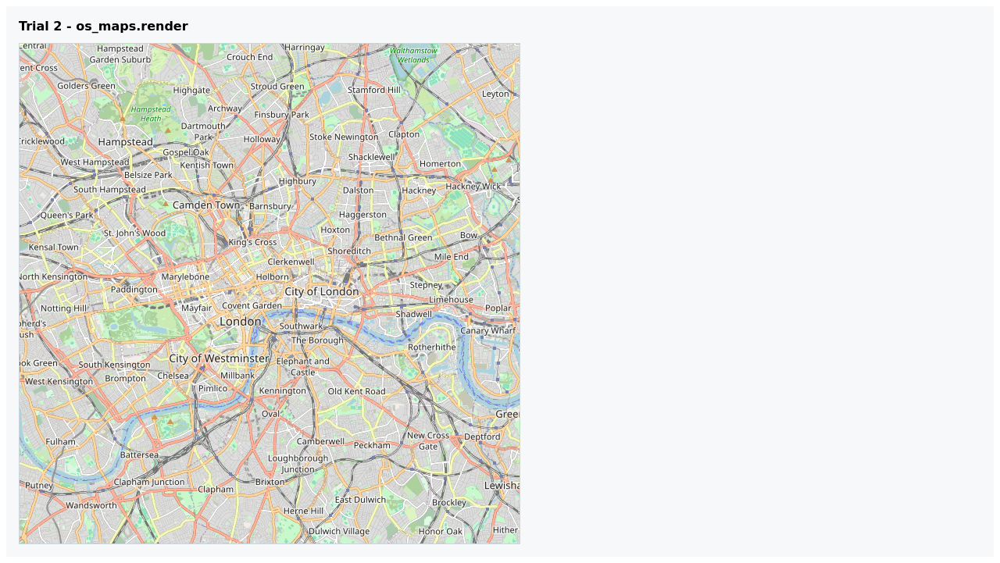

# Progress Journal

## 2026-02-13 19:50 UTC - Research branch and baseline setup

- Created branch: `codex/map-delivery-research-trials`.
- Reviewed existing map stack (`ui/geography_selector.html`, `ui/boundary_explorer.html`, `tools/os_maps.py`, `server/maps_proxy.py`).
- Confirmed existing devcontainer and VS Code MCP wiring.

## 2026-02-13 19:55 UTC - Containerized MCP connectivity baseline

- Started devcontainer (`devcontainer up`).
- Ran MCP server inside container and validated:
  - `/health`
  - `initialize`
  - `tools/call os_maps.render`
  - `tools/call os_vector_tiles.descriptor`
- Evidence: `research/map_delivery_research_2026-02/evidence/logs/devcontainer_mcp_baseline_2026-02-13_v2.log`

## 2026-02-13 19:58 UTC - Autonomous Playwright trial harness built

- Added multi-browser trial config: `playground/playwright.trials.config.js`.
- Added trial matrix: `playground/trials/tests/map_delivery_matrix.spec.js`.
- Added runner: `scripts/run_map_delivery_trials.sh`.
- Added summary generator: `scripts/map_trials/summarize_playwright_trials.py`.

## 2026-02-13 20:00 UTC - Trial stabilization and reruns

- Initial run exposed browser-specific host emulation instability for file-based MCP-Apps pages.
- Refined scope:
  - Cross-browser (Chromium, Firefox, WebKit) for transport-level map delivery trials.
  - Chromium-only for MCP-Apps widget interaction trials where deterministic host emulation is required.
- Added run-time log reset in trial runner to avoid stale entries.

## 2026-02-13 20:06 UTC - Final trial run (clean)

- Final run result: `8 passed, 4 skipped`.
- Log: `research/map_delivery_research_2026-02/evidence/logs/map_delivery_trials_run_20260213T200601Z.log`
- Summary: `research/map_delivery_research_2026-02/reports/trial_summary.md`

### Screenshot evidence snapshots

Static map route (Chromium):

Tool-driven `os_maps.render` output (Firefox):

MCP-Apps geography selector (Chromium):

MCP-Apps boundary explorer local layer selection (Chromium):

## 2026-02-13 20:15 UTC - Full regression check

- Ran full Python regression suite with coverage gate:
  - Command: `./.venv/bin/pytest -q`
  - Result: `708 passed, 6 skipped`, coverage `90.02%`.

## 2026-02-13 23:25 UTC - Blank map investigation loop completed

- Reproduced blank-map behavior from evidence screenshots in Chromium widget trials.
- Implemented deterministic map visibility controls:
  - Added synthetic tile fixture: `playground/trials/fixtures/synthetic_osm_tile.png`.
  - Added explicit map-panel captures for widget trials.
  - Added non-blank screenshot verifier: `scripts/map_trials/verify_map_screenshots.py`.
  - Updated runner `scripts/run_map_delivery_trials.sh` to execute verifier and fail fast.
  - Hardened widget style switching via `setStyle(..., { diff: false })`.
- Re-ran trials:
  - Command: `./scripts/run_map_delivery_trials.sh`
  - Result: `8 passed, 4 skipped`, visual verifier `pass`.
  - Log: `research/map_delivery_research_2026-02/evidence/logs/map_delivery_trials_run_20260213T232739Z.log`
- Ran targeted UI regressions:
  - Command: `npm --prefix playground run test -- tests/geography_selector.spec.js tests/boundary_explorer_local_layers.spec.js`
  - Result: `2 passed`.
