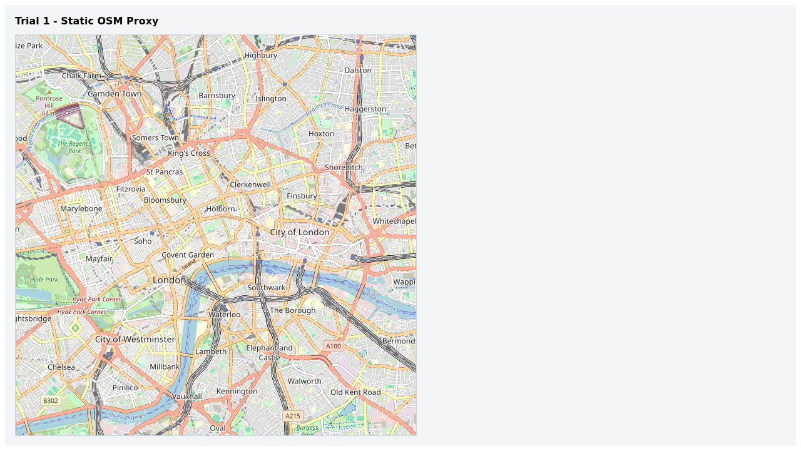
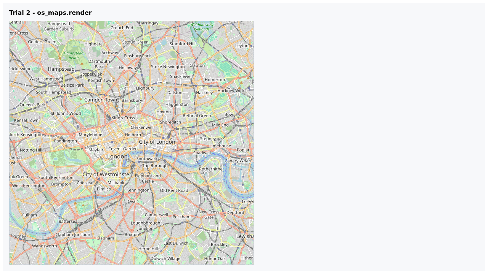
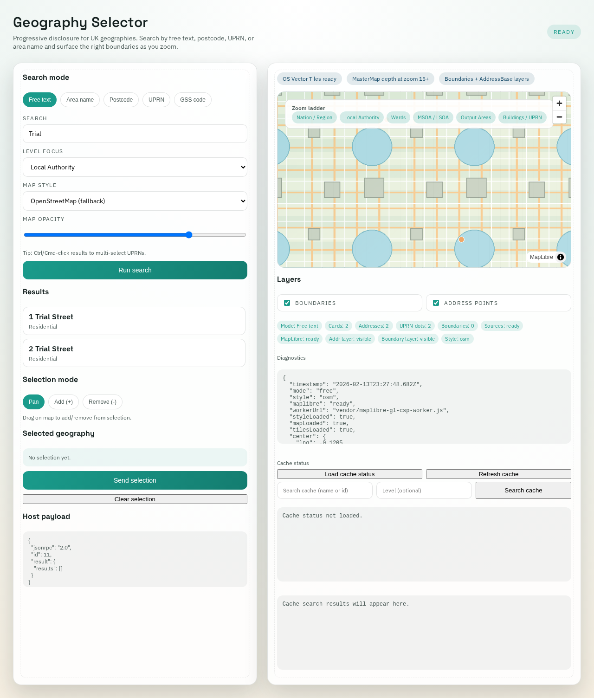
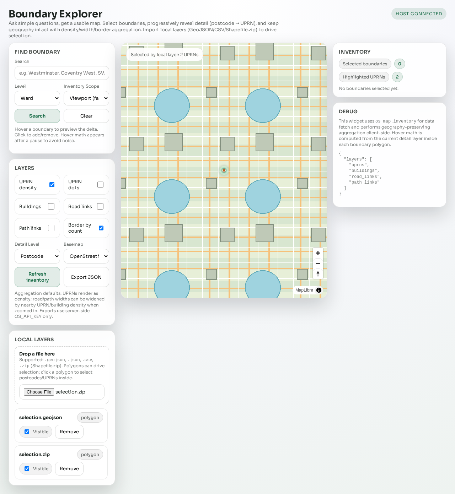
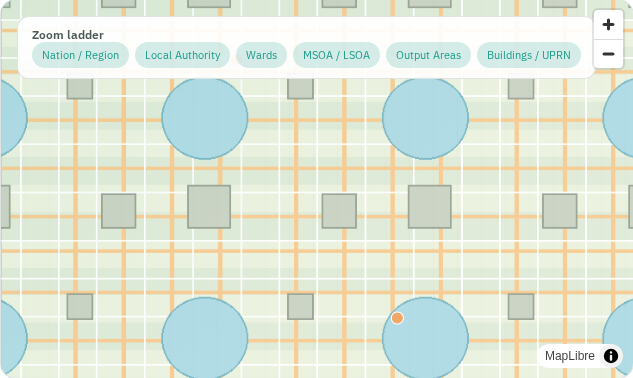
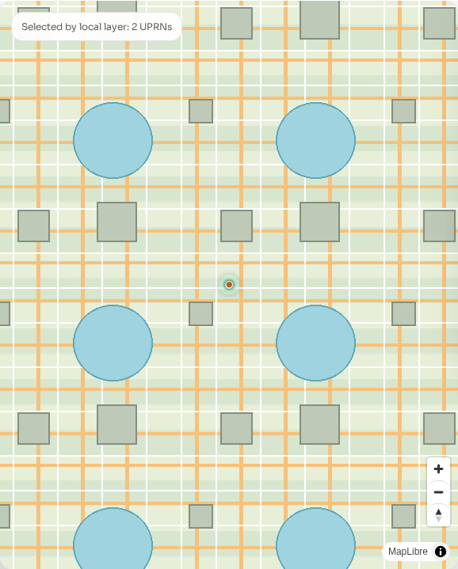

# Trial Results

## Execution summary

- Run command: `./scripts/run_map_delivery_trials.sh`
- Result: `8 passed`, `4 skipped`
- Visual verifier: `pass` (`trial-3` + `trial-4` map panels confirmed non-blank)
- Run log: `research/map_delivery_research_2026-02/evidence/logs/map_delivery_trials_run_20260213T232739Z.log`
- Summary report: `research/map_delivery_research_2026-02/reports/trial_summary.md`

## Implement/test loop for blank-map failure

1. Reproduce:
   - Replayed `trial-3-geography-selector` and `trial-4-boundary-explorer`.
   - Confirmed map panel could render as blank while UI controls stayed active.
2. Implement:
   - Added deterministic synthetic tile fixture and routed widget tile requests to it.
   - Forced style transitions with full reload (`setStyle(..., { diff: false })`) in both widgets to avoid stale style/source state.
   - Added dedicated map-panel screenshot capture (`*-map-panel.png`) for each widget trial.
3. Test:
   - Added `scripts/map_trials/verify_map_screenshots.py` to fail the run if required map panels look visually blank.
   - Wired verifier into `scripts/run_map_delivery_trials.sh` so CI/local runs stop on map visibility regressions.
4. Exit criteria:
   - Loop is complete when both widget map-panel checks pass and screenshots show visible tile detail.

## Containerized MCP connectivity check

Before browser trials, the server was exercised in-container with MCP calls.

- Evidence: `research/map_delivery_research_2026-02/evidence/logs/devcontainer_mcp_baseline_2026-02-13_v2.log`
- Verified responses:
  - `initialize`
  - `tools/call os_maps.render`
  - `tools/call os_vector_tiles.descriptor`

## Trial matrix outcome

| Trial | Chromium | Firefox | WebKit | Notes |
| --- | --- | --- | --- | --- |
| `trial-1-static-osm` | pass | pass | pass | Static map route is robust across engines. |
| `trial-2-os-maps-render` | pass | pass | pass | Tool contract is directly consumable across engines. |
| `trial-3-geography-selector` | pass | skipped | skipped | Widget host emulation constrained to deterministic Chromium path. |
| `trial-4-boundary-explorer` | pass | skipped | skipped | Local layer workflow validated on Chromium host-emulation path. |

## Key technical observations

1. Transport-level map delivery is the highest-confidence interoperability layer.
2. MCP `os_maps.render` offers a stable compatibility bridge when full widget support is uncertain.
3. Widget-level functionality remains valuable, but host capability differences require explicit fallback design.
4. Evidence-first approach (JSONL + screenshot) is effective for monitoring regressions over time.

## Evidence screenshots

Cross-browser static map evidence:

Tool-driven map render evidence:

Widget interaction evidence (Chromium):

Map panel proof (non-blank render):

