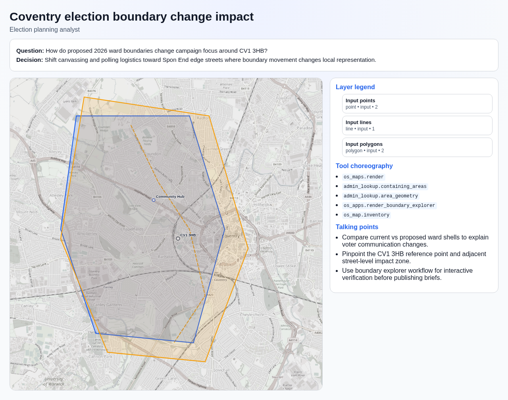
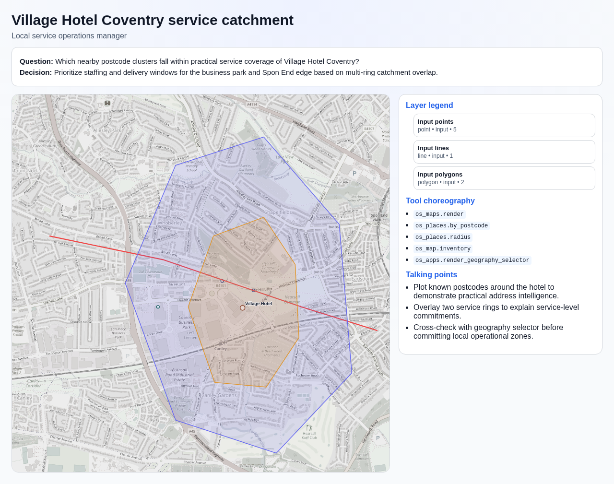
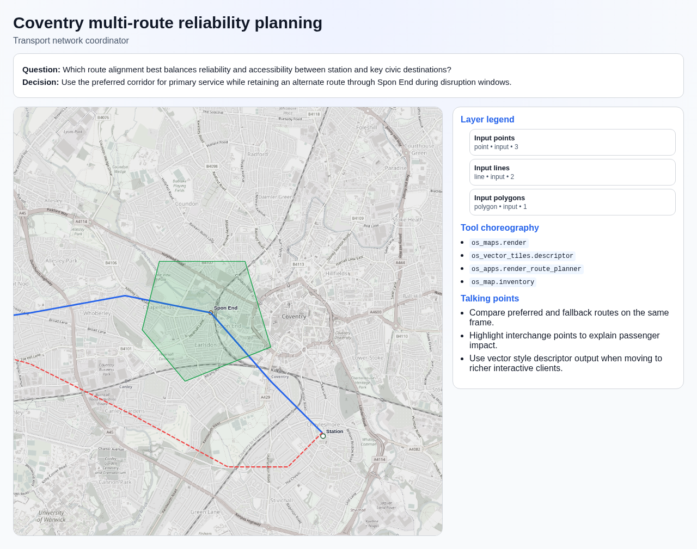
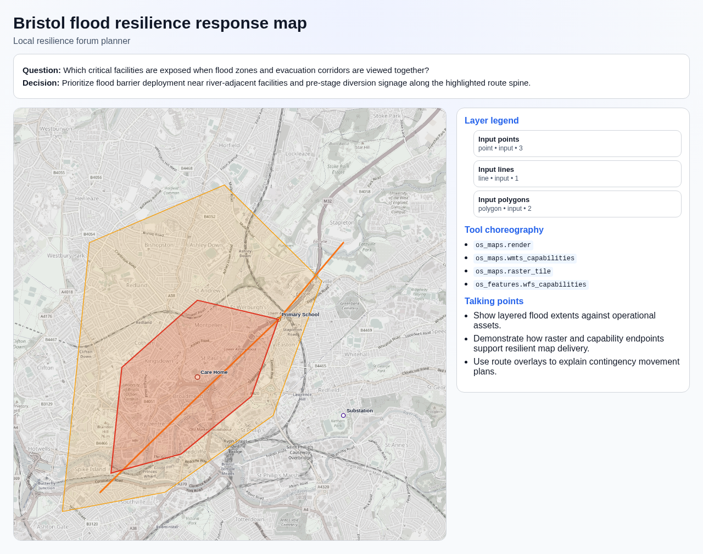
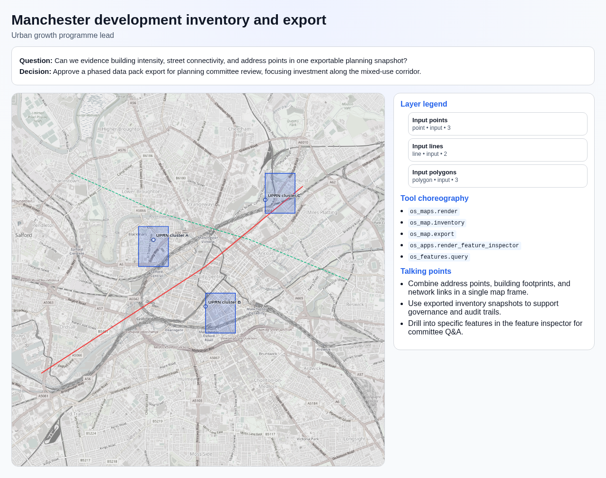
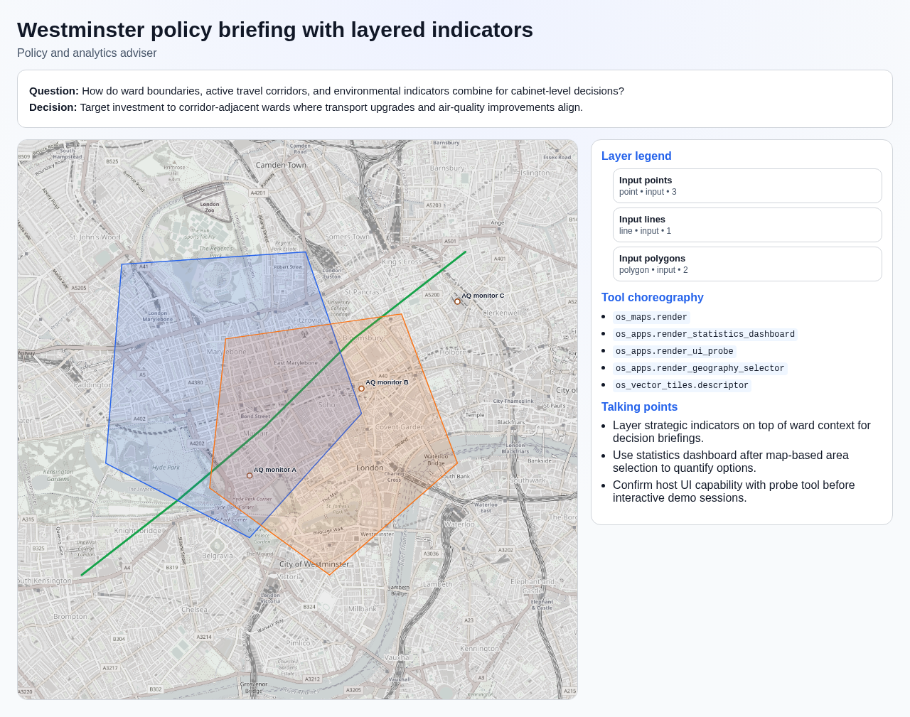

# Map Story Gallery Report

- Generated at (UTC): 2026-02-21T16:20:14.635292Z
- Scenario catalog version: `2026-02-16`
- Scenario count: `6`
- Observation rows loaded: `35`

## Functionality Coverage Matrix

| Tool | Capability | Stories |
| --- | --- | --- |
| `admin_lookup.area_geometry` | Area geometry retrieval | `story-1-coventry-boundary-change` |
| `admin_lookup.containing_areas` | Point-in-area administrative lookup | `story-1-coventry-boundary-change` |
| `os_apps.render_boundary_explorer` | Interactive boundary explorer widget | `story-1-coventry-boundary-change` |
| `os_apps.render_feature_inspector` | Interactive feature inspector widget | `story-5-manchester-inventory-export` |
| `os_apps.render_geography_selector` | Interactive geography selector widget | `story-2-village-hotel-catchment`, `story-6-westminster-policy-layering` |
| `os_apps.render_route_planner` | Interactive route planner widget | `story-3-coventry-route-layering` |
| `os_apps.render_statistics_dashboard` | Interactive statistics dashboard widget | `story-6-westminster-policy-layering` |
| `os_apps.render_ui_probe` | MCP-Apps UI capability probe | `story-6-westminster-policy-layering` |
| `os_features.query` | Feature query by collection + bbox | `story-5-manchester-inventory-export` |
| `os_features.wfs_capabilities` | WFS capability discovery | `story-4-bristol-flood-layer-stack` |
| `os_map.export` | Export lifecycle for map inventory snapshots | `story-5-manchester-inventory-export` |
| `os_map.inventory` | Bounded map inventory layers (UPRNs/buildings/road/path) | `story-1-coventry-boundary-change`, `story-2-village-hotel-catchment`, `story-3-coventry-route-layering`, `story-5-manchester-inventory-export` |
| `os_maps.raster_tile` | Raster tile retrieval | `story-4-bristol-flood-layer-stack` |
| `os_maps.render` | Static map baseline render contract | `story-1-coventry-boundary-change`, `story-2-village-hotel-catchment`, `story-3-coventry-route-layering`, `story-4-bristol-flood-layer-stack`, `story-5-manchester-inventory-export`, `story-6-westminster-policy-layering` |
| `os_maps.wmts_capabilities` | WMTS capability discovery | `story-4-bristol-flood-layer-stack` |
| `os_places.by_postcode` | Address/UPRN lookup by postcode | `story-2-village-hotel-catchment` |
| `os_places.radius` | Radius-based address search | `story-2-village-hotel-catchment` |
| `os_vector_tiles.descriptor` | Vector style/tiles descriptor for rich map clients | `story-3-coventry-route-layering`, `story-6-westminster-policy-layering` |

## Slide Storyboards

## Coventry election boundary change impact

- Story ID: `story-1-coventry-boundary-change`
- Persona: Election planning analyst
- Preferred evidence browser: `chromium-desktop`
- Screenshot: `research/map_delivery_research_2026-02/evidence/screenshots/chromium-desktop-story-1-coventry-boundary-change.png`
- Map panel crop: `research/map_delivery_research_2026-02/evidence/screenshots/chromium-desktop-story-1-coventry-boundary-change-map-panel.png`
- Question: How do proposed 2026 ward boundaries change campaign focus around CV1 3HB?
- Decision narrative: Shift canvassing and polling logistics toward Spon End edge streets where boundary movement changes local representation.

**Tool choreography**

- `os_maps.render`: Static map baseline render contract
- `admin_lookup.containing_areas`: Point-in-area administrative lookup
- `admin_lookup.area_geometry`: Area geometry retrieval
- `os_apps.render_boundary_explorer`: Interactive boundary explorer widget
- `os_map.inventory`: Bounded map inventory layers (UPRNs/buildings/road/path)

**Layered story notes**

- Compare current vs proposed ward shells to explain voter communication changes.
- Pinpoint the CV1 3HB reference point and adjacent street-level impact zone.
- Use boundary explorer workflow for interactive verification before publishing briefs.

**Observed layer counts from capture**

- `input_points` (point, source=input) -> `2` feature(s)
- `input_lines` (line, source=input) -> `1` feature(s)
- `input_polygons` (polygon, source=input) -> `2` feature(s)

## Village Hotel Coventry service catchment

- Story ID: `story-2-village-hotel-catchment`
- Persona: Local service operations manager
- Preferred evidence browser: `chromium-desktop`
- Screenshot: `research/map_delivery_research_2026-02/evidence/screenshots/chromium-desktop-story-2-village-hotel-catchment.png`
- Map panel crop: `research/map_delivery_research_2026-02/evidence/screenshots/chromium-desktop-story-2-village-hotel-catchment-map-panel.png`
- Question: Which nearby postcode clusters fall within practical service coverage of Village Hotel Coventry?
- Decision narrative: Prioritize staffing and delivery windows for the business park and Spon End edge based on multi-ring catchment overlap.

**Tool choreography**

- `os_maps.render`: Static map baseline render contract
- `os_places.by_postcode`: Address/UPRN lookup by postcode
- `os_places.radius`: Radius-based address search
- `os_map.inventory`: Bounded map inventory layers (UPRNs/buildings/road/path)
- `os_apps.render_geography_selector`: Interactive geography selector widget

**Layered story notes**

- Plot known postcodes around the hotel to demonstrate practical address intelligence.
- Overlay two service rings to explain service-level commitments.
- Cross-check with geography selector before committing local operational zones.

**Observed layer counts from capture**

- `input_points` (point, source=input) -> `5` feature(s)
- `input_lines` (line, source=input) -> `1` feature(s)
- `input_polygons` (polygon, source=input) -> `2` feature(s)

## Coventry multi-route reliability planning

- Story ID: `story-3-coventry-route-layering`
- Persona: Transport network coordinator
- Preferred evidence browser: `chromium-desktop`
- Screenshot: `research/map_delivery_research_2026-02/evidence/screenshots/chromium-desktop-story-3-coventry-route-layering.png`
- Map panel crop: `research/map_delivery_research_2026-02/evidence/screenshots/chromium-desktop-story-3-coventry-route-layering-map-panel.png`
- Question: Which route alignment best balances reliability and accessibility between station and key civic destinations?
- Decision narrative: Use the preferred corridor for primary service while retaining an alternate route through Spon End during disruption windows.

**Tool choreography**

- `os_maps.render`: Static map baseline render contract
- `os_vector_tiles.descriptor`: Vector style/tiles descriptor for rich map clients
- `os_apps.render_route_planner`: Interactive route planner widget
- `os_map.inventory`: Bounded map inventory layers (UPRNs/buildings/road/path)

**Layered story notes**

- Compare preferred and fallback routes on the same frame.
- Highlight interchange points to explain passenger impact.
- Use vector style descriptor output when moving to richer interactive clients.

**Observed layer counts from capture**

- `input_points` (point, source=input) -> `3` feature(s)
- `input_lines` (line, source=input) -> `2` feature(s)
- `input_polygons` (polygon, source=input) -> `1` feature(s)

## Bristol flood resilience response map

- Story ID: `story-4-bristol-flood-layer-stack`
- Persona: Local resilience forum planner
- Preferred evidence browser: `chromium-desktop`
- Screenshot: `research/map_delivery_research_2026-02/evidence/screenshots/chromium-desktop-story-4-bristol-flood-layer-stack.png`
- Map panel crop: `research/map_delivery_research_2026-02/evidence/screenshots/chromium-desktop-story-4-bristol-flood-layer-stack-map-panel.png`
- Question: Which critical facilities are exposed when flood zones and evacuation corridors are viewed together?
- Decision narrative: Prioritize flood barrier deployment near river-adjacent facilities and pre-stage diversion signage along the highlighted route spine.

**Tool choreography**

- `os_maps.render`: Static map baseline render contract
- `os_maps.wmts_capabilities`: WMTS capability discovery
- `os_maps.raster_tile`: Raster tile retrieval
- `os_features.wfs_capabilities`: WFS capability discovery

**Layered story notes**

- Show layered flood extents against operational assets.
- Demonstrate how raster and capability endpoints support resilient map delivery.
- Use route overlays to explain contingency movement plans.

**Observed layer counts from capture**

- `input_points` (point, source=input) -> `3` feature(s)
- `input_lines` (line, source=input) -> `1` feature(s)
- `input_polygons` (polygon, source=input) -> `2` feature(s)

## Manchester development inventory and export

- Story ID: `story-5-manchester-inventory-export`
- Persona: Urban growth programme lead
- Preferred evidence browser: `chromium-desktop`
- Screenshot: `research/map_delivery_research_2026-02/evidence/screenshots/chromium-desktop-story-5-manchester-inventory-export.png`
- Map panel crop: `research/map_delivery_research_2026-02/evidence/screenshots/chromium-desktop-story-5-manchester-inventory-export-map-panel.png`
- Question: Can we evidence building intensity, street connectivity, and address points in one exportable planning snapshot?
- Decision narrative: Approve a phased data pack export for planning committee review, focusing investment along the mixed-use corridor.

**Tool choreography**

- `os_maps.render`: Static map baseline render contract
- `os_map.inventory`: Bounded map inventory layers (UPRNs/buildings/road/path)
- `os_map.export`: Export lifecycle for map inventory snapshots
- `os_apps.render_feature_inspector`: Interactive feature inspector widget
- `os_features.query`: Feature query by collection + bbox

**Layered story notes**

- Combine address points, building footprints, and network links in a single map frame.
- Use exported inventory snapshots to support governance and audit trails.
- Drill into specific features in the feature inspector for committee Q&A.

**Observed layer counts from capture**

- `input_points` (point, source=input) -> `3` feature(s)
- `input_lines` (line, source=input) -> `2` feature(s)
- `input_polygons` (polygon, source=input) -> `3` feature(s)

## Westminster policy briefing with layered indicators

- Story ID: `story-6-westminster-policy-layering`
- Persona: Policy and analytics adviser
- Preferred evidence browser: `chromium-desktop`
- Screenshot: `research/map_delivery_research_2026-02/evidence/screenshots/chromium-desktop-story-6-westminster-policy-layering.png`
- Map panel crop: `research/map_delivery_research_2026-02/evidence/screenshots/chromium-desktop-story-6-westminster-policy-layering-map-panel.png`
- Question: How do ward boundaries, active travel corridors, and environmental indicators combine for cabinet-level decisions?
- Decision narrative: Target investment to corridor-adjacent wards where transport upgrades and air-quality improvements align.

**Tool choreography**

- `os_maps.render`: Static map baseline render contract
- `os_apps.render_statistics_dashboard`: Interactive statistics dashboard widget
- `os_apps.render_ui_probe`: MCP-Apps UI capability probe
- `os_apps.render_geography_selector`: Interactive geography selector widget
- `os_vector_tiles.descriptor`: Vector style/tiles descriptor for rich map clients

**Layered story notes**

- Layer strategic indicators on top of ward context for decision briefings.
- Use statistics dashboard after map-based area selection to quantify options.
- Confirm host UI capability with probe tool before interactive demo sessions.

**Observed layer counts from capture**

- `input_points` (point, source=input) -> `3` feature(s)
- `input_lines` (line, source=input) -> `1` feature(s)
- `input_polygons` (polygon, source=input) -> `2` feature(s)

